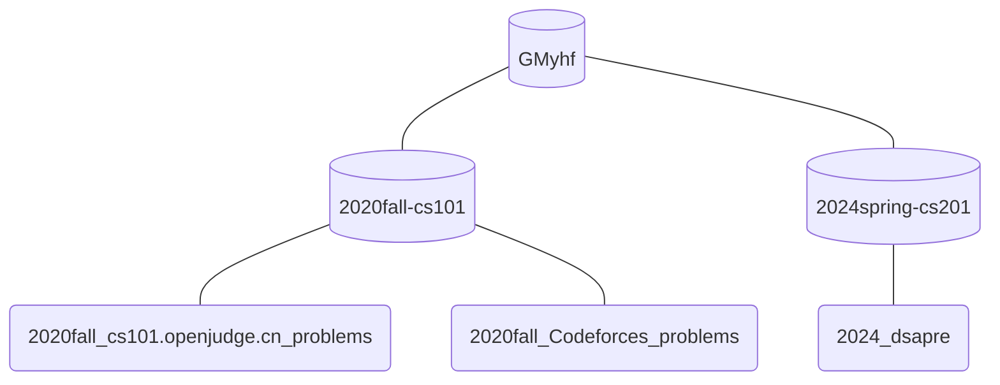
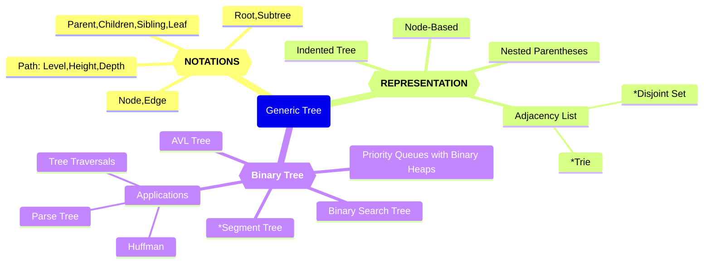
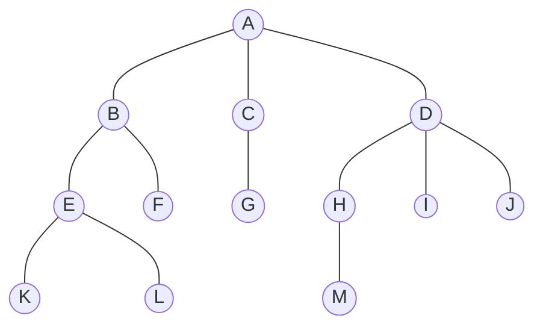

# 时间复杂度


## What is Data Structure?

A data structure is defined as a particular way of storing and organizing data in our devices to use the data efficiently and effectively. The main idea behind using data structures is to minimize the time and space complexities. An efficient data structure takes minimum memory space and requires minimum time to execute the data.

## What is Algorithm?

Algorithm is defined as a process or set of well-defined instructions that are typically used to solve a particular group of problems or perform a specific type of calculation. To explain in simpler terms, it is a set of operations performed in a step-by-step manner to execute a task.

### 1. Learn about Complexities

Here comes one of the interesting and important topics. The primary motive to use DSA is to solve a problem effectively and efficiently. How can you decide if a program written by you is efficient or not? This is measured by complexities. Complexity is of two types:

Both of the above complexities are measured with respect to the input parameters. But here arises a problem. The time required for executing a code depends on several factors, such as: 

- The number of operations performed in the program, 
- The speed of the device, and also 
- The speed of data transfer if being executed on an online platform. 

So how can we determine which one is efficient? The answer is the use of asymptotic notation. 

> **Asymptotic notation** is a mathematical tool that calculates the required time in terms of input size and does not require the execution of the code. 

It neglects the system-dependent constants and is related to only the number of modular operations being performed in the whole program. The following 3 asymptotic notations are mostly used to represent the time complexity of algorithms:

- **Big-O Notation (Ο)** – Big-O notation specifically describes the worst-case scenario.
- **Omega Notation (Ω)** – Omega(Ω) notation specifically describes the best-case scenario.
- **Theta Notation (θ)** – This notation represents the average complexity of an algorithm.


Rate of Growth of Algorithms

The most used notation in the analysis of a code is the **Big O Notation** which gives an upper bound of the running time of the code (or the amount of memory used in terms of input size).

To learn about complexity analysis in detail, you can refer to articles on the **Analysis of Algorithms**.


#### Sorting Algorithm

Here is one other most used algorithm. Often we need to arrange or sort data as per a specific condition. The sorting algorithm is the one that is used in these cases. Based on conditions we can sort a set of homogeneous data in order like sorting an array in increasing or decreasing order. 


# 一、Big-O notation

## Analyzing algorithms

**Analyzing** an algorithm has come to mean predicting the resources that the algorithm requires. Occasionally, resources such as memory, communication bandwidth, or computer hardware are of primary concern, but most often it is computational time that we want to measure. Generally, by analyzing several candidate algorithms for a problem, we can identify a most efficient one. Such analysis may indicate more than one viable candidate, but we can often discard several inferior algorithms in the process.

Before we can analyze an algorithm, we must have a model of the implementation technology that we will use, including a model for the resources of that technology and their costs. For most of this book, we shall assume a generic oneprocessor, **random-access machine (RAM)** model of computation as our implementation technology and understand that our algorithms will be implemented as computer programs. In the RAM model, instructions are executed one after another, with no concurrent operations.
Strictly speaking, we should precisely define the instructions of the RAM model and their costs. To do so, however, would be tedious and would yield little insight into algorithm design and analysis. Yet we must be careful not to abuse the RAM model. For example, what if a RAM had an instruction that sorts? Then we couldsort in just one instruction. Such a RAM would be unrealistic, since real computers do not have such instructions. Our guide, therefore, is how real computers are designed. The RAM model contains instructions commonly found in real computers: arithmetic (such as add, subtract, multiply, divide, remainder, floor, ceiling), data movement (load, store, copy), and control (conditional and unconditional branch, subroutine call and return). Each such instruction takes a constant amount of time.

The data types in the RAM model are integer and floating point (for storing real numbers). Although we typically do not concern ourselves with precision in this book, in some applications precision is crucial. We also assume a limit on the size of each word of data. For example, when working with inputs of size n, we typically assume that integers are represented by c lg n bits for some constant $c \ge 1$. We require $c \ge 1$​ so that each word can hold the value of n, enabling us to index the individual input elements, and we restrict c to be a constant so that the word size does not grow arbitrarily. (If the word size could grow arbitrarily, we could store huge amounts of data in one word and operate on it all in constant time—clearly an unrealistic scenario.)

> 计算机字长（Computer Word Length）是指计算机中用于存储和处理数据的基本单位的位数。它表示计算机能够一次性处理的二进制数据的位数。
>
> 字长的大小对计算机的性能和数据处理能力有重要影响。较大的字长通常意味着计算机能够处理更大范围的数据或执行更复杂的操作。常见的字长包括 8 位、16 位、32 位和 64 位。
>
> 较小的字长可以节省存储空间和资源，适用于简单的计算任务和资源有限的设备。较大的字长通常用于处理更大量级的数据、进行复杂的计算和支持高性能计算需求。
>
> 需要注意的是，字长并不是唯一衡量计算机性能的指标，还有其他因素如处理器速度、缓存大小、操作系统等也会影响计算机的整体性能。

Real computers contain instructions not listed above, and such instructions represent a gray area in the RAM model. For example, is exponentiation a constanttime instruction? In the general case, no; it takes several instructions to compute xy
when x and y are real numbers. In restricted situations, however, exponentiation is a constant-time operation. Many computers have a “shift left” instruction, which in constant time shifts the bits of an integer by k positions to the left. In most computers, shifting the bits of an integer by one position to the left is equivalent to multiplication by 2, so that shifting the bits by k positions to the left is equivalent to multiplication by $2^k$. Therefore, such computers can compute $2^k$ in one constant-time instruction by shifting the integer 1 by k positions to the left, as long as k is no more than the number of bits in a computer word. We will endeavor to avoid such gray areas in the RAM model, but we will treat computation of $2^k$ as a constant-time operation when k is a small enough positive integer.

In the RAM model, we do not attempt to model the memory hierarchy that is common in contemporary computers. That is, we do not model caches or virtual memory. Several computational models attempt to account for memory-hierarchy effects, which are sometimes significant in real programs on real machines. A handful of problems in this book examine memory-hierarchy effects, but for the most part, the analyses in this book will not consider them. Models that include the memory hierarchy are quite a bit more complex than the RAM model, and so they can be difficult to work with. Moreover, RAM-model analyses are usually excellent predictors of performance on actual machines.

Analyzing even a simple algorithm in the RAM model can be a challenge. The mathematical tools required may include combinatorics, probability theory, algebraic dexterity, and the ability to identify the most significant terms in a formula. Because the behavior of an algorithm may be different for each possible input, we need a means for summarizing that behavior in simple, easily understood formulas.

Even though we typically select only one machine model to analyze a given algorithm, we still face many choices in deciding how to express our analysis. We would like a way that is simple to write and manipulate, shows the important characteristics of an algorithm’s resource requirements, and suppresses tedious details.

### 1.Analysis of insertion sort

The time taken by the INSERTION-SORT procedure depends on the input: sorting a thousand numbers takes longer than sorting three numbers. Moreover, INSERTIONSORT can take different amounts of time to sort two input sequences of the same size depending on how nearly sorted they already are. In general, the time taken by an algorithm grows with the size of the input, so it is traditional to describe the running time of a program as a function of the size of its input. To do so, we need to define the terms “running time” and “size of input” more carefully.

The best notion for **input size** depends on the problem being studied. For many problems, such as sorting or computing discrete Fourier transforms, the most natural measure is the number of items in the input—for example, the array size n for sorting. For many other problems, such as multiplying two integers, the best measure of input size is the total number of bits needed to represent the input in ordinary binary notation. Sometimes, it is more appropriate to describe the size of the input with two numbers rather than one. For instance, if the input to an algorithm is a graph, the input size can be described by the numbers of vertices and edges in the graph. We shall indicate which input size measure is being used with each problem we study.

The **running time** of an algorithm on a particular input is the number of primitive operations or “steps” executed. It is convenient to define the notion of step so that it is as machine-independent as possible. For the moment, let us adopt the following view. A constant amount of time is required to execute each line of our pseudocode. One line may take a different amount of time than another line, but we shall assume that each execution of the ith line takes time ci, where ci is a constant. This viewpoint is in keeping with the **RAM** model, and it also reflects how the pseudocode would be implemented on most actual computers.

In the following discussion, our expression for the running time of INSERTIONSORT will evolve from a messy formula that uses all the statement costs ci to a much simpler notation that is more concise and more easily manipulated. This simpler notation will also make it easy to determine whether one algorithm is more efficient than another.

We start by presenting the INSERTION-SORT procedure with the time “cost” of each statement and the number of times each statement is executed. For each `j = 2, 3, ... , n`, where `n = A.length`, we let $t_j$ denote the number of times the **while** loop test in line 7 is executed for that value of j . When a **for** or **while** loop exits in the usual way (i.e., due to the test in the loop header), the test is executed one time more than the loop body. We assume that comments are not executable statements, and so they take no time.

> https://www.geeksforgeeks.org/insertion-sort/
>
> **Insertion sort** is a simple sorting algorithm that works similarly to the way you sort playing cards in your hands. The array is virtually split into a sorted and an unsorted part. Values from the unsorted part are picked and placed in the correct position in the sorted part.
>
> ## Insertion Sort Algorithm
>
> To sort an array of size N in ascending order iterate over the array and compare the current element (key) to its predecessor, if the key element is smaller than its predecessor, compare it to the elements before. Move the greater elements one position up to make space for the swapped element.
>
> Illustrations:
>
> 


Implementation of Insertion Sort Algorithm

“\sum_{j=2}^{n} t_j”  是     			

$\sum_{j=2}^{n} t_j$ 的LaTex表示，

“\sum_{j=2}^{n} t_{j}-1\” 是 $\sum_{j=2}^{n} t_{j}-1$​ 的LaTex表示。

```python
def insertion_sort(arr):														# cost	times
    for i in range(1, len(arr)):										# c1		n
        j = i																				# c2 		n - 1
        
        # Insert arr[j] into the
        # sorted sequence arry[0..j-1]							#	0			n - 1
        while arr[j - 1] > arr[j] and j > 0:				# c4		\sum_{j=2}^{n} t_j
            arr[j - 1], arr[j] = arr[j], arr[j - 1] # c5		\sum_{j=2}^{n} t_j - 1
            j -= 1																	# c6		\sum_{j=2}^{n} t_j - 1


arr = [2, 6, 5, 1, 3, 4]
insertion_sort(arr)
print(arr)

# [1, 2, 3, 4, 5, 6]
```


> **Q:** Suppose you have the following list of numbers to sort: [15, 5, 4, 18, 12, 19, 14, 10, 8, 20] which list represents the partially sorted list after three complete passes of insertion sort? (C)
>
> A. [4, 5, 12, 15, 14, 10, 8, 18, 19, 20]
> B. [15, 5, 4, 10, 12, 8, 14, 18, 19, 20]
> **C. [4, 5, 15, 18, 12, 19, 14, 10, 8, 20]**
> D. [15, 5, 4, 18, 12, 19, 14, 8, 10, 20]


The running time of the algorithm is the sum of running times for each statement executed; a statement that takes $c_i$ steps to execute and executes n times will contribute $c_in$​ to the total running time. To compute T(n), the running time of INSERTION-SORT on an input of n values, we sum the products of the cost and times columns, obtaining


$T(n) = c_1n + c_2(n-1) + c_4\sum_{j=2}^{n} t_j + c_5\sum_{j=2}^{n} t_j-1 + c_6\sum_{j=2}^{n} t_j-1$


Even for inputs of a given size, an algorithm’s running time may depend on which input of that size is given. For example, in INSERTION-SORT, the best case occurs if the array is already sorted. For each i = 1, 2, 3, ... , n-1, we then find that $arr[j-1] \le arr[j]$ in line 7 when $j$ has its initial value of $i$. Thus $t_j = 1$ for i = 1, 2, 3, ... , n-1, and the best-case running time is


$T(n) = c_1n + c_2(n-1) + c_4(n-1)$​

$\quad = (c_1 + c_2 + c_4)n - (c_2 + c_4)$


We can express this running time as `an + b` for constants a and b that depend on
the statement costs $c_i$; it is thus a **linear function** of n.

If the array is in reverse sorted order—that is, in decreasing order—the worst case results. We must compare each element A[j]  with each element in the entire sorted subarray `A[0..j-1]`, and so `tj = j for j = 1, 2, ..., n-1`. Noting that

$\sum_{j=2}^{n} j = \frac{n(n+1)}{2} - 1$​ 

$\sum_{j=2}^{n} j-1 = \frac{n(n-1)}{2}$ 

we find that in the worst case, the running time of INSERTION-SORT is


$T(n) = c_1n + c_2(n-1) + c_4(\frac{n(n+1)}{2} -1) + c_5(\frac{n(n-1)}{2}) + + c_6(\frac{n(n-1)}{2})$

$\quad = (\frac{c_4}2 + \frac{c_5}2 + \frac{c_6}2)n^2 + (c_1 + c_2 + \frac{c_4}2 - \frac{c_5}2 - \frac{c_6}2)n - (c_2 + c_4)$


We can express this worst-case running time as $an^2 + bn + c$ for constants a, b, and c that again depend on the statement costs ci; it is thus a **quadratic function** of n.

Typically, as in insertion sort, the running time of an algorithm is fixed for a given input, although in later chapters we shall see some interesting “randomized” algorithms whose behavior can vary even for a fixed input.


### 2.Worst-case and average-case analysis

In our analysis of insertion sort, we looked at both the best case, in which the input array was already sorted, and the worst case, in which the input array was reverse sorted. For the remainder of this book, though, we shall usually concentrate on finding only the **worst-case running time**, that is, the longest running time for any input of size n. We give three reasons for this orientation.

- The worst-case running time of an algorithm gives us an upper bound on the running time for any input. Knowing it provides a guarantee that the algorithm will never take any longer. We need not make some educated guess about the running time and hope that it never gets much worse.
- For some algorithms, the worst case occurs fairly often. For example, in searching a database for a particular piece of information, the searching algorithm’s worst case will often occur when the information is not present in the database. In some applications, searches for absent information may be frequent.
- The “average case” is often roughly as bad as the worst case. Suppose that we randomly choose n numbers and apply insertion sort. How long does it take to determine where in subarray `A[0 ..  j-1]` to insert element A[j] ? On average, half the elements in `A[0 .. j-1]` are less than `A[j]` , and half the elements are greater. On average, therefore, we check half of the subarray `A[0 ..  j-1]`, and so $t_j$ is about $j/2$. The resulting average-case running time turns out to be a quadratic function of the input size, just like the worst-case running time.

In some particular cases, we shall be interested in the **average-case** running time of an algorithm; we shall see the technique of **probabilistic analysis** applied to various algorithms throughout this book. The scope of average-case analysis is limited, because it may not be apparent what constitutes an “average” input for a particular problem. Often, we shall assume that all inputs of a given size are equally likely. In practice, this assumption may be violated, but we can sometimes use a **randomized algorithm**, which makes random choices, to allow a probabilistic analysis and yield an **expected** running time. 

### 3.Order of growth

We used some simplifying abstractions to ease our analysis of the INSERTIONSORT procedure. First, we ignored the actual cost of each statement, using the constants ci to represent these costs. Then, we observed that even these constants give us more detail than we really need: we expressed the worst-case running time as $an^2 + bn + c$ for some constants a, b, and c that depend on the statement costs $c_i$. We thus ignored not only the actual statement costs, but also the abstract costs $c_i$.

We shall now make one more simplifying abstraction: it is the **rate of growth**, or **order of growth**, of the running time that really interests us. We therefore consider only the leading term of a formula (e.g., $an^2$), since the lower-order terms are relatively insignificant for large values of n. We also ignore the leading term’s constant coefficient, since constant factors are less significant than the rate of growth in determining computational efficiency for large inputs. For insertion sort, when we ignore the lower-order terms and the leading term’s constant coefficient, we are left with the factor of $n^2$ from the leading term. We write that insertion sort has a worst-case running time of $\Theta(n^2)$ (pronounced “theta of n-squared”). 

We usually consider one algorithm to be more efficient than another if its worstcase running time has a lower order of growth. Due to constant factors and lowerorder terms, an algorithm whose running time has a higher order of growth might take less time for small inputs than an algorithm whose running time has a lower order of growth. But for large enough inputs, a $\Theta(n^2)$ algorithm, for example, will run more quickly in the worst case than a $\Theta(n^3)$​ algorithm.


### 4.O-notation

> 通用的记号应该是，O表示上界，$\Omega$表示下界，$\Theta$表示渐进阶，就是既上界又下界。

The $\Theta$-notation asymptotically bounds a function from above and below. When we have only an asymptotic upper bound, we use O-notation. For a given function g(n), we denote by O(g(n) (pronounced “big-oh of g of n” or sometimes just “oh of g of n”) the set of functions

$O(g(n) = \{f(n):  there \space exist \space positive \space constants \space c \space and \space n_0 \space such \space that$​

$\quad\quad\quad\quad\quad\quad\quad  0 \le f(n) \le  cg(n)  for \space all \space n \ge n_0\}$

We use O-notation to give an upper bound on a function, to within a constant factor.

Using O-notation, we can often describe the running time of an algorithm merely by inspecting the algorithm’s overall structure. For example, the doubly nested loop structure of the insertion sort algorithm immediately yields an $O(n^2)$ upper bound on the worst-case running time.

Since O-notation describes an upper bound, when we use it to bound the worstcase running time of an algorithm, we have a bound on the running time of the algorithm on every input.


**举例：**$2n + 10$ is $O(n)$

$2n + 10 \le cn$

$(c - 2) n \ge 10$

$n \ge 10/(c - 2)$

Pick $c = 3 \space and \space n_0 = 10$


**举例：**the function $n^2$ is not O(n)

$n^2 \le cn$

$n \le c$, the inequality cannot be satisfied since $c$​ must be a constant 


**More Big-Oh Examples**

$7n - 2$​ is O(n)

need $c \gt 0$ and $n_0 \ge 1$ such that $7n - 2 \le cn$ for $n \ge n_0$​


$3n^3 + 20n^2 + 5$ is $O(n^3)$

need $c \gt 0$ and $n_0 \ge 1$ such that $3n^3 + 20n^2 + 5 \le cn^3$ for $n \ge n_0$

This is true for $c = 4$ and $n_0 = 21$


$3logn + 5$ is $O(logn)$

need $c \gt 0$ and $n_0 \gt 1$ such that $3logn + 5 \le clogn$ for $n \ge n_0$

this is true for $c=8$ and $n_0 = 2$


The big-Oh notation gives an upper bound on the growth rate of a function. The statement `f(n) is O(g(n))` means that the growth rate of `f(n)` is no more than the growth rate of `g(n)`. •We can use the big-Oh notation to rank functions according to their growth rate.


**Big-Oh Rules**

If is `f(n)` a polynomial of degree `d`, then `f(n)` is $O(n^d)$, i.e.,

​	Drop lower-order terms

​	Drop constant factors

Use the smallest possible class of functions

​	Say $2n$ is $O(n)$ instead of $2n$ is $O(n^2)$

Use the simplest expression of the class

​	Say $3n + 5$ is $O(n)$ instead of $3n + 5$ is $O(3n)$


**Asymptotic Algorithm Analysis**

The asymptotic analysis of an algorithm determines the running time in big-Oh notation.

To perform the asymptotic analysis, find the worst-case number of primitive operations executed as a function of the input size, express this function with big-Oh notation

Example:

say that algorithm **find_max** “runs in **O**(**n**) time”

Since constant factors and lower-order terms are eventually dropped anyhow, disregard them when counting primitive operations


https://www.ics.uci.edu/~pattis/ICS-33/lectures/complexitypython.txt


## Sorting Algorithm

**Sorting Algorithm** is used to rearrange a given array or list elements according to a comparison operator on the elements. The comparison operator is used to decide the new order of element in the respective data structure.


### 1.Bubble Sort

Bubble Sort is the simplest sorting algorithm that works by repeatedly swapping the adjacent elements if they are in the wrong order. This algorithm is not suitable for large data sets as its average and worst-case time complexity is quite high.

Algorithm

> In Bubble Sort algorithm, 
>
> - traverse from left and compare adjacent elements and the higher one is placed at right side. 
> - In this way, the largest element is moved to the rightmost end at first. 
> - This process is then continued to find the second largest and place it and so on until the data is sorted.


```python
# Optimized Python program for implementation of Bubble Sort
def bubbleSort(arr):
    n = len(arr)

    # Traverse through all array elements
    for i in range(n):
        swapped = False

        # Last i elements are already in place
        for j in range(0, n - i - 1):

            # Traverse the array from 0 to n-i-1
            # Swap if the element found is greater
            # than the next element
            if arr[j] > arr[j + 1]:
                arr[j], arr[j + 1] = arr[j + 1], arr[j]
                swapped = True
        if (swapped == False):
            break


# Driver code to test above
if __name__ == "__main__":
    arr = [64, 34, 25, 12, 22, 11, 90]

    bubbleSort(arr)
    print(' '.join(map(str, arr)))

```


**Complexity Analysis of Bubble Sort:**

Time Complexity: O(N2)
Auxiliary Space: O(1)

**Advantages of Bubble Sort:**

- Bubble sort is easy to understand and implement.
- It does not require any additional memory space.
- It is a stable sorting algorithm, meaning that elements with the same key value maintain their relative order in the sorted output.

**Disadvantages of Bubble Sort:**

- Bubble sort has a time complexity of O(N2) which makes it very slow for large data sets.
- Bubble sort is a comparison-based sorting algorithm, which means that it requires a comparison operator to determine the relative order of elements in the input data set. It can limit the efficiency of the algorithm in certain cases.


**Some FAQs related to Bubble Sort:**

**Q1. What is the Boundary Case for Bubble sort?**

Bubble sort takes minimum time (Order of n) when elements are already sorted. Hence it is best to check if the array is already sorted or not beforehand, to avoid O(N2) time complexity.

**Q2. Does sorting happen in place in Bubble sort?**

Yes, Bubble sort performs the swapping of adjacent pairs without the use of any major data structure. Hence Bubble sort algorithm is an in-place algorithm.

**Q3. Is the Bubble sort algorithm stable?**

Yes, the bubble sort algorithm is stable.

**Q4. Where is the Bubble sort algorithm used?**

Due to its simplicity, bubble sort is often used to introduce the concept of a sorting algorithm. 


**Q:** Suppose you have the following list of numbers to sort: [19, 1, 9, 7, 3, 10, 13, 15, 8, 12] which list represents the partially sorted list after three complete passes of bubble sort?? （ B ）

A： [1, 9, 19, 7, 3, 10, 13, 15, 8, 12]	B： **[1, 3, 7, 9, 10, 8, 12, 13, 15, 19]**	

C： [1, 7, 3, 9, 10, 13, 8, 12, 15, 19]	D：[1, 9, 19, 7, 3, 10, 13, 15, 8, 12]


### 2.Selection Sort

> **Selection sort** is a simple and efficient sorting algorithm that works by repeatedly selecting the smallest (or largest) element from the unsorted portion of the list and moving it to the sorted portion of the list. 

The algorithm repeatedly selects the smallest (or largest) element from the unsorted portion of the list and swaps it with the first element of the unsorted part. This process is repeated for the remaining unsorted portion until the entire list is sorted. 

```python
A = [64, 25, 12, 22, 11]

# Traverse through all array elements
for i in range(len(A)):

    # Find the minimum element in remaining
    # unsorted array
    min_idx = i
    for j in range(i + 1, len(A)):
        if A[min_idx] > A[j]:
            min_idx = j

        # Swap the found minimum element with
    # the first element
    A[i], A[min_idx] = A[min_idx], A[i]

# Driver code to test above
print(' '.join(map(str, A)))

# Output: 11 12 22 25 64 
```


The **selection sort** improves on the bubble sort by making only one exchange for every pass through the list. In order to do this, a selection sort looks for the largest value as it makes a pass and, after completing the pass, places it in the proper location. As with a bubble sort, after the first pass, the largest item is in the correct place. After the second pass, the next largest is in place. This process continues and requires n−1 passes to sort *n* items, since the final item must be in place after the (n−1) st pass.

Figure 3 shows the entire sorting process. On each pass, the largest remaining item is selected and then placed in its proper location. The first pass places 93, the second pass places 77, the third places 55, and so on. 


Figure 3: `selectionSort`


```python
def selectionSort(alist):
    for fillslot in range(len(alist)-1, 0, -1):
        positionOfMax = 0
        for location in range(1, fillslot+1):
            if alist[location] > alist[positionOfMax]:
                positionOfMax = location

        if positionOfMax != fillslot:
            alist[fillslot], alist[positionOfMax] = alist[positionOfMax], alist[fillslot]

alist = [54, 26, 93, 17, 77, 31, 44, 55, 20]
selectionSort(alist)
print(alist)

# [17, 20, 26, 31, 44, 54, 55, 77, 93]
```


You may see that the selection sort makes the same number of comparisons as the bubble sort and is therefore also $(O^2)$. However, due to the reduction in the number of exchanges, the selection sort typically executes faster in benchmark studies. In fact, for our list, the bubble sort makes 20 exchanges, while the selection sort makes only 8.


**Complexity Analysis of Selection Sort**

**Time Complexity:** The time complexity of Selection Sort is **O(N2)** as there are two nested loops:

- One loop to select an element of Array one by one = O(N)
- Another loop to compare that element with every other Array element = O(N)
- Therefore overall complexity = O(N) * O(N) = O(N*N) = O(N2)

**Auxiliary Space:** O(1) as the only extra memory used is for temporary variables while swapping two values in Array. The selection sort never makes more than O(N) swaps and can be useful when memory writing is costly. 


**Advantages of Selection Sort Algorithm**

- Simple and easy to understand.
- Works well with small datasets.


**Disadvantages of the Selection Sort Algorithm**

- Selection sort has a time complexity of O(n^2) in the worst and average case.
- Does not work well on large datasets.
- Does not preserve the relative order of items with equal keys which means it is not stable.


**Frequently Asked Questions on Selection Sort**

**Q1. Is Selection Sort Algorithm stable?**

The default implementation of the Selection Sort Algorithm is **not stable**. However, it can be made stable. Please see the [stable Selection Sort](https://www.geeksforgeeks.org/stable-selection-sort/) for details.

**Q2. Is Selection Sort Algorithm in-place?**

Yes, Selection Sort Algorithm is an in-place algorithm, as it does not require extra space.


**Q:** Suppose you have the following list of numbers to sort: [11, 7, 12, 14, 19, 1, 6, 18, 8, 20] which list represents the partially sorted list after three complete passes of selection sort? (D)

A. [7, 11, 12, 1, 6, 14, 8, 18, 19, 20]
B. [7, 11, 12, 14, 19, 1, 6, 18, 8, 20]
C. [11, 7, 12, 14, 1, 6, 8, 18, 19, 20]
D. **[11, 7, 12, 14, 8, 1, 6, 18, 19, 20]**


### 3.Quick Sort

> quickSort is a sorting algorithm based on the[ Divide and Conquer algorithm](https://www.geeksforgeeks.org/divide-and-conquer-algorithm-introduction/) that picks an element as a pivot and partitions the given array around the picked pivot by placing the pivot in its correct position in the sorted array.

How does QuickSort work?

> The key process in quickSort is a partition(). The target of partitions is to place the pivot (any element can be chosen to be a pivot) at its correct position in the sorted array and put all smaller elements to the left of the pivot, and all greater elements to the right of the pivot.
>
> Partition is done recursively on each side of the pivot after the pivot is placed in its correct position and this finally sorts the array.


> https://www.geeksforgeeks.org/introduction-to-divide-and-conquer-algorithm-data-structure-and-algorithm-tutorials/
>
> **Divide And Conquer** 
> This technique can be divided into the following three parts:
>
> 1. **Divide:** This involves dividing the problem into smaller sub-problems.
> 2. **Conquer:** Solve sub-problems by calling recursively until solved.
> 3. **Combine:** Combine the sub-problems to get the final solution of the whole problem.
>     
>
> The following are some standard algorithms that follow Divide and Conquer algorithm. 
>
> 1. [**Quicksort**](https://www.geeksforgeeks.org/quick-sort/) is a sorting algorithm. The algorithm picks a pivot element and rearranges the array elements so that all elements smaller than the picked pivot element move to the left side of the pivot, and all greater elements move to the right side. Finally, the algorithm recursively sorts the subarrays on the left and right of the pivot element.
>
> 2. [**Merge Sort**](https://www.geeksforgeeks.org/merge-sort/) is also a sorting algorithm. The algorithm divides the array into two halves, recursively sorts them, and finally merges the two sorted halves.
>
>    
>
> What does not qualifies as Divide and Conquer:
> Binary Search is a searching algorithm. In each step, the algorithm compares the input element x with the value of the middle element in the array. If the values match, return the index of the middle. Otherwise, if x is less than the middle element, then the algorithm recurs for the left side of the middle element, else recurs for the right side of the middle element. Contrary to popular belief, this is not an example of Divide and Conquer because there is only one sub-problem in each step (Divide and conquer requires that there must be two or more sub-problems) and hence this is a case of Decrease and Conquer.


在partition函数中两个指针 `i` 和 `j` 的方式实现。快排中的partition可以用双指针或者单指针实现，前者更容易理解，也是机考中喜欢出的题目类型。

```python
def quicksort(arr, left, right):
    if left < right:
        partition_pos = partition(arr, left, right)
        quicksort(arr, left, partition_pos - 1)
        quicksort(arr, partition_pos + 1, right)


def partition(arr, left, right):
    i = left
    j = right - 1
    pivot = arr[right]
    while i <= j:
        while i <= right and arr[i] < pivot:
            i += 1
        while j >= left and arr[j] >= pivot:
            j -= 1
        if i < j:
            arr[i], arr[j] = arr[j], arr[i]
    if arr[i] > pivot:
        arr[i], arr[right] = arr[right], arr[i]
    return i


arr = [22, 11, 88, 66, 55, 77, 33, 44]
quicksort(arr, 0, len(arr) - 1)
print(arr)

# [11, 22, 33, 44, 55, 66, 77, 88]
```


To analyze the `quickSort` function, note that for a list of length *n*, if the partition always occurs in the middle of the list, there will again be $log⁡n$ divisions. In order to find the split point, each of the *n* items needs to be checked against the pivot value. The result is $nlogn$. In addition, there is no need for additional memory as in the merge sort process.

Unfortunately, in the worst case, the split points may not be in the middle and can be very skewed to the left or the right, leaving a very uneven division. In this case, sorting a list of *n* items divides into sorting a list of 0 items and a list of n−1 items. Then sorting a list of n−1 divides into a list of size 0 and a list of size n−2, and so on. The result is an $O(n^2)$ sort with all of the overhead that recursion requires.

We mentioned earlier that there are different ways to choose the pivot value. In particular, we can attempt to alleviate some of the potential for an uneven division by using a technique called **median of three**. To choose the pivot value, we will consider the first, the middle, and the last element in the list. In our example, those are 54, 77, and 20. Now pick the median value, in our case 54, and use it for the pivot value (of course, that was the pivot value we used originally). The idea is that in the case where the first item in the list does not belong toward the middle of the list, the median of three will choose a better “middle” value. This will be particularly useful when the original list is somewhat sorted to begin with.


**Complexity Analysis of Quick Sort:**

Time Complexity:

- Best Case: $\Omega(N log (N))$
  The best-case scenario for quicksort occur when the pivot chosen at the each step divides the array into roughly equal halves.
  In this case, the algorithm will make balanced partitions, leading to efficient Sorting.
- Average Case: $\Theta ( N log (N))$
  Quicksort’s average-case performance is usually very good in practice, making it one of the fastest sorting Algorithm.
- Worst Case: $O(N^2)$
  The worst-case Scenario for Quicksort occur when the pivot at each step consistently results in highly unbalanced partitions. When the array is already sorted and the pivot is always chosen as the smallest or largest element. To mitigate the worst-case Scenario, various techniques are used such as choosing a good pivot (e.g., median of three) and using Randomized algorithm (Randomized Quicksort ) to shuffle the element before sorting.

Auxiliary Space: O(1), if we don’t consider the recursive stack space. If we consider the recursive stack space then, in the worst case quicksort could make O(N).


**Advantages of Quick Sort:**

- It is a divide-and-conquer algorithm that makes it easier to solve problems.
- It is efficient on large data sets.
- It has a low overhead, as it only requires a small amount of memory to function.

**Disadvantages of Quick Sort:**

- It has a worst-case time complexity of $O(N^2)$, which occurs when the pivot is chosen poorly.
- It is not a good choice for small data sets.
- It is not a stable sort, meaning that if two elements have the same key, their relative order will not be preserved in the sorted output in case of quick sort, because here we are swapping elements according to the pivot’s position (without considering their original positions).


**Q.** Choose the leftmost element as pivot, given the following list of numbers [14, 17, 13, 15, 19, 10, 3, 16, 9, 12] which answer shows the contents of the list after the second partitioning according to the quicksort algorithm? (D)

A. [9, 3, 10, 13, 12]
B. [9, 3, 10, 13, 12, 14]
C. [9, 3, 10, 13, 12, 14, 17, 16, 15, 19]
**D. [9, 3, 10, 13, 12, 14, 19, 16, 15, 17]**

The first partitioning works on the entire list, and the second partitioning works on the left partition not the right. It's important to remember that quicksort works on the entire list and sorts it in place.


**Q:** Given the following list of numbers [1, 20, 11, 5, 2, 9, 16, 14, 13, 19] what would be the first pivot value using the median of 3 method? (B)

A. 1
**B. 9**
C. 16
D. 19

 although 16 would be the median of 1, 16, 19 the middle is at len(list) // 2.


**Q:** Which of the following sort algorithms are guaranteed to be O(n log n) even in the worst case? (C)

A. Shell Sort
B. Quick Sort
**C. Merge Sort**
D. Insertion Sort

Merge Sort is the only guaranteed O(n log n) even in the worst case. The cost is that merge sort uses more memory.


### 4.Merge Sort

> Merge sort is defined as a sorting algorithm that works by dividing an array into smaller subarrays, sorting each subarray, and then merging the sorted subarrays back together to form the final sorted array.

In simple terms, we can say that the process of merge sort is to divide the array into two halves, sort each half, and then merge the sorted halves back together. This process is repeated until the entire array is sorted.

How does Merge Sort work?

> Merge sort is a recursive algorithm that continuously splits the array in half until it cannot be further divided i.e., the array has only one element left (an array with one element is always sorted). Then the sorted subarrays are merged into one sorted array.


```python
def mergeSort(arr):
	if len(arr) > 1:
		mid = len(arr)//2

		L = arr[:mid]	# Dividing the array elements
		R = arr[mid:] # Into 2 halves

		mergeSort(L) # Sorting the first half
		mergeSort(R) # Sorting the second half

		i = j = k = 0
		# Copy data to temp arrays L[] and R[]
		while i < len(L) and j < len(R):
			if L[i] <= R[j]:
				arr[k] = L[i]
				i += 1
			else:
				arr[k] = R[j]
				j += 1
			k += 1

		# Checking if any element was left
		while i < len(L):
			arr[k] = L[i]
			i += 1
			k += 1

		while j < len(R):
			arr[k] = R[j]
			j += 1
			k += 1


if __name__ == '__main__':
	arr = [12, 11, 13, 5, 6, 7]
	mergeSort(arr)
	print(' '.join(map(str, arr)))
# Output: 5 6 7 11 12 13
```


**Complexity Analysis of Merge Sort**

Time Complexity: O(N log(N)),  Merge Sort is a recursive algorithm and time complexity can be expressed as following recurrence relation. 

> T(n) = 2T(n/2) + θ(n)

The above recurrence can be solved either using the Recurrence Tree method or the Master method. It falls in case II of the Master Method and the solution of the recurrence is θ(Nlog(N)). The time complexity of Merge Sort isθ(Nlog(N)) in all 3 cases (worst, average, and best) as merge sort always divides the array into two halves and takes linear time to merge two halves.

Auxiliary Space: O(N), In merge sort all elements are copied into an auxiliary array. So N auxiliary space is required for merge sort.

**Applications of Merge Sort:**

- Sorting large datasets: Merge sort is particularly well-suited for sorting large datasets due to its guaranteed worst-case time complexity of O(n log n).
- External sorting: Merge sort is commonly used in external sorting, where the data to be sorted is too large to fit into memory.
- Custom sorting: Merge sort can be adapted to handle different input distributions, such as partially sorted, nearly sorted, or completely unsorted data.
- [Inversion Count Problem](https://www.geeksforgeeks.org/inversion-count-in-array-using-merge-sort/): Inversion Count for an array indicates – how far (or close) the array is from being sorted. If the array is already sorted, then the inversion count is 0, but if the array is sorted in reverse order, the inversion count is the maximum. 

**Advantages of Merge Sort:**

- Stability: Merge sort is a stable sorting algorithm, which means it maintains the relative order of equal elements in the input array.
- Guaranteed worst-case performance: Merge sort has a worst-case time complexity of O(N logN), which means it performs well even on large datasets.
- Parallelizable: Merge sort is a naturally parallelizable algorithm, which means it can be easily parallelized to take advantage of multiple processors or threads.

**Drawbacks of Merge Sort:**

- Space complexity: Merge sort requires additional memory to store the merged sub-arrays during the sorting process. 
- Not in-place: Merge sort is not an in-place sorting algorithm, which means it requires additional memory to store the sorted data. This can be a disadvantage in applications where memory usage is a concern.
- Not always optimal for small datasets: For small datasets, Merge sort has a higher time complexity than some other sorting algorithms, such as insertion sort. This can result in slower performance for very small datasets.


**Q:** 给定排序列表 [21,1,26,45,29,28,2,9,16,49,39,27,43,34,46,40]，在归并排序的第 3 次递归调用时，排序的是哪个子表? （ B ）

A： [16, 49,39,27,43,34,46,40]	B： **[21,1]**	C： [21,1,26,45]	D：[21]

Remember mergesort doesn't work on the right half of the list until the left half is completely sorted.


**Q:** 排序数据同上，归并排序中，哪两个子表是最先归并的?（ C ）

A： [21,1] and [26,45]	B：[1, 2, 9,21,26,28,29,45] and [16,27,34,39,40,43, 46,49] 	

C： **[21] and [1]**	D：[9] and [16]

The lists [21] and [1] are the first two base cases encountered by mergesort and will therefore be the first two lists merged.


### 5.Shell Sort

Shell sort is mainly a variation of **Insertion Sort**. In insertion sort, we move elements only one position ahead. When an element has to be moved far ahead, many movements are involved. The idea of ShellSort is to allow the exchange of far items. In Shell sort, we make the array h-sorted for a large value of h. We keep reducing the value of h until it becomes 1. An array is said to be h-sorted if all sublists of every h’th element are sorted.

**Algorithm:**

Step 1 − Start
Step 2 − Initialize the value of gap size. Example: h
Step 3 − Divide the list into smaller sub-part. Each must have equal intervals to h
Step 4 − Sort these sub-lists using insertion sort
Step 5 – Repeat this step 2 until the list is sorted.
Step 6 – Print a sorted list.
Step 7 – Stop.


```python
def shellSort(arr, n):
    # code here
    gap = n // 2

    while gap > 0:
        j = gap
        # Check the array in from left to right
        # Till the last possible index of j
        while j < n:
            i = j - gap  # This will keep help in maintain gap value

            while i >= 0:
                # If value on right side is already greater than left side value
                # We don't do swap else we swap
                if arr[i + gap] > arr[i]:
                    break
                else:
                    arr[i + gap], arr[i] = arr[i], arr[i + gap]

                i = i - gap  # To check left side also
            # If the element present is greater than current element
            j += 1
        gap = gap // 2


# driver to check the code
arr2 = [12, 34, 54, 2, 3]

shellSort(arr2, len(arr2))
print(' '.join(map(str, arr2)))

# Output: 2 3 12 34 54
```


**Time Complexity:** Time complexity of the above implementation of Shell sort is $O(n^2)$. In the above implementation, the gap is reduced by half in every iteration. There are many other ways to reduce gaps which leads to better time complexity. See [this ](http://en.wikipedia.org/wiki/Shellsort#Gap_sequences)for more details.

**Worst Case Complexity**
The worst-case complexity for shell sort is  $O(n^2)$


**Shell Sort Applications**

1. Replacement for insertion sort, where it takes a long time to complete a given task.
2. To call stack overhead we use shell sort.
3. when recursion exceeds a particular limit we use shell sort.
4. For medium to large-sized datasets.
5. In insertion sort to reduce the number of operations.


https://en.wikipedia.org/wiki/Shellsort

The running time of Shellsort is heavily dependent on the gap sequence it uses. For many practical variants, determining their time complexity remains an open problem.

Unlike **insertion sort**, Shellsort is not a **stable sort** since gapped insertions transport equal elements past one another and thus lose their original order. It is an **adaptive sorting algorithm** in that it executes faster when the input is partially sorted.

**Stable sort** algorithms sort equal elements in the same order that they appear in the input. 


**Q:** Given the following list of numbers: [5, 16, 20, 12, 3, 8, 9, 17, 19, 7] Which answer illustrates the contents of the list after all swapping is complete for a gap size of 3? (A)

**A. [5, 3, 8, 7, 16, 19, 9, 17, 20, 12]**
B. [3, 7, 5, 8, 9, 12, 19, 16, 20, 17]
C. [3, 5, 7, 8, 9, 12, 16, 17, 19, 20]
D. [5, 16, 20, 3, 8, 12, 9, 17, 20, 7]

Each group of numbers represented by index positions 3 apart are sorted correctly.


### 6.Comparison sorts

> 在排序算法中，稳定性是指相等元素的相对顺序是否在排序后保持不变。换句话说，如果排序算法在排序过程中保持了相等元素的相对顺序，则称该算法是稳定的，否则是不稳定的。
>
> 对于判断一个排序算法是否稳定，一种常见的方法是观察交换操作。挨着交换（相邻元素交换）是稳定的，而隔着交换（跳跃式交换）可能会导致不稳定性。

Below is a table of [comparison sorts](https://en.wikipedia.org/wiki/Comparison_sort). A comparison sort cannot perform better than *O*(*n* log *n*) on average.

|        Name         |  Best   |  Average  |   Worst   | Memory | Stable |       Method        |                         Other notes                          |
| :-----------------: | :-----: | :-------: | :-------: | :----: | :----: | :-----------------: | :----------------------------------------------------------: |
| In-place merge sort |    —    |     —     | $nlog^2n$ |   1    |  Yes   |       Merging       | Can be implemented as a stable sort based on stable in-place merging. |
|      Heapsort       | $nlogn$ |  $nlogn$  |  $nlogn$  |   1    |   No   |      Selection      |                                                              |
|     Merge sort      | $nlogn$ |  $nlogn$  |  $nlogn$  |  *n*   |  Yes   |       Merging       | Highly parallelizable (up to *O*(log *n*) using the Three Hungarian's Algorithm) |
|       Timsort       |   *n*   |  $nlogn$  |  $nlogn$  |  *n*   |  Yes   | Insertion & Merging | Makes *n-1* comparisons when the data is already sorted or reverse sorted. |
|      Quicksort      | $nlogn$ |  $nlogn$  |   $n^2$   | $logn$ |   No   |    Partitioning     | Quicksort is usually done in-place with *O*(log *n*) stack space. |
|      Shellsort      | $nlogn$ | $n^{4/3}$ | $n^{3/2}$ |   1    |   No   |      Insertion      |                       Small code size.                       |
|   Insertion sort    |   *n*   |   $n^2$   |   $n^2$   |   1    |  Yes   |      Insertion      | *O*(n + d), in the worst case over sequences that have *d* inversions. |
|     Bubble sort     |   *n*   |   $n^2$   |   $n^2$   |   1    |  Yes   |     Exchanging      |                       Tiny code size.                        |
|   Selection sort    |  $n^2$  |   $n^2$   |   $n^2$   |   1    |   No   |      Selection      | Stable with O(n) extra space, when using linked lists, or when made as a variant of Insertion Sort instead of swapping the two items. |


Highly tuned implementations use more sophisticated variants, such as [Timsort](https://en.wikipedia.org/wiki/Timsort) (merge sort, insertion sort, and additional logic), used in [Android](https://en.wikipedia.org/wiki/Android_(operating_system)), [Java](https://en.wikipedia.org/wiki/Java_(programming_language)), and [Python](https://en.wikipedia.org/wiki/Python_(programming_language)), and [introsort](https://en.wikipedia.org/wiki/Introsort) (quicksort and heapsort), used (in variant forms) in some [C++ sort](https://en.wikipedia.org/wiki/Sort_(C%2B%2B)) implementations and in [.NET](https://en.wikipedia.org/wiki/.NET).


# 三、笔试题目

## 选择


**Q:** 用 Huffman 算法构造一个最优二叉编码树，待编码的字符权值分别为{3，4，5，6，8，9，11，12}，请问该最优二叉编码树的带权外部路径长度为（ B ）。（补充说明：树的带权外部路径长度定义为树中所有叶子结点的带权路径长度之和；其中，结点的带权路径长度定义为该结点到树根之间的路径长度与该结点权值的乘积）
A：58	B：169	C：72	D：18


解释：为了构造哈夫曼树，我们遵循一个重复的选择过程，每次选择两个最小的权值创建一个新的节点，直到只剩下一个节点为止。我们可以按照以下步骤操作：

1. 将给定的权值排序：{3, 4, 5, 6, 8, 9, 11, 12}。

2. 选择两个最小的权值：3 和 4，将它们组合成一个新的权值为 7 的节点。

   现在权值变为：{5, 6, 7, 8, 9, 11, 12}。

3. 再次选择两个最小的权值：5 和 6，将它们组合成一个新的权值为 11 的节点。

   现在权值变为：{7, 8, 9, 11, 11, 12}。

4. 选择两个最小的权值：7 和 8，将它们组合成一个新的权值为 15 的节点。

   现在权值变为：{9, 11, 11, 12, 15}。

5. 选择两个最小的权值：9 和 11，将它们合并成一个新的权值为 20 的节点。

   现在权值变为：{11, 12, 15, 20}。

6. 选择两个最小的权值：11 和 12，合并成一个新的权值为 23 的节点。

   现在权值变为：{15, 20, 23}。

7. 选择两个最小的权值：15 和 20，合并成一个新的权值为 35 的节点。

   现在权值变为：{23, 35}。

8. 最后，合并这两个节点得到根节点，权值为 23 + 35 = 58。

现在我们可以计算哈夫曼树的带权外部路径长度（WPL）。

```
          (58)
        /      \
     (23)       (35)
     /  \       /   \
   (11)(12)  (20)    (15) 
             / \       / \
            (9)(11)   (7)(8)
                / \   / \  
               (5)(6)(3) (4)
```

现在让我们计算每个叶子节点的带权路径长度：

- 权值 3 的节点路径长度为 4，WPL部分为 3 * 4 = 12。
- 权值 4 的节点路径长度为 4，WPL部分为 4 * 4 = 16。
- 权值 5 的节点路径长度为 4，WPL部分为 5 * 4 = 20。
- 权值 6 的节点路径长度为 4，WPL部分为 6 * 4 = 24。
- 权值 9 的节点路径长度为 3，WPL部分为 9 * 3 = 27。
- 权值 11（左侧）的节点路径长度为 3，WPL部分为 8 * 3 = 24。
- 权值 11（右侧）的节点路径长度为 2，WPL部分为 11 * 2 = 22。
- 权值 12 的节点路径长度为 2，WPL部分为 12 * 2 = 24。

将所有部分的 WPL 相加，我们得到整棵哈夫曼树的 WPL：

WPL = 12 + 16 + 20 + 24 + 27 + 24 + 22 + 24 = 169


**Q：**假设需要对存储开销 1GB (GigaBytes) 的数据进行排序，但主存储器（RAM）当前可用的存储空间只有 100MB (MegaBytes)。针对这种情况，（ B ）排序算法是最适合的。
A：堆排序	B：**归并排序**	C：快速排序	D：插入排序


解释：对于这种情况，最适合的排序算法是归并排序（B）。

归并排序是一种外部排序算法，它的主要思想是将数据分成较小的块，然后逐步合并这些块以获得有序的结果。由于主存储器的可用空间有限，归并排序非常适合这种情况，因为它可以在有限的主存中进行部分排序，并将排序好的部分写入外部存储（磁盘）中。然后再将不同部分进行合并，直到得到完全排序的结果。

堆排序（A）通常需要对整个数据集进行排序，因此不适合主存储器有限的情况。

快速排序（C）通常是一种原地排序算法，它需要频繁地交换数据，这可能导致频繁的磁盘访问，不适合主存储器有限的情况。

插入排序（D）的时间复杂度较低，但它需要频繁地移动数据，这可能导致频繁的磁盘访问，也不适合主存储器有限的情况。


**Q:** 若按照排序的稳定性和不稳定性对排序算法进行分类，则（ D ）是不稳定排序。
A：冒泡排序	B：归并排序	C：直接插入排序	D：**希尔排序**


解释：根据排序算法的稳定性，如果需要选择一个不稳定排序算法，选项D：希尔排序是正确的选项。

稳定排序算法是指，当有两个相等的元素A和B，且在排序前A出现在B的前面，在排序后A仍然会出现在B的前面。而不稳定排序算法则无法保证这种相对顺序。

冒泡排序（A）和直接插入排序（C）都属于稳定排序算法，它们在比较和交换元素时会考虑相等元素的顺序关系。

归并排序（B）是一种稳定排序算法，它通过分治的思想将待排序的序列划分为较小的子序列，然后逐步合并这些子序列并保持相对顺序。

希尔排序（D）是一种不稳定排序算法，它使用间隔序列来对数据进行分组，然后对每个分组进行插入排序。在插入排序的过程中，相等元素的顺序可能会发生变化。


**Q:** 以下（ C ）分组中的两个排序算法的最坏情况下时间复杂度的大 O 表示相同。
A：快速排序和堆排序 B：归并排序和插入排序 C：**快速排序和选择排序** D：堆排序和冒泡排序


解释：选项C：快速排序和选择排序中的两个排序算法的最坏情况下时间复杂度的大 O 表示相同。

快速排序和选择排序都属于不同的排序算法，但它们的最坏情况下的时间复杂度都是O(n^2)。

快速排序的最坏情况下时间复杂度发生在每次选择的基准元素都划分出了一个很小的子序列，使得递归的深度达到了n，导致时间复杂度为O(n^2)。

选择排序的最坏情况下时间复杂度发生在每次选择最小（或最大）元素时，需要遍历未排序部分的所有元素，导致时间复杂度为O(n^2)。


**Q:** 给定一个 N 个相异元素构成的有序数列，设计一个递归算法实现数列的二分查找，考察递归过程中栈的使用情况，请问这样一个递归调用栈的最小容量应为（ C ）。
A：N	B：N/2	C：$\lceil \log_{2}(N) \rceil$	D：$\lceil \log_{2}(N+1) \rceil$​


解释：对于二分查找的递归实现，每次递归调用都会将问题规模减半，因此递归的深度就是问题规模的对数级别。在最坏情况下，递归的深度达到log2(N)。每次递归调用会占用栈空间，而栈的使用情况可以通过递归调用的最大深度来估计。因此，递归调用栈的最小容量应为最大递归深度的值。

根据给定的有序数列，共有N个相异元素，二分查找的递归深度为log2(N)。但是栈的容量必须能够容纳递归深度的最大值，所以栈的最小容量应为「上取整」，答案是C。


**Q:** 回溯法是一类广泛使用的算法，以下叙述中不正确的是（ C ）。
A：回溯法可以系统地搜索一个问题的所有解或者任意解
B：回溯法是一种既具备系统性又具备跳跃性的搜索算法
C：**回溯算法需要借助队列数据结构来保存从根结点到当前扩展结点的路径**
D：回溯算法在生成解空间的任一结点时，先判断当前结点是否可能包含问题的有效解，如果肯定不包含，则跳过对该结点为根的子树的搜索，逐层向祖先结点回溯


解释：选项C：回溯算法需要借助队列数据结构来保存从根节点到当前扩展节点的路径 是不正确的。

回溯算法通常使用递归来实现，而不是使用队列来保存路径。在回溯算法中，通过递归调用，在搜索过程中会不断地向下扩展当前节点，并在需要的时候回溯到上一层节点。

回溯算法的特点是在搜索过程中具有跳跃性，即可以根据问题的特点进行剪枝或跳过某些无效的搜索路径，以提高效率。选项B正确地描述了回溯算法的这一特点。


**Q：**假设线性表中每个元素有两个数据项 key1 和 key2，现对线性表按以下规则进行排序：先根据数据项 key1 的值进行非递减排序；在 key1 值相同的情况下，再根据数据项 key2 的值进行非递减排序。满足这种要求的排序方法是（ D ）。
A: 先按 key1 值进行冒泡排序，再按 key2 值进行直接选择排序
B: 先按 key2 值进行冒泡排序，再按 key1 值进行直接选择排序
C: 先按 key1 值进行直接选择排序，再按 key2 值进行冒泡排序
**D: 先按 key2 值进行直接选择排序，再按 key1 值进行冒泡排序**


解释：想要满足题目中所述的排序要求，需要使用稳定的排序算法。所谓稳定排序算法，是指排序过程中不会改变相同排序键值的元素之间的相对顺序。

在给定的选项中：

- 冒泡排序是稳定的。
- 直接选择排序通常是不稳定的。


**Q：**下列选项中最适合实现数据的频繁增删及高效查找的组织结构是（ C ）。
A： 有序表	B： 堆排序	C： **二叉排序树**	D： 快速排序

解释：在这些选项中，要实现数据的频繁增删及高效查找，我们应该选择一种数据结构，而不是排序算法。排序算法（如堆排序和快速排序）主要是对数据进行排序，并不提供数据结构的功能。

让我们分析给出的选项：

A：有序表 - 有序表可以提供高效的查找操作（如二分查找），但在有序数组中插入和删除操作可能会很慢，因为它们可能需要移动元素来维护顺序。

B：堆排序 - 这是一种排序算法，并不是一种数据结构。它使用的堆结构可以快速找到最大或最小元素，但不适合频繁的任意增删操作。

C：二叉排序树（也称为二叉搜索树）- 这是一种数据结构，对于增删查操作都可以提供对数时间复杂度的性能（即 O(log n)），这是基于树是平衡的假设。如果树保持平衡（如使用AVL树或红黑树），那么它可以提供高效的增删查操作。

D：快速排序 - 这也是一种排序算法，不是数据结构，不适合频繁的增删操作。

因此，最适合实现数据的频繁增删及高效查找的组织结构是：C：二叉排序树

如果是在一个平衡的二叉搜索树中，如 AVL 树或红黑树，那么插入、删除和查找操作的平均时间复杂度都是 O(log n)，这是非常高效的。


## 判断（10分，每题1分）

对填写"Y"，错填写"N"


**Q:** （N）希尔排序算法的每一趟都要调用一次或多次直接插入排序算法，所以其效率比直接插入排序算法差。


解释：实际上，希尔排序算法的效率通常比直接插入排序算法要高。虽然希尔排序确实在每一趟中使用了直接插入排序算法，但是这里有一个重要的区别：希尔排序在初期趟次使用较大的间隔（增量）对数据进行部分排序，这有助于快速减少大量的逆序对，从而将一些已经比较接近最终位置的元素更快地移动到相应位置。

随着算法的进行，这个间隔会逐渐减小，直到最后一趟的间隔为1，此时整个数组已经接近于有序，并且大多数元素已经处于或接近其最终位置。在这种情况下，直接插入排序的效率很高，因为它在几乎已排序的数组上运行时效率非常好。

希尔排序的主要优点在于通过初期的较大增量排序，它能够移动距离较远的元素，并且随着执行过程中增量的减小，数组变得越来越接近于有序，这减少了直接插入排序在最后几趟中的比较和移动次数。

简而言之，希尔排序算法通过允许非相邻元素的比较和交换，从而在大规模的数据移动方面比直接插入排序更加高效。这使得希尔排序的平均时间复杂度比直接插入排序的时间复杂度要低（直接插入排序的平均时间复杂度为$O(n^2)$，而希尔排序的时间复杂度较低，但其确切的时间复杂度尚未解决，依赖于增量序列的选择）。因此，希尔排序在处理大量数据时通常比直接插入排序更加高效。


**Q:** （Y）直接插入排序、冒泡排序、 希尔排序都是在数据正序的情况下比数据在逆序的情况下要快。


解释：在排序算法分析中，通常讨论最好、平均和最坏情况的时间复杂度。对于直接插入排序和冒泡排序，数据的初始顺序确实会影响它们的执行速度：

1. **直接插入排序**：在最好的情况下，即数据已经是正序时，直接插入排序只需要进行 n-1 次比较和 0 次交换，这时的时间复杂度是 O(n)。然而，在最坏的情况下，即数据完全逆序，它需要进行大约 n^2/2 次比较和同样数量的交换，时间复杂度为 O(n^2)。

2. **冒泡排序**：在最好的情况下（即数据已经是正序），冒泡排序也只需要进行 n-1 次比较和 0 次交换，时间复杂度为 O(n)。在最坏的情况下（即数据完全逆序），冒泡排序需要进行大约 n^2/2 次比较和交换，时间复杂度同样为 O(n^2)。

3. **希尔排序**：希尔排序的情况比较特殊，它是基于插入排序的一种改进。希尔排序的性能并不像直接插入排序和冒泡排序那样严重依赖于原始数据的顺序。它通过设定不同的间隔对序列进行部分排序，随着间隔的减少，最终整个列表变得有序。希尔排序的最好情况时间复杂度可以达到 O(nlogn)，但最坏情况和平均情况的时间复杂度较难精确计算，一般认为是介于 O(nlogn) 和 O(n^2) 之间，依赖于间隔序列的选择。

综上所述，对于直接插入排序和冒泡排序，数据在正序的情况下确实比逆序情况下要快。而希尔排序的性能不是简单地由数据的初始顺序决定的，它的改进在于它能够让元素跳过一些位置快速接近最终位置，从而减少总的比较和移动次数。因此，虽然希尔排序在正序情况下可能比逆序情况下快，但这种差异通常没有直接插入排序和冒泡排序那么显著。


**Q:** （Y）用相邻接矩阵法存储一个图时，在不考虑压缩存储的情况下，所占用的存储空间大小只与图中结点个数有关，而与图的边数无关。


**Q:** （Y）构建一个含 N 个结点的（二叉）最小值堆，建堆的时间复杂度大 O 表示为 $O(Nlog_{2}{N})$。


解释：在最小值堆的构建过程中，我们需要将 N 个节点逐个插入堆中，并保持堆的性质。每次插入一个节点时，需要将它与已有的节点进行比较，然后根据堆的性质进行调整，以确保最小值堆的性质不被破坏。

当插入一个节点时，最坏情况下需要进行 $log_2N$ 次比较和调整操作。因此，插入 N 个节点的时间复杂度为 $O(Nlog_{2}{N})$。


**Q：**（Y）队列是动态集合，其定义的出队列操作所移除的元素总是在集合中存在时间最长的元素。


解释：队列是一种遵循先进先出（First-In-First-Out, FIFO）原则的动态集合。在队列中，元素被添加到集合的一端（通常称为队尾）并从另一端（队首）移除。因此，当进行出队列（dequeue）操作时，移除的元素总是在队列中停留时间最长的元素，即最先被加入队列的元素。


**Q:** （Y）分治算法通常将原问题分解为几个规模较小但类似于原问题的子问题，并要求算法实现写成某种递归形式，递归地求解这些子问题，然后再合并这些子问题的解来建立原问题的解。


解释：分治算法的核心思想就是将一个难以直接解决的大问题，分割成若干个规模较小的同类型问题，递归地求解这些小问题，然后将这些小问题的解合并成原来大问题的解。

分治策略通常包括以下三个步骤：

1. **分解（Divide）**：原问题被分解为若干个规模较小的同类问题。
2. **解决（Conquer）**：递归地解决这些子问题。如果子问题的规模足够小，则直接求解。
3. **合并（Combine）**：将子问题的解合并成原问题的解。

一个经典的分治算法例子是归并排序（Merge Sort），它将一个数组分解为两个规模几乎相等的子数组，递归地对这两个子数组进行排序，然后将它们合并成一个有序的数组。其他分治算法的例子包括快速排序（Quick Sort）、二分搜索（Binary Search）等。分治算法通常用递归形式来实现，因为递归提供了一种自然且直观的方式来分解和解决问题。


**Q：**（Y）考察某个具体问题是否适合应用动态规划算法，必须判定它是否具有最优子结构性质。


解释：一个问题适合应用动态规划算法的一个重要条件是它具有最优子结构性质。最优子结构意味着问题的最优解包含其子问题的最优解。具体来说，一个问题的最优解可以通过组合其子问题的最优解来构造，而这些子问题可以独立求解。

动态规划的两个关键属性是：

1. **最优子结构（Optimal Substructure）**：如您所述，一个问题的最优解包含了其子问题的最优解。这意味着，可以通过组合子问题的最优解来构造整个问题的最优解。
2. **重叠子问题（Overlapping Subproblems）**：在解决问题的过程中，相同的子问题多次出现。这意味着一个子问题一旦被解决，它的解可以被存储和重复使用，避免了重复的计算工作。

动态规划算法通常是通过填表（通常是一维或二维的数组）的方式来解决问题，表中的每个条目对应一个子问题的最优解。动态规划的经典例子包括求解斐波那契数列、背包问题、最长公共子序列、最短路径问题（如Dijkstra算法）、编辑距离问题等。

值得注意的是，并不是所有具有最优子结构的问题都适合用动态规划来解决。如果问题的子问题不是重叠的，即每个子问题只被解决一次，那么可能使用分治算法而非动态规划会更加高效。


**Q：**（Y）考虑一个长度为 n 的顺序表中各个位置插入新元素的概率是相同的，则顺序表的插入算 法平均时间复杂度为 O(n) 。


解释：在顺序表（或者数组）中，插入一个新元素的时间复杂度取决于插入位置。插入操作需要将插入点之后的所有元素向后移动一位来腾出空间。如果在顺序表的末尾插入，则不需要移动任何元素，时间复杂度是 O(1)。但是，如果在顺序表的开始处插入，则需要移动全部的 n 个元素，时间复杂度是 O(n)。

如果每个位置插入新元素的概率相同，那么平均来看，插入新元素在顺序表的任何一个位置的概率是 1/(*n*+1)，因为有 *n*+1个可能的插入位置（考虑到列表初始时有 n 个元素，插入点可以在这些元素之间以及列表末尾，共 *n*+1个位置）。

因此，平均需要移动的元素数目是：

$(0 + 1 + 2 + … + n) / (n + 1) = n(n + 1) / 2 / (n + 1) = n / 2$

所以，平均时间复杂度是*O*(*n*/2)，在大 O 表示法中常数是可以忽略的，因此平均时间复杂度简化为 O(n)。


## 填空（20分，每题2分）

**Q:** 如果只想得到 1000 个元素的序列中最小的前 5 个元素，在冒泡排序、快速排序、堆排序和归并排序中，哪种算法最快？ （ 堆排序 ）


**Q:** 目标串长是 n，模式串长是 m，朴素模式匹配算法思想为：从目标串第一个字符开始，依次与模式串字符匹配；若匹配失败，则尝试匹配的目标串起始字符位置往后移一位，重新开始依次和模式串字符匹配；……. ；直到匹配成功或遍历完整个目标串为止。则该算法中字符的最多比较次数是（使用大 O 表示法）？ O(nm)


解释：朴素模式匹配算法，也称为暴力模式匹配算法，在最坏的情况下，需要对每个目标串中的起始位置都尝试匹配模式串。在目标串中选取起始位置的选择有 $n - m + 1 $种（因为当目标串剩余字符少于模式串时，不可能匹配成功）。对于每个起始位置，你可能需要比较到模式串的最后一个字符，即最多比较 m 次。因此，最坏情况下的比较次数是$(n - m + 1) * m$。使用大 O 表示法，我们通常关注最主要的项并忽略系数，因此朴素模式匹配算法的时间复杂度为 O(nm)。


**Q:** 有 n 个数据对象的二路归并排序中，每趟归并的时间复杂度为? O(n)


解释：二路归并排序是一种分治算法，它包括两个主要过程：分(divide)和治(conquer)。

在"分"的阶段，算法递归地将数据分成两半，直到每个子集只包含一个数据对象。在"治"的阶段，算法将这些子集两两归并，排序并合并为更大的有序集合，直到最后合并成一个完全排序的集合。

在每一趟归并中（即在"治"的阶段），我们需要合并两个已排序的子序列。这个过程需要遍历两个子序列中的所有元素一次，以确保它们合并成一个有序的序列。如果我们在这一趟归并中有`n`个数据对象，那么合并这`n`个数据对象的时间复杂度是线性的，即`O(n)`。

这是因为每个对象都会被复制或者移动一次来合并两个子序列。即使这个过程可能会发生多次（因为归并排序是递归的），在每一层递归中对所有元素的总操作次数都是`n`次。

因此，每趟归并的时间复杂度是`O(n)`。


**Q:** 对一组记录进行降序排序，其关键码为（ 46， 70， 56， 38， 40， 80， 60， 22），采用初始步长为 4的希尔（ shell）排序，第一趟扫描的结果是? **（46, 80, 60, 38, 40, 70, 56, 22）**

而采用归并排序第一轮归并的结果是?**（70, 46, 56, 38, 80, 40, 60, 22）**


解释：**希尔排序第一趟扫描（初始步长为4）**

希尔排序的第一趟扫描涉及将数组分成以步长为间隔的多个子数组，然后对每个子数组进行直接插入排序。在这个例子中，初始步长为4，因此我们将列表划分为4个子数组，并对每个子数组进行直接插入排序。

原始数组：
```
46, 70, 56, 38, 40, 80, 60, 22
```
以步长4进行分组，我们得到以下子数组：
```
子数组1: 46, 40
子数组2: 70, 80
子数组3: 56, 60
子数组4: 38, 22
```
由于我们需要进行降序排序，我们将每个子数组按降序排列：
```
子数组1排序后: 46, 40（已经按降序排列）
子数组2排序后: 80, 70
子数组3排序后: 60, 56
子数组4排序后: 38, 22（已经按降序排列）
```
将排序后的子数组放回原数组对应的位置：
```
第一趟排序后的结果: 46, 80, 60, 38, 40, 70, 56, 22
```


**归并排序第一轮归并**

归并排序的第一轮归并通常将数组中相邻的单个元素视为已排序的子数组，然后两两归并。因为我们正在进行降序排序，所以在比较时，我们会选择两个元素中较大的那个放在前面。

原始数组：
```
46, 70, 56, 38, 40, 80, 60, 22
```
将它分成单个元素的对儿，然后两两归并：
```
归并1: (46, 70) => 70, 46
归并2: (56, 38) => 56, 38
归并3: (40, 80) => 80, 40
归并4: (60, 22) => 60, 22
```
第一轮归并后的结果：
```
70, 46, 56, 38, 80, 40, 60, 22
```
因此，希尔排序第一趟扫描的结果是 `46, 80, 60, 38, 40, 70, 56, 22`，而归并排序第一轮归并的结果是 `70, 46, 56, 38, 80, 40, 60, 22`。


## 简答（24分，每题6分）

**Q:** 哈夫曼树是进行编码的一种有效方式。设给定五个字符，其相应的权值分别为{4， 8， 6， 9， 18}， 试画出相应的哈夫曼树，并计算它的带权外部路径长度 WPL 。

A:

哈夫曼树（Huffman Tree）是一种根据字符出现频率或权重来构建的最优二叉树，它可以用于有效编码，最小化编码的总长度。构建哈夫曼树的步骤是：

1. 将所有字符根据它们的权值作为叶子节点，并将权值作为节点的权重。
2. 在森林中选择两个最小权重的树合并，将这两个树的权重相加形成新树的根节点权重。
3. 重复步骤2，直到森林中只剩下一棵树为止。

根据你给出的权值 {4, 8, 6, 9, 18}，我们可以开始构建哈夫曼树：

1. 首先列出所有权值：4，8，6，9，18。
2. 选择最小的两个数 4 和 6，合并为一个有权值为 10 的节点。
3. 新的权值列表为：10，8，9，18。
4. 再次选择最小的两个数 8 和 9，合并为一个有权值为 17 的节点。
5. 新的权值列表为：10，17，18。
6. 选择最小的两个数 10 和 17，合并为一个有权值为 27 的节点。
7. 新的权值列表为：27，18。
8. 最后，合并这两个节点，得到一个有权值为 45 的根节点。

现在我们可以画出哈夫曼树了：

```
         (45)
        /    \
      (27)  (18)
     /    \
   (10)   (17)
   /  \   /  \
 (4) (6) (8) (9)
```

为了计算这棵哈夫曼树的带权外部路径长度（WPL），我们需要计算每个叶子节点的权重乘以其路径长度（从根节点到叶子节点的边数）。

- 对于权重为 4 的叶子节点，路径长度为 3，所以其部分 WPL 为 4 * 3 = 12。
- 对于权重为 6 的叶子节点，路径长度也为 3，所以其部分 WPL 为 6 * 3 = 18。
- 对于权重为 8 的叶子节点，路径长度为 3，所以其部分 WPL 为 8 * 3 = 24。
- 对于权重为 9 的叶子节点，路径长度为 3，所以其部分 WPL 为 9 * 3 = 27。
- 对于权重为 18 的叶子节点，路径长度为 1，所以其部分 WPL 为 18 * 1 = 18。

将所有部分的 WPL 相加，我们得到整棵哈夫曼树的 WPL：

WPL = 12 + 18 + 24 + 27 + 18 = 99

因此，这棵哈夫曼树的带权外部路径长度 WPL 为 99。


## 算法（16分，每题8分）

阅读下列程序，完成图的深度优先周游算法实现的迷宫探索。已知图采用邻接表表示，Graph 类和 Vertex 类基本定义如下：

```python
import sys
sys.setrecursionlimit(10000000)

class Graph:
    def __init__(self):
        self.vertices = {}

    def addVertex(self, key, label): #添加节点，id 为key，附带数据 label
        self.vertices[key] = Vertex(key, label)

    def getVertex(self, key): # 返回 id 为 key 的节点
        return self.vertices.get(key)

    def __contains__(self, key): # 判断 key 节点是否在图中
        return key in self.vertices

    def addEdge(self, f, t, cost=0): # 添加从节点 id==f 到 id==t 的边
        if f in self.vertices and t in self.vertices:
            self.vertices[f].addNeighbor(t, cost)

    def getVertices(self): # 返回所有的节点 key
        return self.vertices.keys()

    def __iter__(self): # 迭代每一个节点对象
        return iter(self.vertices.values())


class Vertex:
    def __init__(self, key, label=None): # 缺省颜色为"white“
        self.id = key
        self.label = label
        self.color = "white"
        self.connections = {}

    def addNeighbor(self, nbr, weight=0): # 添加到节点 nbr 的边
        self.connections[nbr] = weight

    def setColor(self, color): # 设置节点颜色标记
        self.color = color

    def getColor(self): # 返回节点颜色标记
        return self.color

    def getConnections(self): # 返回节点的所有邻接节点列表
        return self.connections.keys()

    def getId(self): # 返回节点的 id
        return self.id

    def getLabel(self): # 返回节点的附带数据 label
        return self.label


mazelist = [
    "++++++++++++++++++++++",
    "+   +   ++ ++        +",
    "E     +     ++++++++++",
    "+ +    ++  ++++ +++ ++",
    "+ +   + + ++    +++  +",
    "+          ++  ++  + +",
    "+++++ + +      ++  + +",
    "+++++ +++  + +  ++   +",
    "+         + + S+ +   +",
    "+++++ +  + + +     + +",
    "++++++++++++++++++++++",
]


def mazeGraph(mlist, rows, cols): # 从 mlist 创建图，迷宫有 rows 行 cols 列
    mGraph = Graph()
    vstart = None
    for row in range(rows):
        for col in range(cols):
            if mlist[row][col] != "+":
                mGraph.addVertex((row, col), mlist[row][col])
                if mlist[row][col] == "S":
                    vstart = mGraph.getVertex((row, col)) # 等号右侧填空（1分）

    for v in mGraph:
        row, col = v.getId()
        for i in [(-1, 0), (1, 0), (0, -1), (0, 1)]:
            if 0 <= row + i[0] < rows and 0 <= col + i[1] < cols:
                if (row + i[0], col + i[1]) in mGraph:
                    mGraph.addEdge((row, col), (row + i[0], col + i[1])) #括号中两个参数填空（1分）

    return mGraph, vstart # 返回图对象，和开始节点


def searchMaze(path, vcurrent, mGraph): # 从 vcurrent 节点开始 DFS 搜索迷宫，path 保存路径
    path.append(vcurrent.getId())
    vcurrent.setColor("gray")
    if vcurrent.getLabel() != "E":
        done = False
        for nbr in vcurrent.getConnections(): # in 后面部分填空（2分）
            nbr_vertex = mGraph.getVertex(nbr)
            if nbr_vertex.getColor() == "white":
                done = searchMaze(path, nbr_vertex, mGraph) # 参数填空（2分）
                if done:
                    break
        if not done:
            path.pop() # 这条语句空着，填空（2分）
            vcurrent.setColor("white")
    else:
        done = True
    return done # 返回是否成功找到通路


g, vstart = mazeGraph(mazelist, len(mazelist), len(mazelist[0]))
path = []
searchMaze(path, vstart, g)
print(path)

# [(8, 14), (7, 14), (6, 14), (5, 14), (4, 14), (4, 13), (5, 13), (6, 13), (6, 12), (6, 11), (6, 10), (5, 10), (5, 9), (4, 9), (3, 9), (2, 9), (2, 8), (2, 7), (1, 7), (1, 6), (1, 5), (2, 5), (3, 5), (4, 5), (5, 5), (5, 4), (4, 4), (3, 4), (2, 4), (2, 3), (1, 3), (1, 2), (2, 2), (2, 1), (2, 0)]
```


# Week4~6-植树节（Arbor day）


# 一、（Week4）树的概念和表示方法


```python
class DisjSet:
    def __init__(self, n):
        # Constructor to create and
        # initialize sets of n items
        self.rank = [1] * n
        self.parent = [i for i in range(n)]

    def union(self, x, y):
        # Perform union of two sets
        x_root = self.find(x)
        y_root = self.find(y)

        if x_root == y_root:
            return

        # Attach smaller rank tree under root of higher rank tree
        if self.rank[x_root] < self.rank[y_root]:
            self.parent[x_root] = y_root
        elif self.rank[x_root] > self.rank[y_root]:
            self.parent[y_root] = x_root
        else:
            self.parent[y_root] = x_root
            self.rank[x_root] += 1

    def find(self, x):
        # Find the root of the set in which element x belongs
        if self.parent[x] != x:
            # Path compression: Make the parent of x the root of its set
            self.parent[x] = self.find(self.parent[x])
        return self.parent[x]


# 示例用法
A = DisjSet(5)
B = DisjSet(5)

A.union(0, 1)
A.union(2, 3)

print(A.rank)    # 输出: [2, 1, 2, 1, 1]
print(A.parent)  # 输出: [0, 0, 2, 2, 4]
print(B.rank)    # 输出: [1, 1, 1, 1, 1]
print(B.parent)  # 输出: [0, 1, 2, 3, 4]
```


## 1 术语及定义





在看了一些树的例子之后，现在来正式地定义树及其构成。



<center>树的知识图谱</center>


**节点 Node**：节点是树的基础部分。
每个节点具有名称，或“键值”。节点还可以保存额外数据项，数据项根据不同的应用而变。

**边 Edge**：边是组成树的另一个基础部分。
每条边恰好连接两个节点，表示节点之间具有关联，边具有出入方向；
每个节点（除根节点）恰有一条来自另一节点的入边；
每个节点可以有零条/一条/多条连到其它节点的出边。<u>如果加限制不能有 “多条边”，这里树结构就特殊化为线性表</u>

**根节 Root**: 树中唯一没有入边的节点。

**路径 Path**：由边依次连接在一起的有序节点列表。比如，哺乳纲→食肉目→猫科→猫属→家猫就是一条路径。

**子节点 Children**：入边均来自于同一个节点的若干节点，称为这个节点的子节点。

**父节点 Parent**：一个节点是其所有出边连接节点的父节点。

**兄弟节点 Sibling**：具有同一父节点的节点之间为兄弟节点。

**子树 Subtree**：一个节点和其所有子孙节点，以及相关边的集合。

**叶节点 Leaf Node**：没有子节点的节点称为叶节点。

**层级 Level**：
从根节点开始到达一个节点的路径，所包含的边的数量，称为这个节点的层级。
如图 D 的层级为 2，根节点的层级为 0。


图1 


有时候，题目中会给出概念定义，如：

**高度 Height**：树中所有节点的最大层级称为树的高度，如图1所示树的高度为 2。


> 2024/3/20 说明：对于只有一个节点的树来说，高度为0，深度为0。如果是空树，高度、深度都是 -1.
>
> 
>
> **1 教材《Python数据结构与算法分析（第2版）》第六章**
>
> 层级 Level：从根节点开始到达一个节点的路径，所包含的边的数量，称为这个节点的层级。根节点的层级为 0。
>
> 高度 Height：树中所有节点的最大层级称为树的高度。因此空树的高度是-1。
>
> 
>
> **2 Tree (graph theory)**
>
> https://en.wikipedia.org/wiki/Tree_(graph_theory)#:~:text=The%20height%20of%20a%20vertex,its%20root%20(root%20path).
>
> The *height* of a vertex in a rooted tree is the length of the longest downward path to a leaf from that vertex. The *height* of the tree is the height of the root. The *depth* of a vertex is the length of the path to its root (*root path*). This is commonly needed in the manipulation of the various self-balancing trees, AVL trees in particular. The root has depth zero, leaves have height zero, and a tree with only a single vertex (hence both a root and leaf) has depth and height zero. 
>
> Conventionally, an empty tree (a tree with no vertices, if such are allowed) has depth and height −1.
>
> 
>
> **3 2013-book-DataStructuresAndAlgorithmsInPython, page 308, Chapter 8. Trees**
>
> Let p be the position of a node of a tree T . The depth of p is the number of ancestors of p, excluding p itself. Note that this definition implies that the depth of the root of T is 0. The depth of p can also be recursively defined as follows:
> • If p is the root, then the depth of p is 0.
> • Otherwise, the depth of p is one plus the depth of the parent of p
>
> ```python
> def depth(self, p):
>  """Return the number of levels separating Position p from the root."""
>  if self.is_root(p):
>      return 0
>  else:
>      return 1 + self.depth(self.parent(p))
> ```
>
> 
>
> Height and Depth of a node in a Binary Tree,  https://www.geeksforgeeks.org/height-and-depth-of-a-node-in-a-binary-tree/   The depth of a node is the number of edges present in path from the root node of a tree to that node.
> The height of a node is the number of edges present in the longest path connecting that node to a leaf node.
>
> 
>
> 根据前四个参考出处，高度、深度，都是数边的个数，与节点个数无关。
>
> 
>
> **5 这个题目的定义有问题**：与上面常见的深度定义不一致。
>
> http://cs101.openjudge.cn/practice/06646/
>
> 二叉树深度：从根结点到叶结点依次经过的结点（含根、叶结点）形成树的一条路径，最长路径的节点个数为树的深度。


**树 Tree**:

定义基本术语后，就可以进一步给出树的正式定义。实际上，本书将提供两种定义，其中一种涉及节点和边，另一种涉及递归。<u>在后面会看到，递归定义很有用。</u>
**定义一：树**由节点及连接节点的边构成。树有以下属性：
❏ 有一个根节点；
❏ 除根节点外，其他每个节点都与其唯一的父节点相连；
❏ 从根节点到其他每个节点都有且仅有一条路径；
❏ 如果每个节点最多有两个子节点，我们就称这样的树为二叉树。
图2展示了一棵符合定义一的树。边的箭头表示连接方向。


图2 由节点和边构成的树


**定义二：**一棵树要么为空，要么由一个根节点和零棵或多棵子树构成，子树本身也是一棵树。每棵子树的根节点通过一条边连到父树的根节点。图3展示了树的递归定义。从树的递归定义可知，图中的树至少有4个节点，因为三角形代表的子树必定有一个根节点。这棵树或许有更多的节点，但必须更深入地查看子树后才能确定。


图3 树的递归定义


> Q: 树用递归实现才简洁易懂吧？
>
> A: 是的，递归实现通常更简洁易懂，特别是在处理树这种递归结构时。递归的思想与树的结构自然契合，因为树的定义本身就是递归的：树由根节点和若干子树组成，每个子树也可以看作是一棵树。
>
> 递归实现的优点包括：
>
> 1. 自然而直观：递归实现能够直接模拟树的结构，更符合我们对树的直觉认知，使代码更易理解和编写。
>
> 2. 代码简洁：递归实现通常比迭代实现代码更为简洁，因为递归能够利用函数的自身调用来处理子树。
>
> 3. 逻辑清晰：递归实现能够清晰地表达树的遍历和处理逻辑，使代码更易读。
>
> 然而，递归实现也有一些潜在的缺点，例如在处理大规模的树时可能导致栈溢出（Stack Overflow）的问题。此外，递归实现有时可能会导致性能较差，因为在递归过程中可能会进行重复的计算。
>
> 
>
> Q:树的规模较小，较大，具体大概指多少个节点呢？
>
> A:一般来说，树的规模较小和较大是相对的概念，具体的节点数量取决于问题的上下文和实际需求。以下是一些常见的节点数量范围，尽管这只是一种常见的划分，并不是严格的界定：
>
> 1. 小型树：通常指节点数量在几十到几百个之间的树。在这种情况下，递归实现往往是简洁易懂的选择，并且性能方面的差异可能并不明显。
>
> 2. 中型树：通常指节点数量在几百到几千个之间的树。对于中型树，递归实现仍然可以考虑使用，但在性能方面可能需要更加谨慎，以避免潜在的栈溢出问题。在这种情况下，迭代实现可能是更好的选择。
>
> 3. 大型树：通常指节点数量在几千到几百万（甚至更多）之间的树。对于大型树，递归实现可能会面临栈溢出的风险，并且性能方面的差异可能会更加明显。在这种情况下，迭代实现通常是更可靠和高效的选择。


**Application of Tree Data Structure**

- **File System**: This allows for efficient navigation and organization of files.
- **Data Compression**: **Huffman coding** is a popular technique for data compression that involves constructing a binary tree where the leaves represent characters and their frequency of occurrence. The resulting tree is used to encode the data in a way that minimizes the amount of storage required.
- **Compiler Design:** In compiler design, a **syntax tree** is used to represent the structure of a program. 
- **Database Indexing**: B-trees and other tree structures are used in database indexing to efficiently search for and retrieve data. 


**Advantages of Tree Data Structure**

- Tree offer **Efficient Searching** depending on the type of tree, with average search times of O(log n) for balanced trees like AVL. 
- Trees provide a hierarchical representation of data, making it **easy to organize and navigate** large amounts of information.
- The recursive nature of trees makes them **easy to traverse and manipulate** using recursive algorithms.


**Disadvantages of Tree Data Structure**

- Unbalanced Trees, meaning that the height of the tree is skewed towards one side, which can lead to **inefficient search times.**
- Trees demand **more memory space requirements** than some other data structures like arrays and linked lists, especially if the tree is very large.


### 1.1 n阶多叉树 (N-ary Trees)

https://www.geeksforgeeks.org/generic-treesn-array-trees/?ref=outind

Generic trees are a collection of nodes where each node is a data structure that consists of records and a list of references to its children(duplicate references are not allowed). Unlike the linked list, each node stores the address of multiple nodes. Every node stores address of its children and the very first node’s address will be stored in a separate pointer called root.

The Generic trees are the N-ary trees which have the following properties: 

​      1. Many children at every node.

​      2. The number of nodes for each node is not known in advance.

**Example:** 


 


Generic Tree


To represent the above tree, we have to consider the worst case, that is the node with maximum children (in above example, 6 children) and allocate that many pointers for each node.
The node representation based on this method can be written as:

```python
class Node: 
	def __init__(self, data): 
		self.data = data 
		self.firstchild = None
		self.secondchild = None
		self.thirdchild = None
		self.fourthchild = None
		self.fifthchild = None
		self.sixthchild = None

```


Disadvantages of the above representation are: 

1. Memory Wastage – All the pointers are not required in all the cases. Hence, there is lot of memory wastage.
2. Unknown number of children – The number of children for each node is not known in advance.


Simple Approach: 

For storing the address of children in a node we can use an array or linked list. But we will face some issues with both of them.

1. In **Linked list**, we can not randomly access any child’s address. So it will be expensive.
2. In **array**, we can randomly access the address of any child, but we can store only fixed number of children’s addresses in it.


**Better Approach:**

We can use **Dynamic Arrays** for storing the address of children. We can randomly access any child’s address and the size of the vector is also not fixed.

```python
class Node: 
	
	def __init__(self,data): 
		self.data=data 
		self.children=[]

```


#### Efficient Approach

First child / Next sibling representation

 In the first child/next sibling representation, the steps taken are: 

At each node-link the children of the same parent(siblings) from left to right.

- Remove the links from parent to all children except the first child.

Since we have a link between children, we do not need extra links from parents to all the children. This representation allows us to traverse all the elements by starting at the first child of the parent.


 


FIRST CHILD/NEXT SIBLING REPRESENTATION


The node declaration for first child / next sibling representation can be written as: 

```python
class Node: 
	def __init__(self, data): 
		self.data = data 
		self.firstChild = None
		self.nextSibling = None

		# This code is contributed by aadityamaharshi

```


**Advantages:** 

- Memory efficient – No extra links are required, hence a lot of memory is saved.
- Treated as binary trees – Since we are able to convert any generic tree to binary representation, we can <u>treat all generic trees with a first child/next sibling representation as binary trees</u>. Instead of left and right pointers, we just use firstChild and nextSibling.
- Many algorithms can be expressed more easily because it is just a binary tree.
- Each node is of fixed size, so no auxiliary array or vector is required.


#### Height of a generic tree from parent array

https://www.geeksforgeeks.org/height-generic-tree-parent-array/

We are given a tree of size n as array `parent[0..n-1]` where every index `i` in the `parent[]` represents a node and the value at i represents the immediate parent of that node. For root node value will be -1. Find the height of the generic tree given the parent links.

**Examples:** 

```
Input : parent[] = {-1, 0, 0, 0, 3, 1, 1, 2}
Output : 2
```


```
Input  : parent[] = {-1, 0, 1, 2, 3}
Output : 4
```


Here, a **generic tree** is sometimes also called an N-ary tree or N-way tree where N denotes the maximum number of child a node can have. In this problem, the array represents n number of nodes in the tree.


**Approach1:** Build graph for N-ary Tree in O(n) time and apply BFS on the stored graph in O(n) time and while doing BFS store maximum reached level. This solution does two iterations to find the height of N-ary tree.

**Implementation:**

```python
# find height of N-ary tree in O(n)
from collections import deque

MAX = 1001
adj = [[] for i in range(MAX)] # Adjacency list to store N-ary tree

def build_tree(arr, n): # Build tree in tree in O(n)
    root_index = 0

    for i in range(n):
        if (arr[i] == -1): # if root node, store index
            root_index = i
        else:
            adj[i].append(arr[i])
            adj[arr[i]].append(i)

    return root_index


def BFS(start):
    vis = {} # map is used as visited array

    q = deque()
    max_level_reached = 0

    q.append([start, 0]) # height of root node is zero

    # p[0] denotes node in adjacency list
    # p[1] denotes level of p[0]
    p = []

    while (len(q) > 0):
        p = q.popleft()
        vis[p[0]] = 1

        max_level_reached = max(max_level_reached, p[1])

        for i in range(len(adj[p[0]])):
            if (adj[p[0]][i] not in vis):
                q.append([adj[p[0]][i], p[1] + 1]) # adding 1 to pre_level

    return max_level_reached


# Driver code
if __name__ == '__main__':
    parent = [-1, 0, 1, 2, 3] # node 0 to node n-1
    n = len(parent) # Number of nodes in tree

    root_index = build_tree(parent, n)
    ma = BFS(root_index)
    print("Height of N-ary Tree =", ma)

# output: Height of N-ary Tree = 4

```

**Time Complexity:** O(n) which converges to O(n) for very large n.
**Auxiliary Space:** O(n), we are using an adjacency list to store the tree in memory. The size of the adjacency list is proportional to the number of nodes in the tree, so the space complexity of the algorithm is O(n).


**Approach 2:** 

We can find the height of the N-ary Tree in only one iteration. We visit nodes from 0 to n-1 iteratively and mark the unvisited ancestors recursively if they are not visited before till we reach a node which is visited, or we reach the root node. If we reach the visited node while traversing up the tree using parent links, then we use its height and will not go further in recursion.

```python
# find height of N-ary tree in O(n) (Efficient Approach)

# Recur For Ancestors of node and store height of node at last
def fillHeight(p, node, visited, height):
    if (p[node] == -1): # If root node
        visited[node] = 1 # mark root node as visited
        return 0

    if (visited[node]):
        return height[node]

    visited[node] = 1

    # recur for the parent node
    height[node] = 1 + fillHeight(p, p[node], visited, height)

    # return calculated height for node
    return height[node]


def findHeight(parent, n):
    ma = 0
    visited = [0] * n
    height = [0] * n

    for i in range(n):
        if (not visited[i]):
            height[i] = fillHeight(parent, i, visited, height)

        ma = max(ma, height[i])

    return ma


# Driver Code
if __name__ == '__main__':
    parent = [-1, 0, 0, 0, 3, 1, 1, 2]
    n = len(parent)

    print("Height of N-ary Tree =", findHeight(parent, n))

# Output: Height of N-ary Tree = 2

```

**Time Complexity:** O(n)
**Auxiliary Space**: O(n), this is because we need to store the visited and height arrays which are of size n.


#### General Tree Level Order Traversal

https://www.geeksforgeeks.org/generic-tree-level-order-traversal/

树的遍历，除了前序、中序、后序，还有一个是 level order，就是使用队列的bfs方式。

Given a generic tree, perform a Level order traversal and print all of its nodes

**Examples:** 

```
Input :            10
             /   /    \   \
            2  34    56   100
           / \        |   / | \
          77  88      1   7  8  9

Output : 10
         2 34 56 100
         77 88 1 7 8 9

Input :             1
             /   /    \   \
            2  3      4    5
           / \        |  /  | \
          6   7       8 9  10  11
Output : 1
         2 3 4 5
         6 7 8 9 10 11
```

The approach to this problem is similar to [Level Order traversal in a binary tree](https://www.geeksforgeeks.org/level-order-tree-traversal/). We Start with pushing root node in a queue and for each node we pop it, print it and push all its child in the queue.

In case of a generic tree we store child nodes in a vector. Thus we put all elements of the vector in the queue. 

```python
# do level order traversal of a generic tree
from collections import deque


# Represents a node of an n-ary tree
class Node:
    def __init__(self, key):
        self.key = key
        self.child = []


def newNode(key):
    temp = Node(key)
    return temp


# Prints the n-ary tree level wise
def LevelOrderTraversal(root):
    if (root == None):
        return;

    # Standard level order traversal using queue
    q = deque()  # Create a queue
    q.append(root);  # Enqueue root
    while (len(q) != 0):

        n = len(q);

        # If this node has children
        while (n > 0):

            # Dequeue an item from queue and print it
            p = q[0]
            q.popleft();
            print(p.key, end=' ')

            # Enqueue all children of the dequeued item
            for i in range(len(p.child)):
                q.append(p.child[i]);
            n -= 1

        print()  # Print new line between two levels


# Driver program
if __name__ == '__main__':
    ''' Let us create below tree
                10
            / / \ \
            2 34 56 100
        / \		 | / | \
        77 88	 1 7 8 9
    '''
    root = newNode(10);
    (root.child).append(newNode(2));
    (root.child).append(newNode(34));
    (root.child).append(newNode(56));
    (root.child).append(newNode(100));
    (root.child[0].child).append(newNode(77));
    (root.child[0].child).append(newNode(88));
    (root.child[2].child).append(newNode(1));
    (root.child[3].child).append(newNode(7));
    (root.child[3].child).append(newNode(8));
    (root.child[3].child).append(newNode(9));

    print("Level order traversal Before Mirroring")
    LevelOrderTraversal(root);

"""
Level order traversal Before Mirroring
10 
2 34 56 100 
77 88 1 7 8 9 
"""

```

Time Complexity: O(n) where n is the number of nodes in the n-ary tree.
Auxiliary Space: O(n)


## 2 树的表示方法

https://blog.csdn.net/qq_41891805/article/details/104473065

树是n (n>=0) 个结点的有限集。在任意一棵非空树中：
（1）有且仅有一个根结点；（2）除根结点外，其余的结点可分为m(m>=0)个互不相交的子树。


树的表示方法包括

（1）嵌套括号表示法 Nested parentheses representation

是一种表示树结构的方法，通过括号的嵌套来表示树的层次关系。

先将根结点放入一对圆括号中，然后把它的子树按由左而右的顺序放入括号中，而对子树也采用同样方法处理：同层子树与它的根结点用圆括号括起来，同层子树之间用逗号隔开，最后用闭括号括起来。例如下图可写成如下形式
$(a(b,c,d,e))$
    a
/ | | \
b c d e


（2）树形表示

Node-Based or Node-Link structure
In computer science, a general tree is typically represented using this data structure. Each node in the tree contains information and references (links) to its child nodes.



它的嵌套括号表示为：

$(A(B(E(K,L),F),C(G),D(H(M),I,J))$​


（3）文氏图（Venn diagram）

Venn图是在所谓的集合论（或者类的理论）数学分支中，在不太严格的意义下用以表示集合（或类）的一种草图。


（4）凹入表（Indented Tree Representation）


（5）邻接表表示法（Adjacency List Representation）是一种常见的树的表示方法，特别适用于表示稀疏树（树中节点的度数相对较小）。

在邻接表表示法中，使用一个数组来存储树的节点，数组中的每个元素对应一个节点。对于每个节点，使用链表或数组等数据结构来存储它的子节点。

下面是一个示例，展示了如何使用邻接表表示法表示一个树：

假设我们有以下树的结构：

```
       A
     / | \
    B  C  D
   / \    \
  E   F    G
       \
        H
```

使用邻接表表示法，我们可以得到如下的表示：

```
A: ['B', 'C', 'D']
B: ['E', 'F']
E: []
F: ['H']
H: []
C: []
D: ['G']
G: []
```

在这个示例中，每个节点用一个数组来表示，数组的索引对应节点的标识。数组中的每个元素是一个链表，存储了该节点的子节点。

这种表示方法可以有效地存储树的结构，并且可以快速地查找和访问节点的子节点。

```python
class TreeNode:
    def __init__(self, value):
        self.value = value
        self.children = []

def build_tree():
    # 创建树节点
    root = TreeNode('A')
    node_b = TreeNode('B')
    node_c = TreeNode('C')
    node_d = TreeNode('D')
    node_e = TreeNode('E')
    node_f = TreeNode('F')
    node_g = TreeNode('G')
    node_h = TreeNode('H')

    # 构建树的结构
    root.children.extend([node_b, node_c, node_d])
    node_b.children.extend([node_e, node_f])
    node_d.children.append(node_g)
    node_f.children.append(node_h)

    return root

def print_tree_adjacency_list(root):
    adjacency_list = {}

    # 递归构建邻接表
    def build_adjacency_list(node):
        adjacency_list[node.value] = [child.value for child in node.children]
        for child in node.children:
            build_adjacency_list(child)

    # 构建并打印邻接表
    build_adjacency_list(root)
    for node, children in adjacency_list.items():
        print(f"{node}: {children}")

# 构建树
root_node = build_tree()

# 打印邻接表表示的树
print_tree_adjacency_list(root_node)

"""
A: ['B', 'C', 'D']
B: ['E', 'F']
E: []
F: ['H']
H: []
C: []
D: ['G']
G: []
"""
```


邻接表，不陌生。18182: 打怪兽，data structures, http://cs101.openjudge.cn/practice/18182/

用字典模拟邻接表，存储相同时刻的技能。


### 2.1 编程题目

#### 24729: 括号嵌套树

http://cs101.openjudge.cn/practice/24729/

可以用括号嵌套的方式来表示一棵树。表示方法如下：

1) 如果一棵树只有一个结点，则该树就用一个大写字母表示，代表其根结点。
2) 如果一棵树有子树，则用“树根(子树1,子树2,...,子树n)”的形式表示。树根是一个大写字母，子树之间用逗号隔开，没有空格。子树都是用括号嵌套法表示的树。

给出一棵不超过26个结点的树的括号嵌套表示形式，请输出其前序遍历序列和后序遍历序列。

输入样例代表的树如下图：


**输入**

一行，一棵树的括号嵌套表示形式

**输出**

两行。第一行是树的前序遍历序列，第二行是树的后序遍历序列


样例输入

```
A(B(E),C(F,G),D(H(I)))
```

样例输出

```
ABECFGDHI
EBFGCIHDA
```

来源：Guo Wei


题面提到了遍历，但是没有给出定义。定义在3.2 树的遍历 一节。

下面两个代码。先给出用类表示node

```python
class TreeNode:
    def __init__(self, value): #类似字典
        self.value = value
        self.children = []

def parse_tree(s):
    stack = []
    node = None
    for char in s:
        if char.isalpha():  # 如果是字母，创建新节点
            node = TreeNode(char)
            if stack:  # 如果栈不为空，把节点作为子节点加入到栈顶节点的子节点列表中
                stack[-1].children.append(node)
        elif char == '(':  # 遇到左括号，当前节点可能会有子节点
            if node:
                stack.append(node)  # 把当前节点推入栈中
                node = None
        elif char == ')':  # 遇到右括号，子节点列表结束
            if stack:
                node = stack.pop()  # 弹出当前节点
    return node  # 根节点


def preorder(node):
    output = [node.value]
    for child in node.children:
        output.extend(preorder(child))
    return ''.join(output)

def postorder(node):
    output = []
    for child in node.children:
        output.extend(postorder(child))
    output.append(node.value)
    return ''.join(output)

# 主程序
def main():
    s = input().strip()
    s = ''.join(s.split())  # 去掉所有空白字符
    root = parse_tree(s)  # 解析整棵树
    if root:
        print(preorder(root))  # 输出前序遍历序列
        print(postorder(root))  # 输出后序遍历序列
    else:
        print("input tree string error!")

if __name__ == "__main__":
    main()
```


用字典表示node

```python
def parse_tree(s):
    stack = []
    node = None
    for char in s:
        if char.isalpha():  # 如果是字母，创建新节点
            node = {'value': char, 'children': []}
            if stack:  # 如果栈不为空，把节点作为子节点加入到栈顶节点的子节点列表中
                stack[-1]['children'].append(node)
        elif char == '(':  # 遇到左括号，当前节点可能会有子节点
            if node:
                stack.append(node)  # 把当前节点推入栈中
                node = None
        elif char == ')':  # 遇到右括号，子节点列表结束
            if stack:
                node = stack.pop()  # 弹出当前节点
    return node  # 根节点


def preorder(node):
    output = [node['value']]
    for child in node['children']:
        output.extend(preorder(child))
    return ''.join(output)

def postorder(node):
    output = []
    for child in node['children']:
        output.extend(postorder(child))
    output.append(node['value'])
    return ''.join(output)

# 主程序
def main():
    s = input().strip()
    s = ''.join(s.split())  # 去掉所有空白字符
    root = parse_tree(s)  # 解析整棵树
    if root:
        print(preorder(root))  # 输出前序遍历序列
        print(postorder(root))  # 输出后序遍历序列
    else:
        print("input tree string error!")

if __name__ == "__main__":
    main()
```


#### 08581: 扩展二叉树

http://cs101.openjudge.cn/dsapre/08581/

由于先序、中序和后序序列中的任一个都不能唯一确定一棵二叉树，所以对二叉树做如下处理，将二叉树的空结点用·补齐，如图所示。我们把这样处理后的二叉树称为原二叉树的扩展二叉树，扩展二叉树的先序和后序序列能唯一确定其二叉树。 现给出扩展二叉树的先序序列，要求输出其中序和后序序列。


**输入**

扩展二叉树的先序序列（全部都由大写字母或者.组成）

**输出**

第一行：中序序列
第二行：后序序列

样例输入

```
ABD..EF..G..C..
```

样例输出

```
DBFEGAC
DFGEBCA
```


嵌套括号表示法Nested parentheses representation。直接用元组（root, left, right）来代表一棵树。

ABD..EF..G..C..
('A', ('B', ('D', None, None), ('E', ('F', None, None), ('G', None, None))), ('C', None, None))

```python
def build_tree(preorder):
    if not preorder or preorder[0] == '.':
        return None, preorder[1:]
    root = preorder[0]
    left, preorder = build_tree(preorder[1:])
    right, preorder = build_tree(preorder)
    return (root, left, right), preorder

def inorder(tree):
    if tree is None:
        return ''
    root, left, right = tree
    return inorder(left) + root + inorder(right)

def postorder(tree):
    if tree is None:
        return ''
    root, left, right = tree
    return postorder(left) + postorder(right) + root

# 输入处理
preorder = input().strip()

# 构建扩展二叉树
tree, _ = build_tree(preorder)

# 输出结果
print(inorder(tree))
print(postorder(tree))
```


#### 02775: 文件结构“图”

http://cs101.openjudge.cn/practice/02775/

在计算机上看到文件系统的结构通常很有用。Microsoft Windows上面的"explorer"程序就是这样的一个例子。但是在有图形界面之前，没有图形化的表示方法的，那时候最好的方式是把目录和文件的结构显示成一个"图"的样子，而且使用缩排的形式来表示目录的结构。比如：


```
ROOT
|     dir1
|     file1
|     file2
|     file3
|     dir2
|     dir3
|     file1
file1
file2
```

这个图说明：ROOT目录包括三个子目录和两个文件。第一个子目录包含3个文件，第二个子目录是空的，第三个子目录包含一个文件。

**输入**

你的任务是写一个程序读取一些测试数据。每组测试数据表示一个计算机的文件结构。每组测试数据以`*`结尾，而所有合理的输入数据以`#`结尾。一组测试数据包括一些文件和目录的名字（虽然在输入中我们没有给出，但是我们总假设ROOT目录是最外层的目录）。在输入中,以`]`表示一个目录的内容的结束。目录名字的第一个字母是'd'，文件名字的第一个字母是`f`。文件名可能有扩展名也可能没有（比如`fmyfile.dat`和`fmyfile`）。文件和目录的名字中都不包括空格,长度都不超过30。一个目录下的子目录个数和文件个数之和不超过30。

**输出**

在显示一个目录中内容的时候，先显示其中的子目录（如果有的话），然后再显示文件（如果有的话）。<u>文件要求按照名字的字母表的顺序显示</u>（目录不用按照名字的字母表顺序显示，只需要按照目录出现的先后显示）。对每一组测试数据，我们要先输出`DATA SET x:`，这里`x`是测试数据的编号（从1开始）。在两组测试数据之间要输出一个空行来隔开。

你需要注意的是，我们使用一个`|`和5个空格来表示出缩排的层次。

样例输入

```
file1
file2
dir3
dir2
file1
file2
]
]
file4
dir1
]
file3
*
file2
file1
*
#
```

样例输出

```
DATA SET 1:
ROOT
|     dir3
|     |     dir2
|     |     file1
|     |     file2
|     dir1
file1
file2
file3
file4

DATA SET 2:
ROOT
file1
file2
```

提示

一个目录和它的子目录处于不同的层次
一个目录和它的里面的文件处于同一层次

来源

翻译自 Pacific Northwest 1998 的试题


```python
# 夏天明，元培学院
from sys import exit

class dir:
    def __init__(self, dname):
        self.name = dname
        self.dirs = []
        self.files = []
    
    def getGraph(self):
        g = [self.name]
        for d in self.dirs:
            subg = d.getGraph()
            g.extend(["|     " + s for s in subg])
        for f in sorted(self.files):
            g.append(f)
        return g

n = 0
while True:
    n += 1
    stack = [dir("ROOT")]
    while (s := input()) != "*":
        if s == "#": exit(0)
        if s[0] == 'f':
            stack[-1].files.append(s)
        elif s[0] == 'd':
            stack.append(dir(s))
            stack[-2].dirs.append(stack[-1])
        else:
            stack.pop()
    print(f"DATA SET {n}:")
    print(*stack[0].getGraph(), sep='\n')
    print()
```


# 二、（Week5）树的基本操作、Huffman

## 3 二叉树的应用

### 3.1 解析树

现在来看看如何用树解决一些实际问题。本节介绍解析树，可以用它来表示现实世界中像句子（如图1所示）或数学表达式这样的构造。


图1 一个简单句子的解析树


图1展示了一个简单句子的层次结构。用树状结构表示句子让我们可以使用子树处理句子的独立部分。

我们也可以将` ( ( 7 + 3) * ( 5 - 2 ) )` 这样的数学表达式表示成解析树，如图2所示。这是完全括号表达式，乘法的优先级高于加法和减法，但因为有括号，所以在做乘法前必须先做括号内的加法和减法。树的层次性有助于理解整个表达式的计算次序。在计算顶层的乘法前，必须先计算子树中的加法和减法。加法（左子树）的结果是`10`，减法（右子树）的结果是`3`。利用树的层次结构，在计算完子树的表达式后，只需用一个节点代替整棵子树即可。应用这个替换过程后，便得到如图3所示的简化树。


图2 `( ( 7 + 3) * ( 5 - 2 ) )`的解析树


图3 `( ( 7 + 3 ) * ( 5 - 2 ) )`的简化解析树

本节的剩余部分将仔细考察解析树，重点如下：
	❏ 如何根据完全括号表达式构建解析树；
	❏ 如何计算解析树中的表达式；
	❏ 如何将解析树还原成最初的数学表达式。

> 想确认下根据完全括号表达式构建解析式是否有一个算法名称？gpt说：
>
> 完全括号表达式，通常称为“完全圆括号表达式”或“完全括号化表达式”，是数学和计算机科学中的一个概念，用于明确无误地表示带有括号的算术表达式或其他任何需要操作符优先级的表达式。这种表达式形式消除了操作符优先规则的歧义，因为所有的操作都明确地通过括号来指示其顺序。
>
> 构建解析树（或抽象语法树，AST）的过程，从给定的完全括号表达式中提取结构信息，并创建相应的树形结构，这在计算机科学中通常是语法分析（Parsing）的一部分。针对此过程的算法没有特定的通用名称，但它是编译器和解释器中使用的语法分析或解析算法的一部分。
>
> 树形结构能够体现操作符和操作数之间的层级关系，而表达式的解析过程通常遵循以下步骤：
>
> 1. **词法分析（Lexical Analysis）**：此步骤中，输入的字符序列（代码、表达式等）被转换成一系列标记（tokens），例如数字、操作符、括号等。
>
> 2. **语法分析（Syntactic Analysis）**：在该阶段，标记序列根据语法规则被组织成解析树。语法分析器会使用诸如递归下降、LL 解析、LR 解析等算法来构造树。
>
> 3. **语义分析（Semantic Analysis）**：构建的解析树可能会进一步经过语义检查，以确保表达式的意义是合理的，比如类型检查等。
>
> 对于构建解析树的具体算法，没有一个统一的名称来描述这个过程，因为它可能会涉及不同的解析策略和技术。在编译器设计中，常见的解析算法有LL解析器、LR解析器、递归下降解析器等。这些算法都可以用来从完全括号表达式中构建出解析树。。

构建解析树的第一步是将表达式字符串拆分成标记列表。需要考虑4种标记：左括号、右括号、运算符和操作数。我们知道，左括号代表新表达式的起点，所以应该创建一棵对应该表达式的新树。反之，遇到右括号则意味着到达该表达式的终点。我们也知道，操作数既是叶子节点，也是其运算符的子节点。此外，每个运算符都有左右子节点。

有了上述信息，便可以定义以下4条规则：

(1) 如果当前标记是(，就为当前节点添加一个左子节点，并下沉至该子节点；
(2) 如果当前标记在列表`['+', '-', '/', '＊']`中，就将当前节点的值设为当前标记对应的运算符；为当前节点添加一个右子节点，并下沉至该子节点；
(3) 如果当前标记是数字，就将当前节点的值设为这个数并返回至父节点；
(4) 如果当前标记是)，就跳到当前节点的父节点。

编写Python代码前，我们先通过一个例子来理解上述规则。将表达式`(3 + (4 ∗ 5))`拆分成标记列表`['(', '3', '+', '(', '4', '＊', '5', ')', ')']`。起初，解析树只有一个空的根节点，随着对每个标记的处理，解析树的结构和内容逐渐充实，如图6所示。


图4 一步步地构建解析树

以图4为例，我们来一步步地构建解析树。

(a) 创建一棵空树。
(b) 读入第一个标记(。根据规则1，为根节点添加一个左子节点。
(c) 读入下一个标记3。根据规则3，将当前节点的值设为3，并回到父节点。
(d) 读入下一个标记+。根据规则2，将当前节点的值设为+，并添加一个右子节点。新节点成为当前节点。
(e) 读入下一个标记(。根据规则1，为当前节点添加一个左子节点，并将其作为当前节点。
(f) 读入下一个标记4。根据规则3，将当前节点的值设为4，并回到父节点。
(g) 读入下一个标记＊。根据规则2，将当前节点的值设为＊，并添加一个右子节点。新节点成为当前节点。
(h) 读入下一个标记5。根据规则3，将当前节点的值设为5，并回到父节点。
(i) 读入下一个标记)。根据规则4，将＊的父节点作为当前节点。
(j) 读入下一个标记)。根据规则4，将+的父节点作为当前节点。因为+没有父节点，所以工作完成。

本例表明，在构建解析树的过程中，需要追踪当前节点及其父节点。可以通过`getLeftChild`与`getRightChild`获取子节点，但如何追踪父节点呢？一个简单的办法就是在遍历这棵树时使用栈记录父节点。每当要下沉至当前节点的子节点时，先将当前节点压到栈中。当要返回到当前节点的父节点时，就将父节点从栈中弹出来。

利用前面描述的规则以及`Stack`和`BinaryTree`，就可以编写创建解析树的Python函数。

#### 实现：解析树构建器


```python
class Stack(object):
    def __init__(self):
        self.items = []
        self.stack_size = 0

    def isEmpty(self):
        return self.stack_size == 0

    def push(self, new_item):
        self.items.append(new_item)
        self.stack_size += 1

    def pop(self):
        self.stack_size -= 1
        return self.items.pop()

    def peek(self):
        return self.items[self.stack_size - 1]

    def size(self):
        return self.stack_size


class BinaryTree:
    def __init__(self, rootObj):
        self.key = rootObj
        self.leftChild = None
        self.rightChild = None

    def insertLeft(self, newNode):
        if self.leftChild == None:
            self.leftChild = BinaryTree(newNode)
        else:  # 已经存在左子节点。此时，插入一个节点，并将已有的左子节点降一层。
            t = BinaryTree(newNode)
            t.leftChild = self.leftChild
            self.leftChild = t

    def insertRight(self, newNode):
        if self.rightChild == None:
            self.rightChild = BinaryTree(newNode)
        else:
            t = BinaryTree(newNode)
            t.rightChild = self.rightChild
            self.rightChild = t

    def getRightChild(self):
        return self.rightChild

    def getLeftChild(self):
        return self.leftChild

    def setRootVal(self, obj):
        self.key = obj

    def getRootVal(self):
        return self.key

    def traversal(self, method="preorder"):
        if method == "preorder":
            print(self.key, end=" ")
        if self.leftChild != None:
            self.leftChild.traversal(method)
        if method == "inorder":
            print(self.key, end=" ")
        if self.rightChild != None:
            self.rightChild.traversal(method)
        if method == "postorder":
            print(self.key, end=" ")


def buildParseTree(fpexp):
    fplist = fpexp.split()
    pStack = Stack()
    eTree = BinaryTree('')
    pStack.push(eTree)
    currentTree = eTree

    for i in fplist:
        if i == '(':
            currentTree.insertLeft('')
            pStack.push(currentTree)
            currentTree = currentTree.getLeftChild()
        elif i not in '+-*/)':
            currentTree.setRootVal(int(i))
            parent = pStack.pop()
            currentTree = parent
        elif i in '+-*/':
            currentTree.setRootVal(i)
            currentTree.insertRight('')
            pStack.push(currentTree)
            currentTree = currentTree.getRightChild()
        elif i == ')':
            currentTree = pStack.pop()
        else:
            raise ValueError("Unknown Operator: " + i)
    return eTree


exp = "( ( 7 + 3 ) * ( 5 - 2 ) )"
pt = buildParseTree(exp)
for mode in ["preorder", "postorder", "inorder"]:
    pt.traversal(mode)
    print()

"""
* + 7 3 - 5 2 
7 3 + 5 2 - * 
7 + 3 * 5 - 2 
"""

# 代码清单6-10
import operator

def evaluate(parseTree):
    opers = {'+':operator.add, '-':operator.sub, '*':operator.mul, '/':operator.truediv}

    leftC = parseTree.getLeftChild()
    rightC = parseTree.getRightChild()

    if leftC and rightC:
        fn = opers[parseTree.getRootVal()]
        return fn(evaluate(leftC),evaluate(rightC))
    else:
        return parseTree.getRootVal()

print(evaluate(pt))
# 30

#代码清单6-14 后序求值
def postordereval(tree):
    opers = {'+':operator.add, '-':operator.sub,
             '*':operator.mul, '/':operator.truediv}
    res1 = None
    res2 = None
    if tree:
        res1 = postordereval(tree.getLeftChild())
        res2 = postordereval(tree.getRightChild())
        if res1 and res2:
            return opers[tree.getRootVal()](res1,res2)
        else:
            return tree.getRootVal()

print(postordereval(pt))
# 30

#代码清单6-16 中序还原完全括号表达式
def printexp(tree):
    sVal = ""
    if tree:
        sVal = '(' + printexp(tree.getLeftChild())
        sVal = sVal + str(tree.getRootVal())
        sVal = sVal + printexp(tree.getRightChild()) + ')'
    return sVal

print(printexp(pt))
# (((7)+3)*((5)-2))
```


在代码清单中，第79、83、87和92行的`if`语句体现了构建解析树的4条规则，其中每条语句都通过调用`BinaryTree`和`Stack`的方法实现了前面描述的规则。这个函数中唯一的错误检查在`else`从句中，如果遇到一个不能识别的标记，就抛出一个`ValueError`异常。

有了一棵解析树之后，我们能对它做些什么呢？作为第一个例子，我们可以写一个函数计算解析树，并返回计算结果。要写这个函数，我们将利用树的层次性。<u>针对图5中的解析树，可以用图6中的简化解析树替换。由此可见，可以写一个算法，通过递归计算每棵子树得到整棵解析树的结果。</u>

> 因为两个图距离目前文字太远，复制粘贴


图5 `( ( 7 + 3 ) * ( 5 - 2 ) )`的解析树


图6 `( ( 7 + 3 ) * ( 5 - 2 ) )`的简化解析树

和之前编写递归函数一样，设计递归计算函数要从确定基本情况开始。就针对树进行操作的递归算法而言，一个很自然的基本情况就是检查叶子节点。解析树的叶子节点必定是操作数。由于像整数和浮点数这样的数值对象不需要进一步翻译，因此evaluate函数可以直接返回叶子节点的值。为了向**基本情况**靠近，算法将执行递归步骤，即对当前节点的左右子节点调用evaluate函数。递归调用可以有效地沿着各条边往叶子节点靠近。

若要结合两个递归调用的结果，只需将父节点中存储的运算符应用于子节点的计算结果即可。从图6中可知，根节点的两个子节点的计算结果就是它们自身，即`10`和`3`。应用乘号，得到最后的结果30。

递归函数evaluate的实现如代码清单所示。首先，获取指向当前节点的左右子节点的引用。如果左右子节点的值都是None，就说明当前节点确实是叶子节点。第7行执行这项检查。如果当前节点不是叶子节点，则查看当前节点中存储的运算符，并将其应用于左右子节点的递归计算结果。


#### 实现：计算二叉解析树的递归函数

代码清单6-10。

```python
import operator

def evaluate(parseTree):
    opers = {'+':operator.add, '-':operator.sub, '*':operator.mul, '/':operator.truediv}

    leftC = parseTree.getLeftChild()
    rightC = parseTree.getRightChild()

    if leftC and rightC:
        fn = opers[parseTree.getRootVal()]
        return fn(evaluate(leftC),evaluate(rightC)) #先计算左子树，再计算右子树，最后通过根节点运算符的函数调用将两个结果结合起来。
    else:
        return parseTree.getRootVal()
```


我们使用具有键+、-、＊和/的字典实现。字典中存储的值是`operator`模块的函数。该模块给我们提供了常用运算符的函数版本。在字典中查询运算符时，对应的函数对象被取出。既然取出的对象是函数，就可以用普通的方式`function(param1, param2)`调用。因此，`opers\['+'](2, 2)`等价于`operator.add(2, 2)`。

最后，让我们通过图6-12中的解析树构建过程来理解evaluate函数。第一次调用evaluate函数时，将整棵树的根节点作为参数parseTree传入。然后，获取指向左右子节点的引用，检查它们是否存在。第11行进行递归调用。从查询根节点的运算符开始，该运算符是+，对应operator.add函数，要传入两个参数。和普通的Python函数调用一样，Python做的第一件事是计算入参的值。本例中，两个入参都是对evaluate函数的递归调用。由于入参的计算顺序是从左到右，因此第一次递归调用是在左边。对左子树递归调用evaluate函数，发现节点没有左右子节点，所以这是一个叶子节点。处于叶子节点时，只需返回叶子节点的值作为计算结果即可。本例中，返回整数3。

至此，我们已经为顶层的`operator.add`调用计算出一个参数的值了，但还没完。继续从左到右的参数计算过程，现在进行一个递归调用，计算根节点的右子节点。我们发现，该节点不仅有左子节点，还有右子节点，所以检查节点存储的运算符——是＊，将左右子节点作为参数调用函数。这时可以看到，两个调用都已到达叶子节点，计算结果分别是4和5。算出参数之后，返回operator.mul(4, 5)的结果。至此，我们已经算出了顶层运算符（+）的操作数，剩下的工作就是完成对operator.add(3, 20)的调用。因此，表达式(3 + (4 ∗ 5))的计算结果就是23。


#### 编程题目

##### 25140: 根据后序表达式建立队列表达式

http://cs101.openjudge.cn/practice/25140/

后序算术表达式可以通过栈来计算其值，做法就是从左到右扫描表达式，碰到操作数就入栈，碰到运算符，就取出栈顶的2个操作数做运算(先出栈的是第二个操作数，后出栈的是第一个)，并将运算结果压入栈中。最后栈里只剩下一个元素，就是表达式的值。

有一种算术表达式不妨叫做“队列表达式”，它的求值过程和后序表达式很像，只是将栈换成了队列：从左到右扫描表达式，碰到操作数就入队列，碰到运算符，就取出队头2个操作数做运算（先出队的是第2个操作数，后出队的是第1个），并将运算结果加入队列。最后队列里只剩下一个元素，就是表达式的值。

给定一个后序表达式，请转换成等价的队列表达式。例如，`3 4 + 6 5 * -`的等价队列表达式就是`5 6 4 3 * + -` 。

**输入**

第一行是正整数n(n<100)。接下来是n行，每行一个由字母构成的字符串，长度不超过100,表示一个后序表达式，其中小写字母是操作数，大写字母是运算符。运算符都是需要2个操作数的。

**输出**

对每个后序表达式，输出其等价的队列表达式。

样例输入

```
2
xyPzwIM
abcABdefgCDEF
```

样例输出

```
wzyxIPM
gfCecbDdAaEBF
```

提示

建立起表达式树，按层次遍历表达式树的结果前后颠倒就得到队列表达式

来源：Guo Wei modified from Ulm Local 2007


The problem is asking to convert a postfix expression to an equivalent queue expression. The queue expression is obtained by reversing the level order traversal of the expression tree built from the postfix expression.  

Here is a step-by-step plan:  
1.Create a TreeNode class to represent each node in the tree.
2.Create a function build_tree that takes the postfix expression as input and returns the root of the constructed tree.
	Use a stack to store the nodes.
	Iterate over the characters in the postfix expression.
	If the character is an operand, create a new node and push it onto the stack.
	If the character is an operator, pop two nodes from the stack, make them the children of a new node, and push the new node onto the stack.
3.Create a function level_order_traversal that takes the root of the tree as input and returns the level order traversal of the tree.
	Use a queue `traversal` to store the nodes to be visited.
	While the queue is not empty, dequeue a node, visit it, and enqueue its children.
4.For each postfix expression, construct the tree, perform the level order traversal, reverse the result, and output it.

```python
class TreeNode:
    def __init__(self, value):
        self.value = value
        self.left = None
        self.right = None

def build_tree(postfix):
    stack = []
    for char in postfix:
        node = TreeNode(char)
        if char.isupper():
            node.right = stack.pop()
            node.left = stack.pop()
        stack.append(node)
    return stack[0]

def level_order_traversal(root):
    queue = [root]
    traversal = []
    while queue:
        node = queue.pop(0)
        traversal.append(node.value)
        if node.left:
            queue.append(node.left)
        if node.right:
            queue.append(node.right)
    return traversal

n = int(input().strip())
for _ in range(n):
    postfix = input().strip()
    root = build_tree(postfix)
    queue_expression = level_order_traversal(root)[::-1]
    print(''.join(queue_expression))
```


### 3.2 树的遍历

我们已经了解了树的基本功能，现在是时候看看一些附加的使用模式了。这些使用模式可以按节点的访问方式分为3种。我们将对所有节点的访问称为“遍历”，共有3种遍历方式，分别为前序遍历、中序遍历和后序遍历。接下来，我们先仔细地定义这3种遍历方式，然后通过一些例子看看它们的用法。

**前序遍历**
在前序遍历中，先访问根节点，然后递归地前序遍历左子树，最后递归地前序遍历右子树。

**中序遍历**
在中序遍历中，先递归地中序遍历左子树，然后访问根节点，最后递归地中序遍历右子树。

**后序遍历**
在后序遍历中，先递归地后序遍历左子树，然后递归地后序遍历右子树，最后访问根节点。

让我们通过几个例子来理解这3种遍历方式。首先看看前序遍历。我们将一本书的内容结构表示为一棵树，整本书是根节点，每一章是根节点的子节点，每一章中的每一节是这章的子节点，每小节又是这节的子节点，依此类推。图8 展示了一本书的树状结构，它包含两章。注意，遍历算法对每个节点的子节点数没有要求，但本例只针对二叉树。


图8 一本书的树状结构

假设我们从前往后阅读这本书，那么阅读顺序就符合前序遍历的次序。从根节点“书”开始，遵循前序遍历指令，对左子节点“第1章”递归调用preorder函数。然后，对“第1章”的左子节点递归调用preorder函数，得到节点“1.1节”。由于该节点没有子节点，因此不必再进行递归调用。沿着树回到节点“第1章”，接下来访问它的右子节点，即“1.2节”。和前面一样，先访问左子节点“1.2.1节”，然后访问右子节点“1.2.2节”。访问完“1.2节”之后，回到“第1章”。接下来，回到根节点，以同样的方式访问节点“第2章”。

<u>遍历树的代码格外简洁，这主要是因为遍历是递归的。</u>

你可能会想，前序遍历算法的最佳实现方式是什么呢？是一个将树用作数据结构的函数，还是树本身的一个方法？代码清单6-11给出了前序遍历算法的外部函数版本，该函数将二叉树作为参数，其代码尤为简洁，这是因为算法的基本情况仅仅是检查树是否存在。如果参数tree是None，函数直接返回。

代码清单6-11 将前序遍历算法实现为外部函数

```python
def preorder(tree):
    if tree:
        print(tree.getRootVal())
        preorder(tree.getLeftChild())
        preorder(tree.getRightChild())
```


我们也可以将preorder实现为BinaryTree类的方法，如代码清单6-12所示。请留意将代码从外部移到内部后有何变化。通常来说，不仅需要用self代替tree，还需要修改基本情况。内部方法必须在递归调用preorder前，检查左右子节点是否存在。
代码清单6-12 将前序遍历算法实现为BinaryTree类的方法

```python
def preorder(self):
    print(self.key)
    if self.leftChild:
        self.leftChild.preorder()
    if self.rightChild:
        self.rightChild.preorder()
```


哪种实现方式更好呢？在本例中，将preorder实现为外部函数可能是更好的选择。原因在于，很少会仅执行遍历操作，在大多数情况下，还要通过基本的遍历模式实现别的目标。在下一个例子中，我们就会通过后序遍历来计算解析树。所以，我们在此采用外部函数版本。

在代码清单6-13中，后序遍历函数postorder与前序遍历函数preorder几乎相同，只不过对print的调用被移到了函数的末尾。
代码清单6-13 后序遍历函数

```python
def postorder(tree):
    if tree != None:
        postorder(tree.getLeftChild())
        postorder(tree.getRightChild())
        print(tree.getRootVal())
```


我们已经见识过后序遍历的一个常见用途，那就是计算解析树。<u>回顾代码清单6-10，我们所做的就是先计算左子树，再计算右子树，最后通过根节点运算符的函数调用将两个结果结合起来。</u>假设二叉树只存储一个表达式的数据。让我们来重写计算函数，使之更接近于代码清单6-13中的后序遍历函数。

#### 代码清单6-14 后序求值

```python
def postordereval(tree):
    opers = {'+':operator.add, '-':operator.sub, 
             '*':operator.mul, '/':operator.truediv}
    res1 = None
    res2 = None
    if tree:
        res1 = postordereval(tree.getLeftChild())
        res2 = postordereval(tree.getRightChild())
        if res1 and res2:
            return opers[tree.getRootVal()](res1,res2)
        else:
            return tree.getRootVal()
```

注意，代码清单6-14与代码清单6-13在形式上很相似，只不过求值函数最后不是打印节点，而是返回节点。这样一来，就可以保存从第7行和第8行的递归调用返回的值，然后在第10行使用这些值和运算符进行计算。

最后来了解中序遍历。中序遍历的访问顺序是左子树、根节点、右子树。代码清单6-15给出了中序遍历函数的代码。注意，3个遍历函数的区别仅在于print语句与递归调用语句的相对位置。

代码清单6-15 中序遍历函数

```python
def inorder(tree):
    if tree != None:
        inorder(tree.getLeftChild())
        print(tree.getRootVal())
        inorder(tree.getRightChild())
```

<u>通过中序遍历解析树，可以还原不带括号的表达式。</u>接下来修改中序遍历算法，以得到完全括号表达式。唯一要做的修改是：在递归调用左子树前打印一个左括号，在递归调用右子树后打印一个右括号。代码清单6-16是修改后的函数。

#### 代码清单6-16 中序还原完全括号表达式

```python
def printexp(tree):
    sVal = ""
    if tree:
        sVal = '(' + printexp(tree.getLeftChild())
        sVal = sVal + str(tree.getRootVal())
        sVal = sVal + printexp(tree.getRightChild()) + ')'
    return sVal

print(printexp(pt))
# (((7)+3)*((5)-2))
```


注意，printexp函数给每个数字都加上了括号。尽管不能算错误，但这些括号显然是多余的。请修改printexp函数，移除这些括号。


#### 编程题目

打*的题目，可以跳过。比如：20576，输出部分逻辑复杂，不容易看懂。


##### *20576: printExp（逆波兰表达式建树）

http://cs101.openjudge.cn/dsapre/20576/

输出中缀表达式（去除不必要的括号）

**输入**

一个字串

**输出**

一个字串

样例输入

```
( not ( True or False ) ) and ( False or True and True )
```

样例输出

```
not ( True or False ) and ( False or True and True )
```


这三个操作符：`not`：优先级最高，`and`：其次，`or`：优先级最低。

```python
class BinaryTree:
    def __init__(self, root, left=None, right=None):
        self.root = root
        self.leftChild = left
        self.rightChild = right

    def getrightchild(self):
        return self.rightChild

    def getleftchild(self):
        return self.leftChild

    def getroot(self):
        return self.root

def postorder(string):    #中缀改后缀 Shunting yard algorightm
    opStack = []
    postList = []
    inList = string.split()
    prec = { '(': 0, 'or': 1,'and': 2,'not': 3}

    for word in inList:
        if word == '(':
            opStack.append(word)
        elif word == ')':
            topWord = opStack.pop()
            while topWord != '(':
                postList.append(topWord)
                topWord = opStack.pop()
        elif word == 'True' or word == 'False':
            postList.append(word)
        else:
            while opStack and prec[word] <= prec[opStack[-1]]:
                postList.append(opStack.pop())
            opStack.append(word)
    while opStack:
        postList.append(opStack.pop())
    return postList

def buildParseTree(infix):       #以后缀表达式为基础建树
    postList = postorder(infix)
    stack = []
    for word in postList:
        if word == 'not':  
            newTree = BinaryTree(word)
            newTree.leftChild = stack.pop()
            stack.append(newTree)
        elif word == 'True' or word == 'False':
            stack.append(BinaryTree(word))
        else:
            right = stack.pop()
            left = stack.pop()
            newTree = BinaryTree(word)
            newTree.leftChild = left
            newTree.rightChild = right
            stack.append(newTree)
    currentTree = stack[-1]
    return currentTree

def printTree(parsetree: BinaryTree):
    if parsetree.getroot() == 'or':
        return printTree(parsetree.getleftchild()) + ['or'] + printTree(parsetree.getrightchild())
    elif parsetree.getroot() == 'not':
        return ['not'] + (['('] + printTree(parsetree.getleftchild()) + [')'] if parsetree.leftChild.getroot() not in ['True', 'False'] else printTree(parsetree.getleftchild()))
    elif parsetree.getroot() == 'and':
        leftpart = ['('] + printTree(parsetree.getleftchild()) + [')'] if parsetree.leftChild.getroot() == 'or' else printTree(parsetree.getleftchild())
        rightpart = ['('] + printTree(parsetree.getrightchild()) + [')'] if parsetree.rightChild.getroot() == 'or' else printTree(parsetree.getrightchild())
        return leftpart + ['and'] + rightpart
    else:
        return [str(parsetree.getroot())]

def main():
    infix = input()
    Tree = buildParseTree(infix)
    print(' '.join(printTree(Tree)))

main()
```


`printTree`函数是一个递归函数，接收一个`BinaryTree`对象作为参数，然后根据树的结构和节点的值生成一个字符串列表。

函数的工作方式如下：

1. 首先，检查树的根节点的值。根据值的不同，函数会执行不同的操作。

2. 如果根节点的值为"or"，函数会递归地调用自身来处理左子树和右子树，然后将结果合并，并在两个结果之间插入"or"。

3. 如果根节点的值为"not"，函数会递归地调用自身来处理左子树。如果左子树的根节点的值不是"True"或"False"，则会在左子树的结果周围添加括号。

4. 如果根节点的值为"and"，函数会递归地调用自身来处理左子树和右子树。如果左子树或右子树的根节点的值为"or"，则会在相应子树的结果周围添加括号。

5. 如果根节点的值为"True"或"False"，函数会直接返回一个包含该值的列表。

6. 最后，函数会将生成的字符串列表合并为一个字符串，并返回。


##### 24750: 根据二叉树中后序序列建树

http://cs101.openjudge.cn/practice/24750/

假设二叉树的节点里包含一个大写字母，每个节点的字母都不同。

给定二叉树的中序遍历序列和后序遍历序列(长度均不超过26)，请输出该二叉树的前序遍历序列。

**输入**

2行，均为大写字母组成的字符串，表示一棵二叉树的中序遍历序列与后序遍历排列。

**输出**

表示二叉树的前序遍历序列。

样例输入

```
BADC
BDCA
```

样例输出

```
ABCD
```

来源

Lou Yuke


```python
"""
后序遍历的最后一个元素是树的根节点。然后，在中序遍历序列中，根节点将左右子树分开。
可以通过这种方法找到左右子树的中序遍历序列。然后，使用递归地处理左右子树来构建整个树。
"""

def build_tree(inorder, postorder):
    if not inorder or not postorder:
        return []

    root_val = postorder[-1]
    root_index = inorder.index(root_val)

    left_inorder = inorder[:root_index]
    right_inorder = inorder[root_index + 1:]

    left_postorder = postorder[:len(left_inorder)]
    right_postorder = postorder[len(left_inorder):-1]

    root = [root_val]
    root.extend(build_tree(left_inorder, left_postorder))
    root.extend(build_tree(right_inorder, right_postorder))

    return root


def main():
    inorder = input().strip()
    postorder = input().strip()
    preorder = build_tree(inorder, postorder)
    print(''.join(preorder))


if __name__ == "__main__":
    main()

```


```python
"""
定义一个递归函数。在这个递归函数中，我们将后序遍历的最后一个元素作为当前的根节点，然后在中序遍历序列中找到这个根节点的位置，
这个位置将中序遍历序列分为左子树和右子树。
"""
class TreeNode:
    def __init__(self, x):
        self.val = x
        self.left = None
        self.right = None


def buildTree(inorder, postorder):
    if not inorder or not postorder:
        return None

    # 后序遍历的最后一个元素是当前的根节点
    root_val = postorder.pop()
    root = TreeNode(root_val)

    # 在中序遍历中找到根节点的位置
    root_index = inorder.index(root_val)

    # 构建右子树和左子树
    root.right = buildTree(inorder[root_index + 1:], postorder)
    root.left = buildTree(inorder[:root_index], postorder)

    return root


def preorderTraversal(root):
    result = []
    if root:
        result.append(root.val)
        result.extend(preorderTraversal(root.left))
        result.extend(preorderTraversal(root.right))
    return result


# 读取输入
inorder = input().strip()
postorder = input().strip()

# 构建树
root = buildTree(list(inorder), list(postorder))

# 输出前序遍历序列
print(''.join(preorderTraversal(root)))
```


##### 22158: 根据二叉树前中序序列建树

http://cs101.openjudge.cn/practice/22158/

假设二叉树的节点里包含一个大写字母，每个节点的字母都不同。

给定二叉树的前序遍历序列和中序遍历序列(长度均不超过26)，请输出该二叉树的后序遍历序列

**输入**

多组数据
每组数据2行，第一行是前序遍历序列，第二行是中序遍历序列

**输出**

对每组序列建树，输出该树的后序遍历序列

样例输入

```
DURPA
RUDPA
XTCNB
CTBNX
```

样例输出

```
RUAPD
CBNTX
```

来源：郭炜


The problem is asking to construct a binary tree from given preorder and inorder traversal sequences, and then output the postorder traversal sequence of the constructed tree.  

Here is a step-by-step plan:  
1.Create a TreeNode class to represent each node in the tree.
2.Create a function build_tree that takes the preorder and inorder sequences as input and returns the root of the constructed tree.
	The first character of the preorder sequence is the root of the tree.
	Find the position of the root in the inorder sequence.
	Recursively construct the left subtree using the left part of the inorder sequence and the corresponding part of the preorder sequence.
	Recursively construct the right subtree using the right part of the inorder sequence and the corresponding part of the preorder sequence.
3.Create a function postorder_traversal that takes the root of the tree as input and returns the postorder traversal sequence of the tree.
4.For each pair of preorder and inorder sequences, construct the tree and output the postorder traversal sequence.
Here is the Python code that implements this plan:

```python
class TreeNode:
    def __init__(self, value):
        self.value = value
        self.left = None
        self.right = None

def build_tree(preorder, inorder):
    if not preorder or not inorder:
        return None
    root_value = preorder[0]
    root = TreeNode(root_value)
    root_index_inorder = inorder.index(root_value)
    root.left = build_tree(preorder[1:1+root_index_inorder], inorder[:root_index_inorder])
    root.right = build_tree(preorder[1+root_index_inorder:], inorder[root_index_inorder+1:])
    return root

def postorder_traversal(root):
    if root is None:
        return ''
    return postorder_traversal(root.left) + postorder_traversal(root.right) + root.value

while True:
    try:
        preorder = input().strip()
        inorder = input().strip()
        root = build_tree(preorder, inorder)
        print(postorder_traversal(root))
    except EOFError:
        break
```


##### 25145: 猜二叉树（按层次遍历）

http://cs101.openjudge.cn/practice/25145/

一棵二叉树，结点都是大写英文字母，且不重复。

给出它的中序遍历序列和后序遍历序列，求其按层次遍历的序列。

 

**输入**

第一行是整数n, n <=30，表示有n棵二叉树
接下来每两行代表一棵二叉树，第一行是其中序遍历序列，第二行是后序遍历序列

**输出**

对每棵二叉树输出其按层次遍历序列

样例输入

```
2
LZGD
LGDZ
BKTVQP
TPQVKB
```

样例输出

```
ZLDG
BKVTQP
```

来源: Guo Wei


```python
from collections import deque

class Node:
    def __init__(self, data):
        self.data = data
        self.left = None
        self.right = None

def build_tree(inorder, postorder):
    if inorder:
        root = Node(postorder.pop())
        root_index = inorder.index(root.data)
        root.right = build_tree(inorder[root_index+1:], postorder)
        root.left = build_tree(inorder[:root_index], postorder)
        return root

def level_order_traversal(root):
    if root is None:
        return []
    result = []
    queue = deque([root])
    while queue:
        node = queue.popleft()
        result.append(node.data)
        if node.left:
            queue.append(node.left)
        if node.right:
            queue.append(node.right)
    return result

n = int(input())
for _ in range(n):
    inorder = list(input().strip())
    postorder = list(input().strip())
    root = build_tree(inorder, postorder)
    print(''.join(level_order_traversal(root)))
```


##### 27637: 括号嵌套二叉树

http://cs101.openjudge.cn/practice/27637/

可以用括号嵌套的方式来表示一棵二叉树。

方法如下：`*`表示空的二叉树。

如果一棵二叉树只有一个结点，则该树就用一个非`*`字符表示，代表其根结点。

如果一棵二叉左右子树都非空，则用`树根(左子树,右子树)`的形式表示。树根是一个非`*`字符，左右子树之间用逗号隔开，没有空格。左右子树都用括号嵌套法表示。

如果左子树非空而右子树为空，则用`树根(左子树,*)`形式表示；如果左子树为空而右子树非空，则用`树根(*,右子树)`形式表示。

给出一棵树的括号嵌套表示形式，请输出其前序遍历序列、中序遍历序列、后序遍历序列。例如，`A(B(*,C),D(E))`表示的二叉树如图所示


**输入**

第一行是整数n表示有n棵二叉树(n<100) 接下来有n行，每行是1棵二叉树的括号嵌套表示形式

**输出**

对每棵二叉树，输出其前序遍历序列和中序遍历序列

样例输入

```
2
A
A(B(*,C),D(E))
```

样例输出

```
A
A
ABCDE
BCAED
```

来源

http://dsbpython.openjudge.cn/dspythonbook/P0680/


```python
class TreeNode:
    def __init__(self, value):
        self.value = value
        self.left = None
        self.right = None


def parse_tree(s):
    if s == '*':
        return None
    if '(' not in s:
        return TreeNode(s)

    # Find the root value and the subtrees
    root_value = s[0]
    subtrees = s[2:-1]  # Remove the root and the outer parentheses

    # Use a stack to find the comma that separates the left and right subtrees
    stack = []
    comma_index = None
    for i, char in enumerate(subtrees):
        if char == '(':
            stack.append(char)
        elif char == ')':
            stack.pop()
        elif char == ',' and not stack:
            comma_index = i
            break

    left_subtree = subtrees[:comma_index] if comma_index is not None else subtrees
    right_subtree = subtrees[comma_index + 1:] if comma_index is not None else None

    # Parse the subtrees
    root = TreeNode(root_value)
    root.left = parse_tree(left_subtree)
    root.right = parse_tree(right_subtree) if right_subtree else None
    return root


# Define the traversal functions
def preorder_traversal(root):
    if root is None:
        return ""
    return root.value + preorder_traversal(root.left) + preorder_traversal(root.right)


def inorder_traversal(root):
    if root is None:
        return ""
    return inorder_traversal(root.left) + root.value + inorder_traversal(root.right)


# Input reading and processing
n = int(input().strip())
for _ in range(n):
    tree_string = input().strip()
    tree = parse_tree(tree_string)
    preorder = preorder_traversal(tree)
    inorder = inorder_traversal(tree)
    print(preorder)
    print(inorder)
```


### 3.3 Huffman 算法

> 2013-book-Data Structures And Algorithms In Python

In this section, we consider an important text-processing task, text compression. In this problem, we are given a string X defined over some alphabet, such as the ASCII  character sets, and we want to efficiently encode X into a small binary string Y (using only the characters 0 and 1). Text compression is useful in any situation where we wish to reduce bandwidth for digital communications, soas to minimize the time needed to transmit our text. Likewise, text compression is useful for storing large documents more efficiently, so as to allow a fixed-capacity storage device to contain as many documents as possible.

The method for text compression explored in this section is the **Huffman code**. Standard encoding schemes, such as ASCII, use fixed-length binary strings to encode characters (with 7 or 8 bits in the traditional or extended ASCII systems, respectively). The Huffman code saves space over a fixed-length encoding by using short code-word strings to encode high-frequency characters and long code-word strings to encode low-frequency characters. Furthermore, the Huffman code uses a variable-length encoding specifically optimized for a given string X over any alphabet. The optimization is based on the use of character **frequencies**, where we have, for each character c, a count f(c) of the number of times c appears in the string X.

To encode the string X, we convert each character in X to a variable-length code-word, and we concatenate all these code-words in order to produce the encoding Y for X. In order to avoid ambiguities, we insist that no code-word in our encoding be a prefix of another code-word in our encoding. Such a code is called a **prefix code**, and it simplifies the decoding of Y to retrieve X. (See Figure 13.9.) Even with this restriction, the savings produced by a variable-length prefix code can be significant, particularly if there is a wide variance in character frequencies (as is the case for natural language text in almost every written language).

Huffman’s algorithm for producing an optimal variable-length prefix code for X is based on the construction of a binary tree T that represents the code. Each edge in T represents a bit in a code-word, with an edge to a left child representing a “0” and an edge to a right child representing a “1.” Each leaf v is associated with a specific character, and the code-word for that character is defined by the sequence of bits associated with the edges in the path from the root of T to v. (See Figure 13.9.) Each leaf v has a frequency, f(v), which is simply the frequency in X of the character associated with v. In addition, we give each internal node v in T a frequency, f(v), that is the sum of the frequencies of all the leaves in the subtree rooted at v.


Figure 13.9: An illustration of an example Huffman code for the input string X = "a fast runner need never be afraid of the dark": (a) frequency of each character of X; (b) Huffman tree T for string X. The code for a character c is obtained by tracing the path from the root of T to the leaf where c is stored, and associating a left child with 0 and a right child with 1. For example, the code for “r” is 011, and the code for “h” is 10111.


#### 3.3.1 The Huffman Coding Algorithm

The Huffman coding algorithm begins with each of the d distinct characters of the string X to encode being the root node of a single-node binary tree. The algorithm proceeds in a series of rounds. In each round, the algorithm takes the two binary
trees with the smallest frequencies and merges them into a single binary tree. It repeats this process until only one tree is left. 

Each iteration of the **while** loop in Huffman’s algorithm can be implemented in O(logd) time using a priority queue represented with a heap. In addition, each iteration takes two nodes out of Q and adds one in, a process that will be repeated d − 1 times before exactly one node is left in Q. Thus, this algorithm runs in O(n+ d logd) time. Although a full justification of this algorithm’s correctness is beyond our scope here, we note that its intuition comes from a simple idea—any
optimal code can be converted into an optimal code in which the code-words for the two lowest-frequency characters, a and b, differ only in their last bit. Repeating the argument for a string with a and b replaced by a character c, gives the following:

**Proposition** : Huffman’s algorithm constructs an optimal prefix code for a string of length n with d distinct characters in $O(n+d logd)$​ time.


#### 3.3.2 The Greedy Method

Huffman’s algorithm for building an optimal encoding is an example application of an algorithmic design pattern called the greedy method. This design pattern is applied to optimization problems, where we are trying to construct some structure
while minimizing or maximizing some property of that structure. 

The general formula for the greedy method pattern is almost as simple as that for the brute-force method. In order to solve a given optimization problem using the greedy method, we proceed by a sequence of choices. The sequence starts from some well-understood starting condition, and computes the cost for that initial condition. The pattern then asks that we iteratively make additional choices by identifying the decision that achieves the best cost improvement from all of the choices that are currently possible. This approach does not always lead to an optimal solution.

But there are several problems that it does work for, and such problems are said to possess the **greedy-choice** property. This is the property that a global optimal condition can be reached by a series of locally optimal choices (that is, choices that are each the current best from among the possibilities available at the time), starting from a well-defined starting condition. The problem of computing an optimal variable-length prefix code is just one example of a problem that possesses the greedy-choice property.


#### 3.3.3 哈夫曼编码实现

要构建一个最优的哈夫曼编码树，首先需要对给定的字符及其权值进行排序。然后，通过重复合并权值最小的两个节点（或子树），直到所有节点都合并为一棵树为止。

下面是用 Python 实现的代码：

```python
import heapq

class Node:
    def __init__(self, char, freq):
        self.char = char
        self.freq = freq
        self.left = None
        self.right = None

    def __lt__(self, other):
        return self.freq < other.freq

def huffman_encoding(char_freq):
    heap = [Node(char, freq) for char, freq in char_freq.items()]
    heapq.heapify(heap)

    while len(heap) > 1:
        left = heapq.heappop(heap)
        right = heapq.heappop(heap)
        merged = Node(None, left.freq + right.freq) # note: 合并之后 char 字典是空
        merged.left = left
        merged.right = right
        heapq.heappush(heap, merged)

    return heap[0]

def external_path_length(node, depth=0):
    if node is None:
        return 0
    if node.left is None and node.right is None:
        return depth * node.freq
    return (external_path_length(node.left, depth + 1) +
            external_path_length(node.right, depth + 1))

def main():
    char_freq = {'a': 3, 'b': 4, 'c': 5, 'd': 6, 'e': 8, 'f': 9, 'g': 11, 'h': 12}
    huffman_tree = huffman_encoding(char_freq)
    external_length = external_path_length(huffman_tree)
    print("The weighted external path length of the Huffman tree is:", external_length)

if __name__ == "__main__":
    main()

# Output:
# The weighted external path length of the Huffman tree is: 169 
```

这段代码首先定义了一个 `Node` 类来表示哈夫曼树的节点。然后，使用最小堆来构建哈夫曼树，每次从堆中取出两个频率最小的节点进行合并，直到堆中只剩下一个节点，即哈夫曼树的根节点。接着，使用递归方法计算哈夫曼树的带权外部路径长度（weighted external path length）。最后，输出计算得到的带权外部路径长度。

你可以运行这段代码来得到该最优二叉编码树的带权外部路径长度。


#### 编程题目

##### 22161: 哈夫曼编码树

http://cs101.openjudge.cn/practice/22161/

根据字符使用频率(权值)生成一棵唯一的哈夫曼编码树。生成树时需要遵循以下规则以确保唯一性：

选取最小的两个节点合并时，节点比大小的规则是:

1) 权值小的节点算小。权值相同的两个节点，字符集里最小字符小的，算小。

例如 （{'c','k'},12) 和 ({'b','z'},12)，后者小。

2) 合并两个节点时，小的节点必须作为左子节点
3) 连接左子节点的边代表0,连接右子节点的边代表1

然后对输入的串进行编码或解码


**输入**

第一行是整数n，表示字符集有n个字符。
接下来n行，每行是一个字符及其使用频率（权重）。字符都是英文字母。
再接下来是若干行，有的是字母串，有的是01编码串。

**输出**

对输入中的字母串，输出该字符串的编码
对输入中的01串,将其解码，输出原始字符串

样例输入

```
3
g 4
d 8
c 10
dc
110
```

样例输出

```
110
dc
```

提示: 数据规模很小，不用在乎效率

来源: 郭炜


建树：主要利用最小堆，每次取出weight最小的两个节点，weight相加后创建节点，连接左右孩子，再入堆，直至堆中只剩一个节点.

编码：跟踪每一步走的是左还是右，用0和1表示，直至遇到有char值的节点，说明到了叶子节点，将01字串添加进字典.

解码：根据01字串决定走左还是右，直至遇到有char值的节点，将char值取出.

```python
import heapq

class Node:
    def __init__(self, weight, char=None):
        self.weight = weight
        self.char = char
        self.left = None
        self.right = None

    def __lt__(self, other):
        if self.weight == other.weight:
            return self.char < other.char
        return self.weight < other.weight

def build_huffman_tree(characters):
    heap = []
    for char, weight in characters.items():
        heapq.heappush(heap, Node(weight, char))

    while len(heap) > 1:
        left = heapq.heappop(heap)
        right = heapq.heappop(heap)
        #merged = Node(left.weight + right.weight) #note: 合并后，char 字段默认值是空
        merged = Node(left.weight + right.weight, min(left.char, right.char))
        merged.left = left
        merged.right = right
        heapq.heappush(heap, merged)

    return heap[0]

def encode_huffman_tree(root):
    codes = {}

    def traverse(node, code):
        #if node.char:
        if node.left is None and node.right is None:
            codes[node.char] = code
        else:
            traverse(node.left, code + '0')
            traverse(node.right, code + '1')

    traverse(root, '')
    return codes

def huffman_encoding(codes, string):
    encoded = ''
    for char in string:
        encoded += codes[char]
    return encoded

def huffman_decoding(root, encoded_string):
    decoded = ''
    node = root
    for bit in encoded_string:
        if bit == '0':
            node = node.left
        else:
            node = node.right

        #if node.char:
        if node.left is None and node.right is None:
            decoded += node.char
            node = root
    return decoded

# 读取输入
n = int(input())
characters = {}
for _ in range(n):
    char, weight = input().split()
    characters[char] = int(weight)

#string = input().strip()
#encoded_string = input().strip()

# 构建哈夫曼编码树
huffman_tree = build_huffman_tree(characters)

# 编码和解码
codes = encode_huffman_tree(huffman_tree)

strings = []
while True:
    try:
        line = input()
        strings.append(line)

    except EOFError:
        break

results = []
#print(strings)
for string in strings:
    if string[0] in ('0','1'):
        results.append(huffman_decoding(huffman_tree, string))
    else:
        results.append(huffman_encoding(codes, string))

for result in results:
    print(result)
```


#### 笔试题目

**Q:** 用 Huffman 算法构造一个最优二叉编码树，待编码的字符权值分别为{3，4，5，6，8，9，11，12}，请问该最优二叉编码树的带权外部路径长度为（ B ）。（补充说明：树的带权外部路径长度定义为树中所有叶子结点的带权路径长度之和；其中，结点的带权路径长度定义为该结点到树根之间的路径长度与该结点权值的乘积）
A：58	B：169	C：72	D：18


解释：为了构造哈夫曼树，我们遵循一个重复的选择过程，每次选择两个最小的权值创建一个新的节点，直到只剩下一个节点为止。我们可以按照以下步骤操作：

1. 将给定的权值排序：{3, 4, 5, 6, 8, 9, 11, 12}。

2. 选择两个最小的权值：3 和 4，将它们组合成一个新的权值为 7 的节点。

   现在权值变为：{5, 6, 7, 8, 9, 11, 12}。

3. 再次选择两个最小的权值：5 和 6，将它们组合成一个新的权值为 11 的节点。

   现在权值变为：{7, 8, 9, 11, 11, 12}。

4. 选择两个最小的权值：7 和 8，将它们组合成一个新的权值为 15 的节点。

   现在权值变为：{9, 11, 11, 12, 15}。

5. 选择两个最小的权值：9 和 11，将它们合并成一个新的权值为 20 的节点。

   现在权值变为：{11, 12, 15, 20}。

6. 选择两个最小的权值：11 和 12，合并成一个新的权值为 23 的节点。

   现在权值变为：{15, 20, 23}。

7. 选择两个最小的权值：15 和 20，合并成一个新的权值为 35 的节点。

   现在权值变为：{23, 35}。

8. 最后，合并这两个节点得到根节点，权值为 23 + 35 = 58。

现在我们可以计算哈夫曼树的带权外部路径长度（WPL）。

```
          (58)
        /      \
     (23)       (35)
     /  \       /   \
   (11)(12)  (20)    (15) 
             / \       / \
            (9)(11)   (7)(8)
                / \   / \  
               (5)(6)(3) (4)
```

现在让我们计算每个叶子节点的带权路径长度：

- 权值 3 的节点路径长度为 4，WPL部分为 3 * 4 = 12。
- 权值 4 的节点路径长度为 4，WPL部分为 4 * 4 = 16。
- 权值 5 的节点路径长度为 4，WPL部分为 5 * 4 = 20。
- 权值 6 的节点路径长度为 4，WPL部分为 6 * 4 = 24。
- 权值 9 的节点路径长度为 3，WPL部分为 9 * 3 = 27。
- 权值 8 的节点路径长度为 3，WPL部分为 8 * 3 = 24。
- 权值 11 的节点路径长度为 2，WPL部分为 11 * 2 = 22。
- 权值 12 的节点路径长度为 2，WPL部分为 12 * 2 = 24。

将所有部分的 WPL 相加，我们得到整棵哈夫曼树的 WPL：

WPL = 12 + 16 + 20 + 24 + 27 + 24 + 22 + 24 = 169


# 三、（Week6）BinHeap, BST, AVL, Disjoint Set

## 4 利用二叉堆实现优先级队列

我们学习过队列这一先进先出的数据结构。队列有一个重要的变体，叫作优先级队列。和队列一样，优先级队列从头部移除元素，不过元素的逻辑顺序是由优先级决定的。优先级最高的元素在最前，优先级最低的元素在最后。因此，当一个元素入队时，它可能直接被移到优先级队列的头部。后续学习图相关内容时会看到，<u>对于一些图算法来说，优先级队列是一个有用的数据结构</u>。

你或许可以想到一些使用排序函数和列表实现优先级队列的简单方法。但是，就时间复杂度而言，列表的插入操作是 O(n) ，排序操作是 O(nlogn) 。其实，效率可以更高。实现优先级队列的经典方法是使用叫作二叉堆的数据结构。二叉堆的入队操作和出队操作均可达到 O(logn) 。

二叉堆学起来很有意思，它画出来很像一棵树，但实现时只用一个列表作为内部表示。我们将实现最小堆（最小的元素一直在队首）。

### 4.1 二叉堆的实现

1. 结构性

为了使二叉堆能高效地工作，我们利用树的对数性质来表示它。为了保证对数性能，必须维持树的平衡。平衡的二叉树是指，其根节点的左右子树含有数量大致相等的节点。在实现二叉堆时，我们通过创建一棵**完全二叉树complete binary tree**来维持树的平衡。在完全二叉树中，除了最底层，其他每一层的节点都是满的。在最底层，我们从左往右填充节点。图 1 展示了完全二叉树的一个例子。


图 1 完全二叉树


完全二叉树的另一个有趣之处在于，<u>可以用一个列表来表示它</u>，而不需要采用“列表之列表”或“节点与引用”表示法。由于树是完全的，因此对于在列表中处于位置 p 的节点来说，它的左子节点正好处于位置 2p；同理，右子节点处于位置 2p+1。若要找到树中任意节点的父节点，只需使用 Python 的整数除法即可。给定列表中位置 n 处的节点，其父节点的位置就是 n/2。图 2 展示了一棵完全二叉树，并给出了列表表示。树的列表表示——加上这个“完全”的结构性质——让我们得以通过一些简单的数学运算遍历完全二叉树。我们会看到，这也有助于高效地实现二叉堆。


图 2 一棵完全二叉树及其列表表示


2. 堆的有序性

我们用来存储堆元素的方法依赖于堆的有序性。 堆的有序性是指：对于堆中任意元素 x 及其父元素 p， p 都不大于 x。图 6-15 也展示出完全二叉树具备堆的有序性。

3. 堆操作

首先实现二叉堆的构造方法。既然用一个列表就可以表示整个二叉堆，那么构造方法要做的就是初始化这个列表与属性 currentSize，用于记录堆的当前大小。代码清单 6-17 给出了构造方法的 Python 代码。列表 heapList 的第一个元素是 0，它的唯一用途是为了使后续的方法可以使用整数除法。

```python
class BinHeap:
    def __init__(self):
        self.heapList = [0]
        self.currentSize = 0
```

接下来实现insert方法。将元素加入列表的最简单、最高效的方法就是将元素追加到列表的末尾。追加操作的优点在于，它能保证完全树的性质，但缺点是很可能会破坏堆的结构性质。不过可以写一个方法，通过比较新元素与其父元素来重新获得堆的结构性质。如果新元素小于其父元素，就将二者交换。图3展示了将新元素放到正确位置上所需的一系列交换操作。


图3 将新元素往上移到正确位置 Percolate the New Node up to Its Proper Position

注意，将元素往上移时，其实是在新元素及其父元素之间重建堆的结构性质。此外，也保留了兄弟元素之间的堆性质。当然，如果新元素很小，需要继续往上一层交换。代码清单6-18给出了percUp方法的代码，该方法将元素一直沿着树向上移动，直到重获堆的结构性质。此时，heapList中的元素0正好能发挥重要作用。我们使用整数除法计算任意节点的父节点。就当前节点而言，父节点的下标就是当前节点的下标除以2。

代码清单6-18 percUp方法

```python
def percUp(self,i):
    while i // 2 > 0:
      if self.heapList[i] < self.heapList[i // 2]:
         tmp = self.heapList[i // 2]
         self.heapList[i // 2] = self.heapList[i]
         self.heapList[i] = tmp
      i = i // 2
```

现在准备好编写insert方法了。代码清单6-19给出了该方法的Python代码。其实，insert方法的大部分工作是由percUp方法完成的。当元素被追加到树中之后，percUp方法将其移到正确的位置。

代码清单6-19 向二叉堆中新加元素

```python
def insert(self,k):
    self.heapList.append(k)
    self.currentSize = self.currentSize + 1
    self.percUp(self.currentSize)
```

正确定义insert方法后，就可以编写delMin方法。既然堆的有序性质要求根节点是树的最小元素，那么查找最小值就很简单。delMin方法的难点在于，如何在移除根节点之后重获堆的结构性质和有序性。可以分两步重建堆。第一步，取出列表中的最后一个元素，将其移到根节点的位置。移动最后一个元素保证了堆的结构性质，但可能会破坏二叉堆的有序性。第二步，将新的根节点沿着树推到正确的位置，以重获堆的有序性。图4展示了将新的根节点移动到正确位置所需的一系列交换操作。

> 二叉堆BinHeap，明显可以排序Heapsort，树的特点，时间复杂度与归并排序Mergesort一致。取最小元素后，为了恢复有序性，堆顶与列表最后一个元素交换，这种远距离的交换，自然是 不稳定NoStable 的排序。
>
> 
>
> |    Name    |  Best   | Average |  Worst  | Memory | Stable |  Method   |                         Other notes                          |
> | :--------: | :-----: | :-----: | :-----: | :----: | :----: | :-------: | :----------------------------------------------------------: |
> |  Heapsort  | $nlogn$ | $nlogn$ | $nlogn$ |   1    |   No   | Selection |                                                              |
> | Merge sort | $nlogn$ | $nlogn$ | $nlogn$ |  *n*   |  Yes   |  Merging  | Highly parallelizable (up to *O*(log *n*) using the Three Hungarian's Algorithm) |
>
> 


图4 Percolating the Root Node down the Tree


代码清单6-20 percDown方法和minChild方法

```python
def percDown(self,i):
    while (i * 2) <= self.currentSize:
        mc = self.minChild(i)
        if self.heapList[i] > self.heapList[mc]:
            tmp = self.heapList[i]
            self.heapList[i] = self.heapList[mc]
            self.heapList[mc] = tmp
        i = mc

def minChild(self,i):
    if i * 2 + 1 > self.currentSize:
        return i * 2
    else:
        if self.heapList[i*2] < self.heapList[i*2+1]:
            return i * 2
        else:
            return i * 2 + 1
```


delMin方法如代码清单6-21所示。同样，主要工作也由辅助函数完成。本例中的辅助函数是percDown。

代码清单6-21 从二叉堆中删除最小的元素

```python
def delMin(self):
    retval = self.heapList[1]
    self.heapList[1] = self.heapList[self.currentSize]
    self.currentSize = self.currentSize - 1
    self.heapList.pop()
    self.percDown(1)
    return retval
```


关于二叉堆，还有最后一点需要讨论。我们来看看根据元素列表构建整个堆的方法。然而，如果从完整的列表开始，构建整个堆只需O(n) ，https://oi-wiki.org/ds/binary-heap/。代码清单6-22给出了构建整个堆的代码。

代码清单6-22 根据元素列表构建堆

```python
def buildHeap(self,alist):
    i = len(alist) // 2  # 超过中点的节点都是叶子节点
    self.currentSize = len(alist)
    self.heapList = [0] + alist[:]
    while (i > 0):
        self.percDown(i)
        i = i - 1
```


图5展示了buildHeap方法进行的交换过程，它将各节点从最初状态移到各自的正确位置上。尽管从树的中间开始，向根的方向操作，但是percDown方法保证了最大的节点总是沿着树向下移动。<u>在这棵完全二叉树中，超过中点的节点都是叶子节点，没有任何子节点</u>。当i = 1时，从树的根节点往下移，可能需要经过多次交换。如你所见，9先被移出根节点，然后percDown会沿着树检查子节点，以确保尽量将它往下移。在本例中，9的第2次交换对象是3。这样一来，9就移到了树的底层，不需要再做交换了。比较一系列交换操作后的列表表示将有助于理解，如图5所示。


图5 根据列表[9, 6, 5, 2, 3]构建堆


```python
class BinHeap:
    def __init__(self):
        self.heapList = [0]
        self.currentSize = 0

    def percUp(self, i):
        while i // 2 > 0:
            if self.heapList[i] < self.heapList[i // 2]:
                tmp = self.heapList[i // 2]
                self.heapList[i // 2] = self.heapList[i]
                self.heapList[i] = tmp
            i = i // 2

    def insert(self, k):
        self.heapList.append(k)
        self.currentSize = self.currentSize + 1
        self.percUp(self.currentSize)

    def percDown(self, i):
        while (i * 2) <= self.currentSize:
            mc = self.minChild(i)
            if self.heapList[i] > self.heapList[mc]:
                tmp = self.heapList[i]
                self.heapList[i] = self.heapList[mc]
                self.heapList[mc] = tmp
            i = mc

    def minChild(self, i):
        if i * 2 + 1 > self.currentSize:
            return i * 2
        else:
            if self.heapList[i * 2] < self.heapList[i * 2 + 1]:
                return i * 2
            else:
                return i * 2 + 1

    def delMin(self):
        retval = self.heapList[1]
        self.heapList[1] = self.heapList[self.currentSize]
        self.currentSize = self.currentSize - 1
        self.heapList.pop()
        self.percDown(1)
        return retval

    def buildHeap(self, alist):
        i = len(alist) // 2
        self.currentSize = len(alist)
        self.heapList = [0] + alist[:]
        while (i > 0):
            print(f'i = {i}, {self.heapList}')
            self.percDown(i)
            i = i - 1
        print(f'i = {i}, {self.heapList}')


bh = BinHeap()
bh.buildHeap([9, 5, 6, 2, 3])
"""
i = 2, [0, 9, 5, 6, 2, 3]
i = 1, [0, 9, 2, 6, 5, 3]
i = 0, [0, 2, 3, 6, 5, 9]
"""

for _ in range(bh.currentSize):
    print(bh.delMin())
"""
2
3
5
6
9
"""
```


前面说过，构建堆的时间复杂度是O(n)，这乍一听可能很难理解，证明在 https://oi-wiki.org/ds/binary-heap/ 。不过，要点在于，因子log n是由树的高度决定的。在buildHeap的大部分工作中，树的高度不足log n。


利用建堆的时间复杂度为O(n)这一点，可以构造一个使用堆为列表排序的算法，使它的时间复杂度为O(n log n)。


### 4.2 编程题目

#### 04078: 实现堆结构

http://cs101.openjudge.cn/practice/04078/

定义一个数组，初始化为空。在数组上执行两种操作：

1、增添1个元素，把1个新的元素放入数组。

2、输出并删除数组中最小的数。

使用堆结构实现上述功能的高效算法。

**输入**

第一行输入一个整数n，代表操作的次数。
每次操作首先输入一个整数type。
当type=1，增添操作，接着输入一个整数u，代表要插入的元素。
当type=2，输出删除操作，输出并删除数组中最小的元素。
1<=n<=100000。

**输出**

每次删除操作输出被删除的数字。

样例输入

```
4
1 5
1 1
1 7
2
```

样例输出

```
1
```

提示

每组测试数据的复杂度为O(nlogn)的算法才能通过本次，否则会返回TLE(超时)
需要使用最小堆结构来实现本题的算法


这题目本意是练习自己写个BinHeap。当然机考时候，如果遇到这样题目，直接import heapq。

手搓栈、队列、堆、AVL等，考试前需要搓个遍。

```python
class BinHeap:
    def __init__(self):
        self.heapList = [0]
        self.currentSize = 0

    def percUp(self, i):
        while i // 2 > 0:
            if self.heapList[i] < self.heapList[i // 2]:
                tmp = self.heapList[i // 2]
                self.heapList[i // 2] = self.heapList[i]
                self.heapList[i] = tmp
            i = i // 2

    def insert(self, k):
        self.heapList.append(k)
        self.currentSize = self.currentSize + 1
        self.percUp(self.currentSize)

    def percDown(self, i):
        while (i * 2) <= self.currentSize:
            mc = self.minChild(i)
            if self.heapList[i] > self.heapList[mc]:
                tmp = self.heapList[i]
                self.heapList[i] = self.heapList[mc]
                self.heapList[mc] = tmp
            i = mc

    def minChild(self, i):
        if i * 2 + 1 > self.currentSize:
            return i * 2
        else:
            if self.heapList[i * 2] < self.heapList[i * 2 + 1]:
                return i * 2
            else:
                return i * 2 + 1

    def delMin(self):
        retval = self.heapList[1]
        self.heapList[1] = self.heapList[self.currentSize]
        self.currentSize = self.currentSize - 1
        self.heapList.pop()
        self.percDown(1)
        return retval

    def buildHeap(self, alist):
        i = len(alist) // 2
        self.currentSize = len(alist)
        self.heapList = [0] + alist[:]
        while (i > 0):
            #print(f'i = {i}, {self.heapList}')
            self.percDown(i)
            i = i - 1
        #print(f'i = {i}, {self.heapList}')


n = int(input().strip())
bh = BinHeap()
for _ in range(n):
    inp = input().strip()
    if inp[0] == '1':
        bh.insert(int(inp.split()[1]))
    else:
        print(bh.delMin())
```


#### 晴问9.7: 向下调整构建大顶堆

https://sunnywhy.com/sfbj/9/7

现有个不同的正整数，将它们按层序生成完全二叉树，然后使用**向下调整**的方式构建一个完整的大顶堆。最后按层序输出堆中的所有元素。

**输入**

第一行一个整数$n (1 \le n \le 10^3)$，表示正整数的个数；

第二行 n 个整数$a_i (1 \le a_i \le 10^4) $​，表示正整数序列。

**输出**

输出 n 个整数，表示堆的层序序列，中间用空格隔开，行末不允许有多余的空格。

样例1

输入

```
6
3 2 6 5 8 7
```

输出

```
8 5 7 3 2 6
```

解释

调整前的完全二叉树和调整后的堆如下图所示。


```python
class BinHeap:
    def __init__(self):
        self.heapList = [0]
        self.currentSize = 0

    def percUp(self, i):
        while i // 2 > 0:
            if self.heapList[i] < self.heapList[i // 2]:
                tmp = self.heapList[i // 2]
                self.heapList[i // 2] = self.heapList[i]
                self.heapList[i] = tmp
            i = i // 2

    def insert(self, k):
        self.heapList.append(k)
        self.currentSize = self.currentSize + 1
        self.percUp(self.currentSize)

    def percDown(self, i):
        while (i * 2) <= self.currentSize:
            mc = self.minChild(i)
            if self.heapList[i] > self.heapList[mc]:
                tmp = self.heapList[i]
                self.heapList[i] = self.heapList[mc]
                self.heapList[mc] = tmp
            i = mc

    def minChild(self, i):
        if i * 2 + 1 > self.currentSize:
            return i * 2
        else:
            if self.heapList[i * 2] < self.heapList[i * 2 + 1]:
                return i * 2
            else:
                return i * 2 + 1

    def delMin(self):
        retval = self.heapList[1]
        self.heapList[1] = self.heapList[self.currentSize]
        self.currentSize = self.currentSize - 1
        self.heapList.pop()
        self.percDown(1)
        return retval

    def buildHeap(self, alist):
        i = len(alist) // 2
        self.currentSize = len(alist)
        self.heapList = [0] + alist[:]
        while (i > 0):
            #print(f'i = {i}, {self.heapList}')
            self.percDown(i)
            i = i - 1
        #print(f'i = {i}, {self.heapList}')


n = int(input().strip())
heap = list(map(int, input().strip().split())) # [9, 5, 6, 2, 3]
heap = [-x for x in heap]

bh = BinHeap()
bh.buildHeap(heap)
ans = [-x for x in bh.heapList[1:]]
print(*ans)
```


#### 18164: 剪绳子

greedy/huffman, http://cs101.openjudge.cn/practice/18164/

小张要将一根长度为L的绳子剪成N段。准备剪的绳子的长度为L1,L2,L3...,LN，未剪的绳子长度恰好为剪后所有绳子长度的和。 

每次剪断绳子时，需要的开销是此段绳子的长度。

比如，长度为10的绳子要剪成长度为2,3,5的三段绳子。长度为10的绳子切成5和5的两段绳子时，开销为10。再将5切成长度为2和3的绳子，开销为5。因此总开销为15。


请按照目标要求将绳子剪完最小的开销时多少。

已知，1<=N <= 20000，0<=Li<= 50000

**输入**

第一行：N，将绳子剪成的段数。
第二行：准备剪成的各段绳子的长度。

**输出**

最小开销

样例输入

```
3
2 3 5
```

样例输出

```
15
```

来源：cs101-2017 期末机考备选


与 05333: Fence Repair 一样。http://cs101.openjudge.cn/practice/05333

思路： 剪绳子，实际上是 Huffman编码/树，https://zhuanlan.zhihu.com/p/42238580

```python
# OJ18164
import sys
try: fin = open('test.in','r').readline
except: fin = sys.stdin.readline

n = int(fin())
import heapq
a = list(map(int, fin().split()))
heapq.heapify(a)
ans = 0
for i in range(n-1):
    x = heapq.heappop(a)
    y = heapq.heappop(a)
    z = x + y
    heapq.heappush(a, z)
    ans += z
print(ans)
```


### 4.3 笔试题目

**Q**: 下图是一棵完全二叉树:
1)请根据初始建堆算法对该完全二叉树建堆，请画出构建的小根堆(2分);

2)基于(1)中得到的堆，删除其中的最小元素，请用图给出堆的调整过程(2分);

3)基于(1)中得到的堆，向其中插入元素2，请给出堆的调整过程(2分)。

注:每移动一个元素视为一个执行步骤，画出所有执行步骤。


```
          (31)
        /      \
      (8)       (53)
     /   \      /  \
   (10)  (20)  (7) (15) 
   / \    / 
 (3)(20) (1)
```


说明：根据二叉堆的“完全二叉树”结构性质建堆。从完全二叉树的最后一个非叶子节点开始，向上遍历每个节点。对于每个节点，进行下沉操作，将节点与其子节点进行比较，并交换位置直到满足小根堆的性质。重复步骤，直到根节点。


GPT3.5:

1）初始建堆算法的步骤如下：

- 从完全二叉树的最后一个非叶子节点开始，向上遍历每个节点。
- 对于每个节点，进行下沉操作，将节点与其子节点进行比较，并交换位置直到满足小根堆的性质。
- 重复上述步骤，直到根节点。


最后一个非叶子节点是(20)。（请同学验证是否正确？）

```
          (31)
        /      \
      (8)       (53)
     /   \      /  \
   (10)  (1)  (7) (15) 
   / \    / 
 (3)(20) (20)
```


```
          (31)
        /      \
      (8)       (53)
     /   \      /  \
   (3)    (1)  (7) (15) 
   / \    / 
 (10)(20) (20)
```


```
          (31)
        /      \
      (8)       (7)
     /    \      /  \
   (3)    (1)  (53) (15) 
   / \     / 
 (10)(20) (20)
```


```
          (31)
        /      \
      (1)       (7)
     /    \      /  \
   (3)    (8)  (53) (15) 
   / \     / 
 (10)(20) (20)
```


```
          (1)
        /      \
      (3)       (7)
     /    \      /  \
   (10)    (8)  (53) (15) 
   / \     / 
 (31)(20) (20)
```


2）删除最小元素的堆调整过程：

- 首先，将根节点与最后一个叶子节点交换位置。
- 然后，将根节点进行下沉操作，与其子节点进行比较并交换位置，直到满足小根堆的性质。


删除最小元素后，将最后一个元素20 移到根节点，然后进行堆的调整。

```
          (20)
        /      \
      (3)       (7)
     /    \      /  \
   (10)    (8)  (53) (15) 
   / \     
 (31)(20) 
```

继续调整堆：

```
          (3)
        /      \
      (8)       (7)
     /    \      /  \
   (10)    (20)  (53) (15) 
   / \     
 (31)(20) 
```


3）插入元素的堆调整过程：

- 首先，将新元素插入到完全二叉树的最后一个位置。
- 然后，将新元素进行上浮操作，与其父节点进行比较并交换位置，直到满足小根堆的性质。


首先将元素2插入到堆的末尾，然后向上调整堆。

```
          (1)
        /      \
      (3)       (7)
     /    \      /  \
   (10)    (8)  (53) (15) 
   / \     /  \
 (31)(20) (20) (2)
```

继续调整堆：

```
          (1)
        /      \
      (2)       (7)
     /    \      /  \
   (10)    (3)  (53) (15) 
   / \     /  \
 (31)(20) (20) (8)
```


## 5 二叉搜索树

二叉搜索树（Binary Search Tree，BST），它是映射的另一种实现。我们感兴趣的不是元素在树中的确切位置，而是如何利用二叉树结构提供高效的搜索。

二叉搜索树依赖于这样一个性质：小于父节点的键都在左子树中，大于父节点的键则都在右子树中。我们称这个性质为二叉搜索性。


#### 5.1 编程题目

##### 22275: 二叉搜索树的遍历

http://cs101.openjudge.cn/practice/22275/

给出一棵二叉搜索树的前序遍历，求它的后序遍历

**输入**

第一行一个正整数n（n<=2000）表示这棵二叉搜索树的结点个数
第二行n个正整数，表示这棵二叉搜索树的前序遍历
保证第二行的n个正整数中，1~n的每个值刚好出现一次

**输出**

一行n个正整数，表示这棵二叉搜索树的后序遍历

样例输入

```
5
4 2 1 3 5
```

样例输出

```
1 3 2 5 4
```

提示

树的形状为
   4  
  / \ 
  2  5 
 / \  
 1  3  


```python
"""
王昊 光华管理学院。思路：
建树思路：数组第一个元素是根节点，紧跟着是小于根节点值的节点，在根节点左侧，直至遇到大于根节点值的节点，
后续节点都在根节点右侧，按照这个思路递归即可
"""
class Node():
    def __init__(self, val):
        self.val = val
        self.left = None
        self.right = None


def buildTree(preorder):
    if len(preorder) == 0:
        return None

    node = Node(preorder[0])

    idx = len(preorder)
    for i in range(1, len(preorder)):
        if preorder[i] > preorder[0]:
            idx = i
            break
    node.left = buildTree(preorder[1:idx])
    node.right = buildTree(preorder[idx:])

    return node


def postorder(node):
    if node is None:
        return []
    output = []
    output.extend(postorder(node.left))
    output.extend(postorder(node.right))
    output.append(str(node.val))

    return output


n = int(input())
preorder = list(map(int, input().split()))
print(' '.join(postorder(buildTree(preorder))))
```


```python
# 管骏杰 生命科学学院
# 中序遍历就是顺序排列，进而通过上次作业的思路根据前序中序推出后序
class Node:
    def __init__(self, val):
        self.val = val
        self.left = None
        self.right = None


def build(preorder, inorder):
    if not preorder or not inorder:
        return None
    root_val = preorder[0]
    root = Node(root_val)
    root_index = inorder.index(root_val)
    root.left = build(preorder[1:root_index + 1], inorder[:root_index])
    root.right = build(preorder[root_index + 1:], inorder[root_index + 1:])
    return root


def postorder(root):
    if not root:
        return []
    if root.left is None and root.right is None:
        return [root.val]
    result = []
    result += postorder(root.left)
    result += postorder(root.right)
    result += [root.val]
    return result


input()
preorder = list(map(int, input().split()))
inorder = sorted(preorder)
root = build(preorder, inorder)
result = postorder(root)
print(' '.join(map(str, result)))
```


```python
def post_order(pre_order):
    if not pre_order:
        return []
    root = pre_order[0]
    left_subtree = [x for x in pre_order if x < root]
    right_subtree = [x for x in pre_order if x > root]
    return post_order(left_subtree) + post_order(right_subtree) + [root]

n = int(input())
pre_order = list(map(int, input().split()))
print(' '.join(map(str, post_order(pre_order))))
```


##### 05455: 二叉搜索树的层次遍历

http://cs101.openjudge.cn/practice/05455/

二叉搜索树在动态查表中有特别的用处，一个无序序列可以通过构造一棵二叉搜索树变成一个有序序列，

构造树的过程即为对无序序列进行排序的过程。每次插入的新的结点都是二叉搜索树上新的叶子结点，在进行

插入操作时，不必移动其它结点，只需改动某个结点的指针，由空变为非空即可。

这里，我们想探究二叉树的建立和层次输出。

**输入**

只有一行，包含若干个数字，中间用空格隔开。（数字可能会有重复，对于重复的数字，只计入一个）

**输出**

输出一行，对输入数字建立二叉搜索树后进行按层次周游的结果。

样例输入

```
51 45 59 86 45 4 15 76 60 20 61 77 62 30 2 37 13 82 19 74 2 79 79 97 33 90 11 7 29 14 50 1 96 59 91 39 34 6 72 7
```

样例输出

```
51 45 59 4 50 86 2 15 76 97 1 13 20 60 77 90 11 14 19 30 61 82 96 7 29 37 62 79 91 6 33 39 74 34 72
```

提示

输入输出的最后都不带空格和回车换行


The problem is asking to construct a binary search tree (BST) from a sequence of numbers and then perform a level order traversal (also known as breadth-first search) on the BST.

Here is a step-by-step plan:
1. Create a TreeNode class to represent each node in the tree.
2. Create a function `insert` that takes a node and a value as input and inserts the value into the BST rooted at the node.
3. Create a function `level_order_traversal` that takes the root of the tree as input and returns the level order traversal of the tree.
   - Use a queue to store the nodes to be visited.
   - While the queue is not empty, dequeue a node, visit it, and enqueue its children.
4. Read the sequence of numbers from the input, construct the BST, perform the level order traversal, and output the result.

Here is the Python code that implements this plan:

```python
class TreeNode:
    def __init__(self, value):
        self.value = value
        self.left = None
        self.right = None

def insert(node, value):
    if node is None:
        return TreeNode(value)
    if value < node.value:
        node.left = insert(node.left, value)
    elif value > node.value:
        node.right = insert(node.right, value)
    return node

def level_order_traversal(root):
    queue = [root]
    traversal = []
    while queue:
        node = queue.pop(0)
        traversal.append(node.value)
        if node.left:
            queue.append(node.left)
        if node.right:
            queue.append(node.right)
    return traversal

numbers = list(map(int, input().strip().split()))
numbers = list(dict.fromkeys(numbers))  # remove duplicates
root = None
for number in numbers:
    root = insert(root, number)
traversal = level_order_traversal(root)
print(' '.join(map(str, traversal)))
```

This code reads the sequence of numbers from the input, removes duplicates, constructs the BST, performs the level order traversal, and prints the result.


#### 5.2 二叉搜索树实现快排

快速排序是一种基于分治法的排序算法，它通过选择一个元素作为基准（pivot），将数组分割为两个子数组，其中一个子数组的元素都小于基准，另一个子数组的元素都大于基准。然后，对两个子数组递归地应用相同的排序过程，直到排序完成。

二叉搜索树是一种有序的二叉树，它满足以下性质：
- 左子树中的所有节点的值都小于根节点的值。
- 右子树中的所有节点的值都大于根节点的值。
- 左子树和右子树也分别是二叉搜索树。

可以使用二叉搜索树来实现快速排序的过程。具体步骤如下：
1. 选择数组中的一个元素作为基准。
2. 创建一个空的二叉搜索树。
3. 将数组中的其他元素逐个插入二叉搜索树中。
4. 按照二叉搜索树的中序遍历（左子树、根节点、右子树）得到排序后的结果。

这种方法的时间复杂度为 O(n log n)，其中 n 是数组的长度。每次插入操作都需要 O(log n) 的时间复杂度，总共进行 n-1 次插入操作。

需要注意的是，二叉搜索树的性能取决于树的平衡性。如果二叉搜索树变得不平衡，性能可能会下降到 O(n^2) 的时间复杂度。因此，在实际应用中，为了确保性能，通常会使用平衡二叉搜索树（如红黑树、AVL树）来实现快速排序。

```python
class TreeNode:
    def __init__(self, val):
        self.val = val
        self.left = None
        self.right = None

def insert(root, val):
    if root is None:
        return TreeNode(val)
    if val < root.val:
        root.left = insert(root.left, val)
    else:
        root.right = insert(root.right, val)
    return root

def inorder_traversal(root, result):
    if root:
        inorder_traversal(root.left, result)
        result.append(root.val)
        inorder_traversal(root.right, result)

def quicksort(nums):
    if not nums:
        return []
    root = TreeNode(nums[0])
    for num in nums[1:]:
        insert(root, num)
    result = []
    inorder_traversal(root, result)
    return result

# 示例输入
nums = [5, 2, 7, 1, 8, 3]

# 使用二叉搜索树实现快速排序
sorted_nums = quicksort(nums)

# 打印排序结果
print(sorted_nums)
```


## 6 平衡二叉搜索树

当二叉搜索树不平衡时，get和put等操作的性能可能降到O(n)。本节将介绍一种特殊的二叉搜索树，它能自动维持平衡。这种树叫作 AVL树，以其发明者G. M. Adelson-Velskii和E. M. Landis的姓氏命名。

> AVL 平衡树的全称是 Adelson-Velsky and Landis 平衡树。它是由两位前苏联的计算机科学家，即Георгий Максимович Адельсон-Вельский（Georgy Maximovich Adelson-Velsky）和Евгений Михайлович Ландис（Evgenii Mikhailovich Landis）于1962年提出的一种自平衡二叉搜索树。
>
> 这种树的名称取自这两位科学家的姓氏的首字母缩写。AVL 平衡树通过在每个节点上维护一个平衡因子（balance factor）来实现平衡。平衡因子是指节点的左子树高度与右子树高度之差的绝对值。通过不断调整树的结构，AVL 树能够保持树的平衡，使得在最坏情况下的查找、插入和删除操作的时间复杂度保持在 O(log n)。
>
> AVL 平衡树的特点是在每次插入或删除节点时，会通过旋转操作来调整树的结构，使得平衡因子在特定的范围内，通常是 -1、0、1。这样的平衡状态能够保证树的高度始终保持在较小的范围内，提供了较快的查找和更新操作。
>
> 总结起来，AVL 平衡树是一种自平衡二叉搜索树，通过调整树的结构来保持树的平衡性，以提供高效的查找和更新操作。

AVL树实现映射抽象数据类型的方式与普通的二叉搜索树一样，唯一的差别就是性能。实现AVL树时，要记录每个节点的平衡因子。我们通过查看每个节点左右子树的高度来实现这一点。更正式地说，我们将平衡因子定义为左右子树的高度之差。

$balance Factor = height (left SubTree) - height(right SubTree)$

根据上述定义，如果平衡因子大于零，我们称之为左倾；如果平衡因子小于零，就是右倾；如果平衡因子等于零，那么树就是完全平衡的。为了实现AVL树并利用平衡树的优势，我们将平衡因子为-1、0和1的树都定义为**平衡树**。一旦某个节点的平衡因子超出这个范围，我们就需要通过一个过程让树恢复平衡。图1展示了一棵右倾树及其中每个节点的平衡因子。


图1 带平衡因子的右倾树

### 6.1 AVL树的性能

我们先看看限定平衡因子带来的结果。我们认为，保证树的平衡因子为-1、0或1，可以使关键操作获得更好的大 O 性能。首先考虑平衡因子如何改善最坏情况。有左倾与右倾这两种可能性。如果考虑高度为0、1、2和3的树，图2展示了应用新规则后最不平衡的左倾树。


图2 左倾AVL树的最坏情况


查看树中的节点数之后可知，高度为0时有1个节点，高度为1时有2个节点（1 + 1 = 2），高度为2时有4个节点（1 + 1 + 2 = 4），高度为3时有7个节点（1 + 2 + 4 = 7）。也就是说，当高度为h时，节点数$N_h$是：

$N_h = 1 + N_{h-1} + N_{h-2}$​

你或许觉得这个公式很眼熟，因为它与斐波那契数列很相似。


#### 6.1.1 编程题目

##### 27625: AVL树至少有几个结点

> http://cs101.openjudge.cn/practice/27625/
>
> 输入n (0<n<50), 输出一个n层的AVL树至少有多少个结点。
>
> **输入**
>
> n
>
> **输出**
>
> 答案
>
> 样例输入
>
> ```
> 4
> ```
>
> 样例输出
>
> ```
> 7
> ```
>
> 来源：Guo Wei
>
> 
>
> ```python
> from functools import lru_cache
> 
> @lru_cache(maxsize=None)
> def avl_min_nodes(n):
>  if n == 0:
>      return 0
>  elif n == 1:
>      return 1
>  else:
>      return avl_min_nodes(n-1) + avl_min_nodes(n-2) + 1
> 
> n = int(input())
> min_nodes = avl_min_nodes(n)
> print(min_nodes)
> ```
>
> 
>
> ```python
> def avl_min_nodes(n, memo):
>  if n == 0:
>      return 0
>  elif n == 1:
>      return 1
>  elif memo[n] != 0:  # 如果已经计算过，直接返回保存的结果
>      return memo[n]
>  else:
>      memo[n] = avl_min_nodes(n-1, memo) + avl_min_nodes(n-2, memo) + 1
>      return memo[n]
> 
> n = int(input())
> memo = [0] * (n+1)  # 创建一个数组来保存已计算的结果
> min_nodes = avl_min_nodes(n, memo)
> print(min_nodes)
> ```


##### 27626: AVL树最多有几层

> http://cs101.openjudge.cn/practice/27626/
>
> n个结点的AVL树最多有多少层？
>
> **输入**
>
> 整数n 。 0< n < 50,000,000
>
> **输出**
>
> AVL树最多有多少层
>
> 样例输入
>
> ```
>20
> ```
>
> 样例输出
> 
> ```
>6
> ```
>
> 来源：Guo Wei
> 
> 
>
> AVL树是一种自平衡的二叉搜索树，其中每个节点的左右子树的高度最多相差1。为了确定具有`n`个节点的AVL树的最大高度，我们可以使用一个递归关系，该关系描述了给定高度的AVL树所能包含的最少节点数。
>
> 设`N(h)`表示高度为`h`的AVL树的最少节点数，那么有如下递归关系：
>
> ```
>N(h) = N(h-1) + N(h-2) + 1
> ```
>
> 这里，`N(h-1)`是较高子树的最少节点数，`N(h-2)`是较矮子树的最少节点数，`+1`是根节点自身。
> 
> 基本情况是：
>
> ```
>N(1) = 1  （单个节点的树）
> N(0) = 0  （空树）
>```
> 
> 可以使用这个递归关系来计算任何高度的AVL树的最少节点数。然后，我们可以通过递增高度，直到计算出的节点数超过输入的`n`，来找出具有`n`个节点的AVL树的最大高度。
> 
> 用于计算具有`n`个节点的AVL树的最大高度：
>
> ```python
>from functools import lru_cache
> 
>@lru_cache(maxsize=None)
> def min_nodes(h):
>  if h == 0: return 0
>  if h == 1: return 1
>  return min_nodes(h-1) + min_nodes(h-2) + 1
> 
>    def max_height(n):
>     h = 0
>     while min_nodes(h) <= n:
>      h += 1
>  return h - 1
>    
>    n = int(input())
>    print(max_height(n))
>    ```
> 


因为与斐波那契数列很相似，可以根据它推导出由AVL树的节点数计算高度的公式。在斐波那契数列中，第i个数是：

$\begin{split}F_0 = 0 \\
F_1 = 1 \\
F_i = F_{i-1} + F_{i-2}  \text{ for all } i \ge 2\end{split}$​


一个重要的事实是，随着斐波那契数列的增长，$F_i/F_{i-1}$逐渐逼近黄金分割比例$\Phi$，$ \Phi = \frac{1 + \sqrt{5}}{2}$。如果你好奇这个等式的推导过程，可以找一本数学书看看。我们在此直接使用这个等式，将$F_i$近似为$F_i =
\Phi^i/\sqrt{5}$。

> ```python
> def fibonacci_recursive(n):
>     if n <= 1:
>         return n
>     else:
>         return fibonacci_recursive(n-1) + fibonacci_recursive(n-2)
> 
> 
> def fibonacci_iterative(n):
>     if n <= 1:
>         return n
>     else:
>         a, b = 0, 1
>         for _ in range(2, n+1):
>             a, b = b, a + b
>         return b
> 
> 
> phi = (1+5**0.5)/2
> 
> dp = [0]
> print("The ith Fibonacci number, \t With golden ratio approximation")
> for i in range(10):
>     result_recursive = fibonacci_recursive(i)
>     print(f"F{i}: {result_recursive}, ", end='')
>     print(f'{phi**i/(5**0.5)}')
> 
> """
> The ith Fibonacci number, 	 With golden ratio approximation
> F0: 0, 0.4472135954999579
> F1: 1, 0.7236067977499789
> F2: 1, 1.1708203932499368
> F3: 2, 1.8944271909999157
> F4: 3, 3.065247584249853
> F5: 5, 4.959674775249769
> F6: 8, 8.024922359499623
> F7: 13, 12.984597134749393
> F8: 21, 21.009519494249016
> F9: 34, 33.99411662899841
> """
> ```
>
> 

$\begin{split} N_0 = 1 \\
N_1 = 2 \quad F_3 = 3 \\
N_2 = 4 \quad F_4 = 5 \\
N_3 = 7 \quad F_5 = 8 
\end{split}$


由此，可以将$N_h$的等式重写为：

$N_h = F_{h+2} - 1, h \ge 1$

用黄金分割近似替换，得到：

$N_h = \frac{\Phi^{h+2}}{\sqrt{5}} - 1$

移项，两边以2为底取对数，求h，得到：

$\begin{split}\log{(N_h+1)} = (h+2)\log{\Phi} - \frac{1}{2} \log{5} \\
h = \frac{\log{(N_h+1)} - 2 \log{\Phi} + \frac{1}{2} \log{5}}{\log{\Phi}} \\
h = 1.44 \log{N_h}\end{split}$​​​​

在任何时间，AVL树的高度都等于节点数取对数再乘以一个常数（1.44）。对于搜索AVL树来说，这是一件好事，因为时间复杂度被限制为$O(\log{N})$​。


### 6.2 AVL树的实现

我们已经证明，保持AVL树的平衡会带来很大的性能优势，现在看看如何往树中插入一个键。所有新键都是以叶子节点插入的，因为新叶子节点的平衡因子是零，所以新插节点没有什么限制条件。但插入新节点后，必须更新父节点的平衡因子。新的叶子节点对其父节点平衡因子的影响取决于它是左子节点还是右子节点。如果是右子节点，父节点的平衡因子减一。如果是左子节点，则父节点的平衡因子加一。

假设现在已有一棵平衡二叉树，那么可以预见到，在往其中插入一个结点时，一定会有结点的平衡因子发生变化，此时可能会有结点的平衡因子的绝对值大于 1（这些平衡因子只可能是 2 或者 -2)，这样以该结点为根结点的子树就是失衡的，需要进行调整。显然，只有在从根结点到该插入结点的路径上的结点才可能发生平衡因子变化，因此只需对这条路径上失衡的结点进行调整。可以证明，**只要把最靠近插入结点的失衡结点调整到正常，路径上的所有结点就都会平衡**。

当平衡的二叉排序树因插入结点而失去平衡时，仅需对最小不平衡子树进行平衡旋转处理即可。因为经过旋转处理之后的子树深度和插入之前相同，因而不影响插入路径上所有祖先结点的平衡度。


> 如果需要进行再平衡，该怎么做呢？高效的再平衡是让AVL树发挥作用同时不损性能的关键。为了让AVL树恢复平衡，需要在树上进行一次或多次旋转。
>
> 要理解什么是旋转，来看一个简单的例子。考虑图3中左边的树。这棵树失衡了，平衡因子是-2。要让它恢复平衡，我们围绕以节点A为根节点的子树做一次左旋。
>
> 
>
> 图3 通过左旋让失衡的树恢复平衡
>
> 本质上，左旋包括以下步骤。
>
> ❏ 将右子节点（节点B）提升为子树的根节点。
> ❏ 将旧根节点（节点A）作为新根节点的左子节点。
> ❏ 如果新根节点（节点B）已经有一个左子节点，将其作为新左子节点（节点A）的右子节点。注意，<u>因为节点B之前是节点A的右子节点，所以此时节点A必然没有右子节点。</u>因此，可以为它添加新的右子节点，而无须过多考虑。
>
> 我们来看一棵稍微复杂一点的树，并理解右旋过程。图4左边的是一棵左倾的树，根节点的平衡因子是2。右旋步骤如下。
>
> 
>
> 图4 通过右旋让失衡的树恢复平衡
>
> ❏ 将左子节点（节点C）提升为子树的根节点。
> ❏ 将旧根节点（节点E）作为新根节点的右子节点。
> ❏ 如果新根节点（节点C）已经有一个右子节点（节点D），将其作为新右子节点（节点E）的左子节点。注意，<u>因为节点C之前是节点E的左子节点，所以此时节点E必然没有左子节点。</u>因此，可以为它添加新的左子节点，而无须过多考虑。


假设最靠近插入结点的失衡结点是 A，显然它的平衡因子只可能是 2 或者 -2。很容易发现这两种情况完全对称，因此主要讨论结点 A 的平衡因子是 2 的情形。

由于结点 A 的平衡因子是 2，因此左子树的高度比右子树大 2，于是以结点 A 为根结点的子树一定是图4的两种形态 LL 型与 LR 型之一（**注意：LL 和 LR 只表示树型，不是左右旋的意思**），其中☆、★、◇、◆是图中相应结点的 AVL 子树，结点 A、B、C 的权值满足 A > B > C。可以发现，**当结点 A 的左孩子的平衡因子是 1 时为 LL 型，是 -1 时为 LR 型**。那么，为什么结点 A 的左孩子的平衡因子只可能是 1 或者 -1 ，而不可能是 0 呢?这是因为这种情况无法由平衡二叉树插入一个结点得到。(不信举个反例？)


图4 树型之 LL 型与 LR 型（数字代表平衡因子）


补充说明，除了☆、★、◇、◆均为空树的情况以外，其他任何情况均满足在插入前底层两棵子树的高度比另外两棵子树的高度小 1，且插入操作一定发生在底层两棵子树上。例如对LL型来说，插入前子树的高度满足☆ = ★ = ◆-1 = ◇-1，而在☆或★中插入一个结点后导致☆或★的高度加 1，使得结点A不平衡。(辅助理解，不需要记住)现在考虑怎样调整这两种树型，才能使树平衡。

先考虑 LL 型，可以把以 C 为根结点的子树看作一个整体，然后以结点 A 作为 root 进行右旋，便可以达到平衡，如图5 所示。


图5 LL 型调整示意图（数字代表平衡因子）


然后考虑 LR 型，可以先忽略结点 A，以结点 C 为root 进行左旋，就可以把情况转化为 LL 型，然后按上面 LL 型的做法进行一次右旋即可，如图6 所示。


图6 LR型调整示意图（数字代表平衡因子）


至此,结点 A 的平衡因子是 2 的情况已经讨论清楚,下面简要说明平衡因子是 -2 的情况，显然两种情况是完全对称的。
由于结点 A 的平衡因子为 -2，因此右子树的高度比左子树大 2，于是以结点A为根结点的子树一定是图7 的两种形态 RR 型与 RL 型之一。注意，由于和上面讨论的 LL 型和 LR 型对称，此处结点 A、B、C 的权值满足A < B < C。可以发现，**当结点 A 的右孩子的平衡因子是 -1 时为 RR 型，是1时为 RL 型**。


图7 树型之 RR型与RL型（数字代表平衡因子）


对 RR 型来说，可以把以 C 为根结点的子树看作一个整体，然后以结点 A 作为 root 进行左旋，便可以达到平衡，如图8 所示。


图8 RR 型调整示意图（数字代表平衡因子）


对 RL 型来说，可以先忽略结点 A，以结点 C 为 root 进行右旋，就可以把情况转化为 RR 然后按上面 RR 型的做法进行一次左旋即可，如图9 所示。


图9 RL型调整示意图（数字代表平衡因子）


至此，对LL 型、LR 型、RR 型、RL型的调整方法都已经讨论清楚。

通过维持树的平衡，可以保证get方法的时间复杂度为$O(log_2(n))$。但这会给put操作的性能带来多大影响呢？我们来看看put操作。因为新节点作为叶子节点插入，所以更新所有父节点的平衡因子最多需要$log_2(n)$次操作——每一层一次。如果树失衡了，恢复平衡最多需要旋转两次。每次旋转的时间复杂度是O(1)，所以put操作的时间复杂度仍然是$O(log_2(n))$​。

至此，我们已经实现了一棵可用的AVL树。了解旋转的基本原理之后，来看编程题目。


#### 6.2.1 编程题目

##### 晴问9.5: 平衡二叉树的建立

https://sunnywhy.com/sfbj/9/5/359

将 n 个互不相同的正整数先后插入到一棵空的AVL树中，求最后生成的AVL树的先序序列。

**输入**

第一行一个整数 $n (1 \le n \le 50)$，表示AVL树的结点个数；

第二行 n 个整数$a_i (1 \le a_i \le 100)$，表示表示插入序列。

**输出**

输出 n 个整数，表示先序遍历序列，中间用空格隔开，行末不允许有多余的空格。

样例1

输入

```
5
5 2 3 6 8
```

输出

```
3 2 6 5 8
```

解释

插入的过程如下图所示。


To solve this problem, you can follow these steps:

1. Read the input sequence.
2. Insert the values into an AVL tree. An AVL tree is a self-balancing binary search tree, and the heights of the two child subtrees of any node differ by at most one.
3. Perform a preorder traversal of the AVL tree and print the result.

Here is the Python code that implements this plan:

```python
class Node:
    def __init__(self, value):
        self.value = value
        self.left = None
        self.right = None
        self.height = 1

class AVL:
    def __init__(self):
        self.root = None

    def insert(self, value):
        if not self.root:
            self.root = Node(value)
        else:
            self.root = self._insert(value, self.root)

    def _insert(self, value, node):
        if not node:
            return Node(value)
        elif value < node.value:
            node.left = self._insert(value, node.left)
        else:
            node.right = self._insert(value, node.right)

        node.height = 1 + max(self._get_height(node.left), self._get_height(node.right))

        balance = self._get_balance(node)

        if balance > 1:
            if value < node.left.value:	# 树形是 LL
                return self._rotate_right(node)
            else:	# 树形是 LR
                node.left = self._rotate_left(node.left)
                return self._rotate_right(node)

        if balance < -1:
            if value > node.right.value:	# 树形是 RR
                return self._rotate_left(node)
            else:	# 树形是 RL
                node.right = self._rotate_right(node.right)
                return self._rotate_left(node)

        return node

    def _get_height(self, node):
        if not node:
            return 0
        return node.height

    def _get_balance(self, node):
        if not node:
            return 0
        return self._get_height(node.left) - self._get_height(node.right)

    def _rotate_left(self, z):
        y = z.right
        T2 = y.left
        y.left = z
        z.right = T2
        z.height = 1 + max(self._get_height(z.left), self._get_height(z.right))
        y.height = 1 + max(self._get_height(y.left), self._get_height(y.right))
        return y

    def _rotate_right(self, y):
        x = y.left
        T2 = x.right
        x.right = y
        y.left = T2
        y.height = 1 + max(self._get_height(y.left), self._get_height(y.right))
        x.height = 1 + max(self._get_height(x.left), self._get_height(x.right))
        return x

    def preorder(self):
        return self._preorder(self.root)

    def _preorder(self, node):
        if not node:
            return []
        return [node.value] + self._preorder(node.left) + self._preorder(node.right)

n = int(input().strip())
sequence = list(map(int, input().strip().split()))

avl = AVL()
for value in sequence:
    avl.insert(value)

print(' '.join(map(str, avl.preorder())))
```

This code reads the sequence from the input, inserts its values into an AVL tree, performs a preorder traversal of the AVL tree, and then prints the result.


#### 6.2.2 AVL树中删除节点

要实现从AVL树中删除节点，需要添加一个删除方法，并确保在删除节点后重新平衡树。

下面是更新后的代码，包括删除方法 `_delete`：

```python
class AVL:
    # Existing code...
    
    def delete(self, value):
        self.root = self._delete(value, self.root)

    def _delete(self, value, node):
        if not node:
            return node

        if value < node.value:
            node.left = self._delete(value, node.left)
        elif value > node.value:
            node.right = self._delete(value, node.right)
        else:
            if not node.left:
                temp = node.right
                node = None
                return temp
            elif not node.right:
                temp = node.left
                node = None
                return temp

            temp = self._min_value_node(node.right)
            node.value = temp.value
            node.right = self._delete(temp.value, node.right)

        if not node:
            return node

        node.height = 1 + max(self._get_height(node.left), self._get_height(node.right))

        balance = self._get_balance(node)

        # Rebalance the tree
        if balance > 1:
            if self._get_balance(node.left) >= 0:
                return self._rotate_right(node)
            else:
                node.left = self._rotate_left(node.left)
                return self._rotate_right(node)

        if balance < -1:
            if self._get_balance(node.right) <= 0:
                return self._rotate_left(node)
            else:
                node.right = self._rotate_right(node.right)
                return self._rotate_left(node)

        return node

    def _min_value_node(self, node):
        current = node
        while current.left:
            current = current.left
        return current

    # Existing code...
```

这段代码中的 `_delete` 方法用于删除节点。它首先检查树中是否存在要删除的节点，然后根据节点的左右子树情况执行相应的操作，以保持AVL树的平衡。

在 AVL 树中，删除节点时，当被删除的节点有两个子节点时，需要一些额外的步骤来保持树的平衡性。让我们详细讲解 `else` 分支中的情况：

```python
else:
    if not node.left:
        temp = node.right
        node = None
        return temp
    elif not node.right:
        temp = node.left
        node = None
        return temp

    temp = self._min_value_node(node.right)
    node.value = temp.value
    node.right = self._delete(temp.value, node.right)
```

1. 如果要删除的节点 `node` 没有左子节点，那么我们只需返回其右子节点。这是因为右子节点（如果存在）将占据 `node` 的位置，而不会影响树的平衡性。所以我们将 `node` 设置为 `None`，然后返回其右子节点即可。

2. 如果要删除的节点 `node` 没有右子节点，那么我们只需返回其左子节点。这与上述情况类似。

3. 如果要删除的节点 `node` 既有左子节点又有右子节点，那么我们需要找到 `node` 的右子树中的最小值节点，并将其值替换到 `node` 中，然后在右子树中删除这个最小值节点。这是因为右子树中的最小值节点是大于左子树中所有节点值且小于右子树中所有节点值的节点，它在替代被删除节点后能够保持树的平衡性。

函数 `_min_value_node` 用于找到树中的最小值节点，其实现如下：

```python
def _min_value_node(self, node):
    current = node
    while current.left:
        current = current.left
    return current
```

这样，当我们删除带有两个子节点的节点时，我们选择将右子树中的最小值节点的值替换到要删除的节点中，然后递归地在右子树中删除这个最小值节点。


### 6.3 映射实现总结

用来实现映射这一抽象数据类型的多种数据结构，包括有序列表、散列表、二叉搜索树以及AVL树。表6-1总结了每个数据结构的性能。

表6-1 映射的不同实现间的性能对比

| operation | Sorted List    | Hash Table | Binary Search Tree | AVL Tree       |
| :-------- | :------------- | :--------- | :----------------- | :------------- |
| put       | $O(n)$         | $O(1)$     | $O(n)$             | $O(\log_2{n})$ |
| get       | $O(\log_2{n})$ | $O(1)$     | $O(n)$             | $O(\log_2{n})$ |
| in        | $O(\log_2{n})$ | $O(1)$     | $O(n)$             | $O(\log_2{n})$ |
| del       | $O(n)$         | $O(1)$     | $O(n)$             | $O(\log_2{n})$ |


## 7 并查集（Disjoint Set）

> 通常情况下，使用邻接表来表示并查集（Disjoint Set）和前缀树（Trie Tree）是比较常见的做法。
>
> 1. **并查集（Disjoint Set）**：在并查集中，每个元素都属于一个集合，并且这些集合之间是不相交的。为了高效地实现并查集操作，通常会使用树形结构来表示集合之间的关系。每个集合可以用一个树表示，其中树的根节点是集合的代表元素。使用邻接表来表示这种树形结构是一种常见的做法，其中每个节点存储其父节点的指针。
>
> 2. **前缀树（Trie Tree）**：前缀树是一种用于存储字符串集合的数据结构，通常用于快速地进行字符串匹配和搜索。在前缀树中，每个节点代表一个字符，从根节点到叶子节点的路径表示一个字符串。为了表示字符串的结构，通常会使用邻接表来表示前缀树，其中每个节点存储一个字符以及指向子节点的指针列表。
>
> 使用邻接表表示并查集和前缀树可以高效地支持各种操作，如并查集的合并和查找操作，以及前缀树的插入、搜索和删除操作。同时，邻接表也能够比较直观地表示数据结构之间的关系，便于理解和实现。


Disjoint Set (Union-Find Algorithm)

https://www.geeksforgeeks.org/introduction-to-disjoint-set-data-structure-or-union-find-algorithm/

**What is a Disjoint set data structure?**

> Two sets are called **disjoint sets** if they don’t have any element in common, the intersection of sets is a null set.

A data structure that stores non overlapping or disjoint subset of elements is called disjoint set data structure. The disjoint set data structure supports following operations:

- Adding new sets to the disjoint set.
- Merging disjoint sets to a single disjoint set using **Union** operation.
- Finding representative of a disjoint set using **Find** operation.
- Check if two sets are disjoint or not. 

Consider a situation with a number of persons and the following tasks to be performed on them:

- Add a **new friendship relation**, i.e. a person x becomes the friend of another person y i.e adding new element to a set.
- Find whether individual **x is a friend of individual y** (direct or indirect friend)

**Examples:** 

> We are given 10 individuals say, a, b, c, d, e, f, g, h, i, j
>
> Following are relationships to be added:
> a <-> b  
> b <-> d
> c <-> f
> c <-> i
> j <-> e
> g <-> j
>
> Given queries like whether a is a friend of d or not. We basically need to create following 4 groups and maintain a quickly accessible connection among group items:
> G1 = {a, b, d}
> G2 = {c, f, i}
> G3 = {e, g, j}
> G4 = {h}


**Find whether x and y belong to the same group or not, i.e. to find if x and y are direct/indirect friends.**

Partitioning the individuals into different sets according to the groups in which they fall. This method is known as a **Disjoint set Union** which maintains a collection of **Disjoint sets** and each set is represented by one of its members.

**To answer the above question two key points to be considered are:**

- **How to Resolve sets?** Initially, all elements belong to different sets. After working on the given relations, we select a member as a **representative**. There can be many ways to select a representative, a simple one is to select with the biggest index.
- **Check if 2 persons are in the same group?** If representatives of two individuals are the same, then they’ll become friends.


**Data Structures used are:** 

**Array:** An array of integers is called **Parent[]**. If we are dealing with **N** items, i’th element of the array represents the i’th item. More precisely, the i’th element of the Parent[] array is the parent of the i’th item. These relationships create one or more virtual trees.

**Tree:** It is a **Disjoint set**. If two elements are in the same tree, then they are in the same **Disjoint set**. The root node (or the topmost node) of each tree is called the **representative** of the set. There is always a single **unique representative** of each set. A simple rule to identify a representative is if ‘i’ is the representative of a set, then **Parent[i] = i**. If i is not the representative of his set, then it can be found by traveling up the tree until we find the representative.


### 7.1 Operations on Disjoint Set

操作包括 Find 和 Union。

#### 7.1.1 Find

Can be implemented by recursively traversing the parent array until we hit a node that is the parent of itself.


```python
# Finds the representative of the set
# that i is an element of

def find(i):

	# If i is the parent of itself
	if (parent[i] == i):

		# Then i is the representative of
		# this set
		return i
	else:

		# Else if i is not the parent of
		# itself, then i is not the
		# representative of his set. So we
		# recursively call Find on its parent
		return find(parent[i])

# The code is contributed by Nidhi goel

```


**Time complexity**: This approach is inefficient and can take O(n) time in worst case.


#### 7.1.2 Union 

It takes **two elements** as input and finds the representatives of their sets using the **Find** operation, and finally puts either one of the trees (representing the set) under the root node of the other tree.

```python
# Unites the set that includes i
# and the set that includes j

def union(parent, rank, i, j):
	# Find the representatives
	# (or the root nodes) for the set
	# that includes i
	irep = find(parent, i)
	
	# And do the same for the set
	# that includes j
	jrep = find(parent, j)
	
	# Make the parent of i’s representative
	# be j’s representative effectively
	# moving all of i’s set into j’s set)
	
	parent[irep] = jrep

```

**Time complexity**: This approach is inefficient and could lead to tree of length O(n) in worst case.


### 7.2 Optimizations (Union by Rank/Size and Path Compression)

The efficiency depends heavily on which tree get attached to the other. There are 2 ways in which it can be done. First is Union by Rank, which considers height of the tree as the factor and Second is Union by Size, which considers size of the tree as the factor while attaching one tree to the other . This method along with Path Compression gives complexity of nearly constant time.


#### 7.2.1 Path Compression

Modifications to Find()):

It speeds up the data structure by **compressing the height** of the trees. It can be achieved by inserting a small caching mechanism into the **Find** operation. Take a look at the code for more details:

```python
# Finds the representative of the set that i
# is an element of.


def find(i):

	# If i is the parent of itself
	if Parent[i] == i:

		# Then i is the representative 
		return i
	else:

		# Recursively find the representative.
		result = find(Parent[i])

		# We cache the result by moving i’s node 
		# directly under the representative of this
		# set
		Parent[i] = result
	
		# And then we return the result
		return result

# The code is contributed by Arushi Jindal. 

```


**Time Complexity**: O(log n) on average per call.


#### 7.2.2 Union by Rank

First of all, we need a new array of integers called **rank[]**. The size of this array is the same as the parent array **Parent[]**. If i is a representative of a set, **rank[i]** is the height of the tree representing the set. 
Now recall that in the Union operation, it doesn’t matter which of the two trees is moved under the other. Now what we want to do is minimize the height of the resulting tree. If we are uniting two trees (or sets), let’s call them left and right, then it all depends on the **rank of left** and the **rank of right**. 

- If the rank of **left** is less than the rank of **right**, then it’s best to move **left under right**, because that won’t change the rank of right (while moving right under left would increase the height). In the same way, if the rank of right is less than the rank of left, then we should move right under left.
- If the ranks are equal, it doesn’t matter which tree goes under the other, but the rank of the result will always be one greater than the rank of the trees.


#### 7.2.3 Path compression and union by rank

Below is the complete implementation of disjoint set with path compression and union by rank.

```python
class DisjSet:
	def __init__(self, n):
		# Constructor to create and initialize sets of n items
		self.rank = [1] * n
		self.parent = [i for i in range(n)]


	# Finds set of given item x
	def find(self, x):
		
		# Finds the representative of the set that x is an element of
		if (self.parent[x] != x):
			
			# if x is not the parent of itself
			# Then x is not the representative of its set
			self.parent[x] = self.find(self.parent[x])
			
			# so we recursively call Find on its parent
			# and move i's node directly under the
			# representative of this set

		return self.parent[x]


	# Do union of two sets represented by x and y.
	def Union(self, x, y):
		
		# Find current sets of x and y
		xset = self.find(x)
		yset = self.find(y)

		# If they are already in same set
		if xset == yset:
			return

		# Put smaller ranked item under
		# bigger ranked item if ranks are different
		if self.rank[xset] < self.rank[yset]:
			self.parent[xset] = yset

		elif self.rank[xset] > self.rank[yset]:
			self.parent[yset] = xset

		# If ranks are same, then move y under x (doesn't matter
    # which one goes where) and increment rank of x's tree
		else:
			self.parent[yset] = xset
			self.rank[xset] = self.rank[xset] + 1

# Driver code
obj = DisjSet(5)
obj.Union(0, 2)
obj.Union(4, 2)
obj.Union(3, 1)
if obj.find(4) == obj.find(0):
	print('Yes')
else:
	print('No')
if obj.find(1) == obj.find(0):
	print('Yes')
else:
	print('No')


"""
Yes
No
"""
```


**Time complexity**: O(n) for creating n single item sets . The two techniques -path compression with the union by rank/size, the time complexity will reach nearly constant time. It turns out, that the final[ amortized time complexity](https://www.geeksforgeeks.org/introduction-to-amortized-analysis/) is O(α(n)), where α(n) is the inverse Ackermann function, which grows very steadily (it does not even exceed for $n<10^{600}$  approximately).

**Space complexity:** O(n) because we need to store n elements in the Disjoint Set Data Structure.


#### 7.2.4 Union by Size

Again, we need a new array of integers called **size[]**. The size of this array is the same as the parent array **Parent[]**. If i is a representative of a set, **size[i]** is the number of the elements in the tree representing the set. 
Now we are uniting two trees (or sets), let’s call them left and right, then in this case it all depends on the **size of left** and the **size of right** tree (or set).

- If the size of **left** is less than the size of **right**, then it’s best to move **left under right** and increase size of right by size of left. In the same way, if the size of right is less than the size of left, then we should move right under left. and increase size of left by size of right.
- If the sizes are equal, it doesn’t matter which tree goes under the other.

```python
class UnionFind:
	def __init__(self, n):
		self.Parent = list(range(n))
		self.Size = [1] * n

	# Function to find the representative (or the root node) for the set that includes i
	def find(self, i):
		if self.Parent[i] != i:
			# Path compression: Make the parent of i the root of the set
			self.Parent[i] = self.find(self.Parent[i])
		return self.Parent[i]

	# Unites the set that includes i and the set that includes j by size
	def unionBySize(self, i, j):
		# Find the representatives (or the root nodes) for the set that includes i
		irep = self.find(i)

		# And do the same for the set that includes j
		jrep = self.find(j)

		# Elements are in the same set, no need to unite anything.
		if irep == jrep:
			return

		# Get the size of i’s tree
		isize = self.Size[irep]

		# Get the size of j’s tree
		jsize = self.Size[jrep]

		# If i’s size is less than j’s size
		if isize < jsize:
			# Then move i under j
			self.Parent[irep] = jrep

			# Increment j's size by i's size
			self.Size[jrep] += self.Size[irep]
		# Else if j’s size is less than i’s size
		else:
			# Then move j under i
			self.Parent[jrep] = irep

			# Increment i's size by j's size
			self.Size[irep] += self.Size[jrep]

# Example usage
n = 5
unionFind = UnionFind(n)

# Perform union operations
unionFind.unionBySize(0, 1)
unionFind.unionBySize(2, 3)
unionFind.unionBySize(0, 4)

# Print the representative of each element after unions
for i in range(n):
	print("Element {}: Representative = {}".format(i, unionFind.find(i)))

# This code is contributed by Susobhan Akhuli

"""
Element 0: Representative = 0
Element 1: Representative = 0
Element 2: Representative = 2
Element 3: Representative = 2
Element 4: Representative = 0
"""
```


**Time complexity**: O(log n) without Path Compression.


### 7.3 编程题目

#### 晴问9.6.1 学校的班级个数（1）

https://sunnywhy.com/sfbj/9/6/360

现有一个学校，学校中有若干个班级，每个班级中有若干个学生，每个学生只会存在于一个班级中。如果学生`A`和学生`B`处于一个班级，学生`B`和学生`C`处于一个班级，那么我们称学生`A`和学生`C`也处于一个班级。

现已知学校中共 n 个学生（编号为从`1`到`n`），并给出 m 组学生关系（指定两个学生处于一个班级），问总共有多少个班级。

**输入**

第一行两个整数 $m、n (1 \le n \le 100, 1 \le m \le 100)$，分别表示学生个数、学生关系个数；

接下来 m 行，每行两个整数 a 和 b $ (1 \le a \le n, 1 \le b \le n, a \ne b)$，表示编号为`a`的学生和编号为`b`的学生处于一个班级。

**输出**

输出一个整数，表示班级个数。

样例1

输入

```
5 3
4 2
1 3
2 5
```

输出

```
2
```

解释

编号`2`、`4`、`5`的学生在同一个班级，编号`1`、`3`的学生在同一个班级，因此共有两个班级。


To solve this problem, you can use the concept of disjoint sets (also known as union-find). Each student is initially in their own set (or class). When a relationship between two students is given, you unite their sets. The number of disjoint sets at the end will be the number of classes.

Here is a step-by-step plan:

1. Initialize an array `parent` of size `n+1` where `parent[i]` is initially `i`. This means each student is in their own class.
2. For each student relationship, unite their sets using the union operation.
3. Count the number of unique parents. This will be the number of classes.

Here is the Python code that implements this plan:

```python
def find(x):
    if parent[x] != x: # 如果不是根结点，继续循环
        parent[x] = find(parent[x])
    return parent[x]

def union(x, y):
    parent[find(x)] = find(y)

n, m = map(int, input().split())
parent = list(range(n + 1))	# parent[i] == i，则说明元素i是该集合的根结点

for _ in range(m):
    a, b = map(int, input().split())
    union(a, b)

classes = set(find(x) for x in range(1, n + 1))
print(len(classes))
```

This code reads the number of students and relationships from the input, initializes each student to be in their own class, unites the classes of each pair of students that have a relationship, and then counts and prints the number of unique classes.


#### 晴问9.6.2 学校的班级人数（2）

https://sunnywhy.com/sfbj/9/6/361

现有一个学校，学校中有若干个班级，每个班级中有若干个学生，每个学生只会存在于一个班级中。如果学生`A`和学生`B`处于一个班级，学生`B`和学生`C`处于一个班级，那么我们称学生`A`和学生`C`也处于一个班级。

现已知学校中共 n 个学生（编号为从`1`到`n`），并给出 m 组学生关系（指定两个学生处于一个班级），问总共有多少个班级，并按降序给出每个班级的人数。

输入

第一行两个整数 $m、n (1 \le n \le 100, 1 \le m \le 100)$，分别表示学生个数、学生关系个数；

接下来 m 行，每行两个整数 a 和 b $ (1 \le a \le n, 1 \le b \le n, a \ne b)$，表示编号为`a`的学生和编号为`b`的学生处于一个班级。

输出

第一行输出一个整数，表示班级个数；

第二行若干个整数，按降序给出每个班级的人数。整数之间用空格隔开，行末不允许有多余的空格。

样例1

输入

```
5 3
4 2
1 3
2 5
```

输出

```
2
3 2
```

解释

编号`2`、`4`、`5`的学生在同一个班级，编号`1`、`3`的学生在同一个班级，因此共有两个班级，人数分别是`3`和`2`。


To solve this problem, you can use the concept of disjoint sets (also known as union-find). Each student is initially in their own set (or class). When a relationship between two students is given, you unite their sets. The number of disjoint sets at the end will be the number of classes. You can also maintain a count of the number of students in each class.

Here is a step-by-step plan:

1. Initialize an array `parent` of size `n+1` where `parent[i]` is initially `i`. This means each student is in their own class.
2. Initialize an array `size` of size `n+1` where `size[i]` is initially `1`. This means each class initially has one student.
3. For each student relationship, unite their sets using the union operation and update the size of the new set.
4. Count the number of unique parents. This will be the number of classes.
5. Print the sizes of the classes in descending order.

Here is the Python code that implements this plan:

```python
def find(x):
    if parent[x] != x:
        parent[x] = find(parent[x])
    return parent[x]

def union(x, y):
    root_x = find(x)
    root_y = find(y)
    if root_x != root_y:
        parent[root_x] = root_y
        size[root_y] += size[root_x]

n, m = map(int, input().split())
parent = list(range(n + 1))
size = [1] * (n + 1)

for _ in range(m):
    a, b = map(int, input().split())
    union(a, b)

#classes = [size[find(x)] for x in range(1, n + 1) if x == parent[x]]
classes = [size[x] for x in range(1, n + 1) if x == parent[x]]
print(len(classes))
print(' '.join(map(str, sorted(classes, reverse=True))))
```

This code reads the number of students and relationships from the input, initializes each student to be in their own class, unites the classes of each pair of students that have a relationship, counts and prints the number of unique classes, and prints the sizes of the classes in descending order.


#### 晴问9.6.3 是否相同班级

https://sunnywhy.com/sfbj/9/6/362

现有一个学校，学校中有若干个班级，每个班级中有若干个学生，每个学生只会存在于一个班级中。如果学生`A`和学生`B`处于一个班级，学生`B`和学生`C`处于一个班级，那么我们称学生`A`和学生`C`也处于一个班级。

现已知学校中共 n 个学生（编号为从`1`到`n`），并给出 m 组学生关系（指定两个学生处于一个班级）。然后给出 k 个查询，每个查询询问两个学生是否在同一个班级。

**输入**

第一行两个整数 $n、m (1 \le n \le 10^5, 1 \le m \le 10^5)$，分别表示学生个数、学生关系个数；

接下来 m 行，每行两个整数 a 和 b $ (1 \le a \le n, 1 \le b \le n, a \ne b)$，表示编号为`a`的学生和编号为`b`的学生处于一个班级。

然后一个整数 $k (1 \le k \le 10^3)$，表示查询个数；

接下来 k 行，每行两个整数 a 和 b $ (1 \le a \le n, 1 \le b \le n)$，表示询问编号为`a`的学生和编号为`b`的学生是否在同一个班级。

**输出**

每个查询输出一行，如果在同一个班级，那么输出`Yes`，否则输出`No`。

样例1

输入

```
5 3
4 2
1 3
2 5
2
4 5
1 2
```

输出

```
Yes
No
```

解释

编号`2`、`4`、`5`的学生在同一个班级，编号`1`、`3`的学生在同一个班级，因此编号`4`和`5`的学生在同一个班级，编号`1`和`2`的学生不在同一个班级。


To solve this problem, you can use the concept of disjoint sets (also known as union-find). Each student is initially in their own set (or class). When a relationship between two students is given, you unite their sets. For each query, you check if the two students are in the same set.

Here is a step-by-step plan:

1. Initialize an array `parent` of size `n+1` where `parent[i]` is initially `i`. This means each student is in their own class.
2. For each student relationship, unite their sets using the union operation.
3. For each query, check if the two students are in the same set using the find operation.

Here is the Python code that implements this plan:

```python
def find(x):
    if parent[x] != x:
        parent[x] = find(parent[x])
    return parent[x]

def union(x, y):
    parent[find(x)] = find(y)

n, m = map(int, input().split())
parent = list(range(n + 1))

for _ in range(m):
    a, b = map(int, input().split())
    union(a, b)

k = int(input())
for _ in range(k):
    a, b = map(int, input().split())
    if find(a) == find(b):
        print('Yes')
    else:
        print('No')
```

This code reads the number of students and relationships from the input, initializes each student to be in their own class, unites the classes of each pair of students that have a relationship, and then for each query, checks and prints whether the two students are in the same class.


#### 晴问9.6.4 迷宫连通性

https://sunnywhy.com/sfbj/9/6/363

现有一个迷宫，迷宫中有 n 个房间（编号为从`1`到`n`），房间与房间之间可能连通。如果房间`A`和房间`B`连通，房间`B`和房间`C`连通，那么我们称房间`A`和房间`C`也连通。给定 m 组连通关系（指定两个房间连通），问迷宫中的所有房间是否连通。

**输入**

第一行两个整数$n、m (1 \le n \le 100, 1 \le m \le 100)$，分别表示房间个数、连通关系个数；

接下来行，每行两个整数 a 和 b $ (1 \le a \le n, 1 \le b \le n)$，表示编号为`a`的房间和编号为`b`的房间是连通的。

**输出**

如果所有房间连通，那么输出`Yes`，否则输出`No`。

样例1

输入

```
5 4
4 2
1 3
2 5
1 5
```

输出

```
Yes
```

解释

所有房间都连通，因此输出`Yes`。

样例2

输入

```
5 3
4 2
1 3
2 5
```

输出

```
No
```

解释

编号`2`、`4`、`5`的房间互相连通，编号`1`、`3`的房间互相连通，因此没有全部互相连通，输出`No`。


To solve this problem, you can use the concept of disjoint sets (also known as union-find). Each room is initially in its own set. When a connection between two rooms is given, you unite their sets. If at the end there is only one set, then all rooms are connected.

Here is a step-by-step plan:

1. Initialize an array `parent` of size `n+1` where `parent[i]` is initially `i`. This means each room is in its own set.
2. For each connection, unite their sets using the union operation.
3. Check if all rooms are in the same set.

Here is the Python code that implements this plan:

```python
def find(x):
    if parent[x] != x:
        parent[x] = find(parent[x])
    return parent[x]

def union(x, y):
    parent[find(x)] = find(y)

n, m = map(int, input().split())
parent = list(range(n + 1))

for _ in range(m):
    a, b = map(int, input().split())
    union(a, b)

sets = set(find(x) for x in range(1, n + 1))
if len(sets) == 1:
    print('Yes')
else:
    print('No')
```

This code reads the number of rooms and connections from the input, initializes each room to be in its own set, unites the sets of each pair of rooms that have a connection, and then checks and prints whether all rooms are in the same set.


《挑战程序设计竞赛（第2版）》的2.4.4并查集，也有讲到。

```python
# 并查集，https://zhuanlan.zhihu.com/p/93647900/
'''
我们设[0,n)区间表示同类，[n,2*n)区间表示x吃的动物，[2*n,3*n)表示吃x的动物。

如果是关系1：
　　将y和x合并。将y吃的与x吃的合并。将吃y的和吃x的合并。
如果是关系2：
　　将y和x吃的合并。将吃y的与x合并。将y吃的与吃x的合并。
原文链接：https://blog.csdn.net/qq_34594236/article/details/72587829
'''
# p = [0]*150001

def find(x):	# 并查集查询
    if p[x] == x:
        return x
    else:
        p[x] = find(p[x])	# 父节点设为根节点。目的是路径压缩。
        return p[x]

n,k = map(int, input().split())

p = [0]*(3*n + 1)
for i in range(3*n+1):	#并查集初始化
    p[i] = i

ans = 0
for _ in range(k):
    a,x,y = map(int, input().split())
    if x>n or y>n:
        ans += 1; continue
    
    if a==1:
        if find(x+n)==find(y) or find(y+n)==find(x):
            ans += 1; continue
        
        # 合并
        p[find(x)] = find(y)				
        p[find(x+n)] = find(y+n)
        p[find(x+2*n)] = find(y+2*n)
    else:
        if find(x)==find(y) or find(y+n)==find(x):
            ans += 1; continue
        p[find(x+n)] = find(y)
        p[find(y+2*n)] = find(x)
        p[find(x+2*n)] = find(y+n)

print(ans)
```


# 四、笔试题目

2022年5个大题：图Dijkstra，二叉树，排序，单链表，二叉树。

2021年6个大题：森林dfs、bfs，哈夫曼树，二叉树建堆，图prim，二叉树遍历，图走迷宫。


## 选择（30分，每题2分）

**Q:** 在一棵度为 3 的树中，度为 3 的节点个数为 2，度为 2 的节点个数为 1，则度为 0 的节点个数为（ C ）。结点的度定义为该结点拥有的子树的数量。

A: 4	B: 5	**C:** 6	D:7


**Q:** 若定义二叉树中根结点的层数为零，树的高度等于其结点的最大层数加一。则当某二叉树的前序序列和后序序列正好相反，则该二叉树一定是（ B ）的二叉树。
A： 空或只有一个结点 **B：**高度等于其节点数
C： 任一结点无左孩子 D： 任一结点无右孩子


**Q:** 给定一个二叉树，若前序遍历序列与中序遍历序列相同，则二叉树是（ D ）。
A：根结点无左子树的二叉树
B：根结点无右子树的二叉树
C：只有根结点的二叉树或非叶子结点只有左子树的二叉树
**D：**只有根结点的二叉树或非叶子结点只有右子树的二叉树

因为在前序遍历中，根节点总是首先访问的，而在中序遍历中，根节点必然在中间。


## 判断（10分，每题1分）

对填写"Y"，错填写"N"

**Q:**（ N ）若有一个叶子结点是二叉树中某个子树的前序遍历结果序列的最后一个结点，则它一定是该子树的中序遍历结果序列的最后一个结点。

**Q:**（ Y ）若某非空二叉树的先序序列和后序序列正好相同，则该二叉树只有一个根结点。

**Q:**（ Y ）有n 个节点的二叉排序树有多种，其中树高最小的二叉排序树是搜索效率最好。


## 填空（20分，每题2分）


**Q:** 一棵含有101个结点的二叉树中有36个叶子结点，度为 2 的结点个数是 _ _ _ _ 和度为１的结点个数是 _ _ _ _ ？

结点的度定义为该结点拥有的子树的数量。

A: 34 31

**B: 35 30**

C: 33 32

D: 32 33


> 树的一个基本性质：树中所有节点的度数之和加一（对于根节点）等于节点总数。这个性质来源于每个节点（除了根节点）都是作为某个节点的子节点出现的事实。即在一棵树中，所有节点的度之和等于 n − 1，其中 n 是节点的个数。


为了解决这个问题，我们可以利用二叉树的一些基本性质。在一棵二叉树中，结点的总数等于叶子结点（度为0的结点）数、度为1的结点数以及度为2的结点数的总和。同时，可以利用另一个性质，即除了根节点外，每个结点都是另一个结点的子结点。这意味着如果我们有n个度为2的结点，那么我们就有2n个子结点（因为每个度为2的结点贡献了两个子结点），度为1的结点贡献了一个子结点，而叶子结点（度为0）不贡献子结点。

给定：

- 结点总数 = 101
- 叶子结点（度为0）的个数 = 36

设：

- 度为2的结点数 = x
- 度为1的结点数 = y

我们知道：

1. 总结点数 = 叶子结点数 + 度为1的结点数 + 度为2的结点数
   - \(101 = 36 + x + y\)

2. 除根节点外，每个结点都是其它结点的子结点。根节点提供0个额外子结点，度为1的结点提供1个子结点，度为2的结点提供2个子结点，所以子结点总数等于结点总数减1（因为根节点不是任何结点的子结点）。
   - \(101 - 1 = 36\*0 + y\*1 + x\*2\)
   - \(100 = 2x + y\)

从上面两个等式中，我们可以解出x和y。第一个等式可以改写为：

- \(y = 101 - 36 - x\)
- \(y = 65 - x\)

将\(y = 65 - x\)代入第二个等式：

- \(100 = 2x + (65 - x)\)
- \(100 = x + 65\)
- \(x = 35\)

所以，度为2的结点个数是35。现在我们可以计算度为1的结点数：

- \(y = 65 - 35\)
- \(y = 30\)

因此，度为2的结点个数是35个，度为1的结点个数是30个。


## 简答（24分，每题6分）

**Q:** 


## 算法（16～20分，每题8～10分）

1.填空完成下列程序：输入一棵二叉树的扩充二叉树的先根周游（前序遍历）序列，构建该二叉树，并输出它的中根周游（中序遍历）序列。这里定义一棵扩充二叉树是指将原二叉树中的所有空引用增加一个表示为@的虚拟叶结点。譬如下图所示的一棵二叉树，
输入样例：
ABD@G@@@CE@@F@@
输出样例：
DGBAECF


```python
s = input()
ptr = 0

class BinaryTree:
    def __init__(self, data, left=None, right=None):
        self.data, self.left, self.right = data, left, right

    def addLeft(self, tree):
        self.left = tree

    def addRight(self, tree):
        self.right = tree

    def inorderTraversal(self):
        if self.left:
            self.left.inorderTraversal()    # (1分) 
        print(self.data, end="")
        if self.right:
            self.right.inorderTraversal()   # (1分) 

def buildTree():
    global ptr
    if s[ptr] == "@":
        ptr += 1
        return None             # (2分) 
    tree = BinaryTree(s[ptr])   # (1分) 
    ptr += 1
    tree.addLeft(buildTree())   # (2分) 
    tree.addRight(buildTree())  # (2分) 

    return tree

tree = buildTree()
tree.inorderTraversal()

"""
sample input:
ABD@G@@@CE@@F@@

sample output:
DGBAECF
"""
```


笔试中，对于程序阅读理解，要求还是挺高的。因为AC的代码通常有多种写法，如果考出来写的不规范代码，就有点难受。例如：上面程序，递归程序带着全局变量，难受。

较好的写法是：

```python
class TreeNode:
    def __init__(self, data):
        self.data = data
        self.left = None
        self.right = None

def buildTree(preorder):
    if not preorder:
        return None

    data = preorder.pop(0)
    if data == "@":
        return None

    node = TreeNode(data)
    node.left = buildTree(preorder)
    node.right = buildTree(preorder)

    return node

def inorderTraversal(node):
    if node is None:
        return []

    result = []
    result.extend(inorderTraversal(node.left))
    result.append(node.data)
    result.extend(inorderTraversal(node.right))

    return result

preorder = input()
tree = buildTree(list(preorder))

inorder = inorderTraversal(tree)
print(''.join(inorder))

"""
sample input:
ABD@G@@@CE@@F@@

sample output:
DGBAECF
"""
```


# 附录

## A 线段树（Segment Tree）

Segment tree | Efficient implementation

https://www.geeksforgeeks.org/segment-tree-efficient-implementation/


Let us consider the following problem to understand Segment Trees without recursion.
We have an array $arr[0 . . . n-1]$. We should be able to, 

1. Find the sum of elements from index `l` to `r` where $0 \leq l \leq r \leq n-1$
2. Change the value of a specified element of the array to a new value x. We need to do $arr[i] = x$ where $0 \leq i \leq n-1$. 

A **simple solution** is to run a loop from l to r and calculate the sum of elements in the given range. To update a value, simply do $arr[i] = x$. The first operation takes **O(n)** time and the second operation takes **O(1)** time.

**Another solution** is to create another array and store the sum from start to i at the ith index in this array. The sum of a given range can now be calculated in O(1) time, but the update operation takes O(n) time now. This works well if the number of query operations is large and there are very few updates.
What if the number of queries and updates are equal? Can we perform both the operations in O(log n) time once given the array? We can use a [Segment Tree](https://www.geeksforgeeks.org/segment-tree-set-1-sum-of-given-range/) to do both operations in O(Logn) time. We have discussed the complete implementation of segment trees in our [previous](https://www.geeksforgeeks.org/segment-tree-set-1-sum-of-given-range/) post. In this post, we will discuss the easier and yet efficient implementation of segment trees than in the previous post.
Consider the array and segment tree as shown below:  叶子是数组值，非叶是和


You can see from the above image that the original array is at the bottom and is 0-indexed with 16 elements. The tree contains a total of 31 nodes where the leaf nodes or the elements of the original array start from node 16. So, we can easily construct a segment tree for this array using a `2*N` sized array where `N` is the number of elements in the original array. The leaf nodes will start from index `N` in this array and will go up to index (2*N – 1). Therefore, the element at index i in the original array will be at index (i + N) in the segment tree array. Now to calculate the parents, we will start from the index (N – 1) and move upward. 根节点下标从1开始，For index i , the left child will be at (2 * i) and the right child will be at (2*i + 1) index. So the values at nodes at (2 * i) and (2*i + 1) are combined at i-th node to construct the tree. 
As you can see in the above figure, we can query in this tree in an interval [L,R) with left index(L) included and right (R) excluded.
We will implement all of these multiplication and addition operations using bitwise operators.
Let us have a look at the complete implementation: 

```python
# Python3 Code Addition 

# limit for array size 
N = 100000; 

# Max size of tree 
tree = [0] * (2 * N); 

# function to build the tree 
def build(arr) : 

	# insert leaf nodes in tree 
	for i in range(n) : 
		tree[n + i] = arr[i]; 
	
	# build the tree by calculating parents 
	for i in range(n - 1, 0, -1) : 
    # tree[i] = tree[2*i] + tree[2*i+1]
		tree[i] = tree[i << 1] + tree[i << 1 | 1]; 	

# function to update a tree node 
def updateTreeNode(p, value) : 
	
	# set value at position p 
	tree[p + n] = value; 
	p = p + n; 
	
	# move upward and update parents 
	i = p; 
	
	while i > 1 : 
		
		tree[i >> 1] = tree[i] + tree[i ^ 1]; 
		i >>= 1; 

# function to get sum on interval [l, r) 
def query(l, r) : 

	res = 0; 
	
	# loop to find the sum in the range 
	l += n; 
	r += n; 
	
	while l < r : 
	
		if (l & 1) : 
			res += tree[l]; 
			l += 1
	
		if (r & 1) : 
			r -= 1; 
			res += tree[r]; 
			
		l >>= 1; 
		r >>= 1
	
	return res; 

if __name__ == "__main__" : 

	a = [1, 2, 3, 4, 5, 6, 7, 8, 9, 10, 11, 12]; 

	n = len(a); 
	
	build(a); 
	
	# print the sum in range(1,2) index-based 
	print(query(1, 3)); 
	
	# modify element at 2nd index 
	updateTreeNode(2, 1); 
	
	# print the sum in range(1,2) index-based 
	print(query(1, 3)); 

```


**Output:** 

```
5
3
```

Yes! That is all. The complete implementation of the segment tree includes the query and update functions. Let us now understand how each of the functions works: 


1. The picture makes it clear that the leaf nodes are stored at i+n, so we can clearly insert all leaf nodes directly.
2. The next step is to build the tree and it takes O(n) time. The parent always has its less index than its children, so we just process all the nodes in decreasing order, calculating the value of the parent node. If the code inside the build function to calculate parents seems confusing, then you can see this code. It is equivalent to that inside the build function. 

```python
tree[i] = tree[2*i] + tree[2*i+1]
```

 

3. Updating a value at any position is also simple and the time taken will be proportional to the height （“高度”这个概念，其实就是从下往上度量，树这种数据结构的高度是从最底层开始计数，并且计数的起点是0） of the tree. We only update values in the parents of the given node which is being changed. So to get the parent, we just go up to the parent node, which is p/2 or p>>1, for node p. p^1 turns (2\*i) to (2\*i + 1) and vice versa to get the second child of p.
4. Computing the sum also works in $O(Logn)$ time. If we work through an interval of [3,11), we need to calculate only for nodes 19,26,12, and 5 in that order.  要演示这个索引上行的求和过程，前面程序数组是12个元素，图示是16个元素，需要稍作修改。增加了print输出，便于调试。


The idea behind the query function is whether we should include an element in the sum or whether we should include its parent. Let’s look at the image once again for proper understanding. 


Consider that L is the left border of an interval and R is the right border of the interval [L,R). It is clear from the image that if L is odd, then it means that it is the right child of its parent and our interval includes only L and not the parent. So we will simply include this node to sum and move to the parent of its next node by doing L = (L+1)/2. Now, if L is even, then it is the left child of its parent and the interval includes its parent also unless the right borders interfere. Similar conditions are applied to the right border also for faster computation. We will stop this iteration once the left and right borders meet.
The theoretical time complexities of both previous implementation and this implementation is the same, but practically, it is found to be much more efficient as there are no recursive calls. We simply iterate over the elements that we need. Also, this is very easy to implement.

> The algorithm re-evaluates the sum variable only if the idex from and to are odd. Why is that? It's because if the index is even, then it's the left child node. We don't need to bother reading it, since we'll get another chance at doing it on the next level up. Of course, the same logic applies on the next level up, and the decision about even index nodes could always be postponed. Given that the length of the tree array is always twice the size of the input array, which is a constant multiplier. And that on each iteration of the loop, the from and to variables are halved, the loop iterates at most log base two of two multiply by n. Which is a order log n running time complexity. Another way of saying this is, since the algorithm works up the tree and the height of the tree is equal to log n, its running time is order log n.
>
> 为什么在索引 from 和 to 是奇数时，算法才重新计算和更新 sum 变量。原因是，如果索引是偶数，那么它对应的节点是左子节点。我们不需要读取它，因为我们在下一层级中会有另一次机会进行读取。当然，相同的逻辑也适用于上一层级，对偶数索引节点的决定总是可以推迟的。考虑到树数组的长度始终是输入数组大小的两倍，这是一个恒定的乘数。而且在循环的每次迭代中，from 和 to 变量都会减半，因此循环的最大迭代次数是以log 2n。这是一个对数复杂度的运行时间。换句话说，由于算法是沿着树向上运行的，而树的高度等于 log n，因此其运行时间是对数复杂度的。


**Time Complexities:**

- Tree Construction: O( n )
- Query in Range: O( Log n )
- Updating an element: O( Log n ).

**Auxiliary Space:** O(2*N)


### 1364A: A. XXXXX

brute force/data structures/number theory/two pointers, 1200, https://codeforces.com/problemset/problem/1364/A

Ehab loves number theory, but for some reason he hates the number 𝑥. Given an array 𝑎, find the length of its longest subarray such that the sum of its elements **isn't** divisible by 𝑥, or determine that such subarray doesn't exist.

An array 𝑎 is a subarray of an array 𝑏 if 𝑎 can be obtained from 𝑏 by deletion of several (possibly, zero or all) elements from the beginning and several (possibly, zero or all) elements from the end.

**Input**

The first line contains an integer 𝑡 (1≤𝑡≤5) — the number of test cases you need to solve. The description of the test cases follows.

The first line of each test case contains 2 integers 𝑛 and 𝑥 (1≤𝑛≤10^5^, 1≤𝑥≤10^4^) — the number of elements in the array 𝑎 and the number that Ehab hates.

The second line contains 𝑛 space-separated integers $𝑎_1, 𝑎_2, ……, 𝑎_𝑛 (0≤𝑎_𝑖≤10^4)$ — the elements of the array 𝑎.

**Output**

For each testcase, print the length of the longest subarray whose sum isn't divisible by 𝑥. If there's no such subarray, print −1.

Example

input

```
3
3 3
1 2 3
3 4
1 2 3
2 2
0 6
```

output

```
2
3
-1
```

Note

In the first test case, the subarray \[2,3\] has sum of elements 5, which isn't divisible by 3.

In the second test case, the sum of elements of the whole array is 6, which isn't divisible by 4.

In the third test case, all subarrays have an even sum, so the answer is −1.


Pypy3 可以AC。使用tree segment，时间复杂度是O(n*logn)

```python
# CF 1364A
 
# def prefix_sum(nums):
#     prefix = []
#     total = 0
#     for num in nums:
#         total += num
#         prefix.append(total)
#     return prefix
 
# def suffix_sum(nums):
#     suffix = []
#     total = 0
#     # 首先将列表反转
#     reversed_nums = nums[::-1]
#     for num in reversed_nums:
#         total += num
#         suffix.append(total)
#     # 将结果反转回来
#     suffix.reverse()
#     return suffix
 
 
t = int(input())
ans = []
for _ in range(t):
    n, x = map(int, input().split())
    a = [int(i) for i in input().split()]


# Segment tree | Efficient implementation
# https://www.geeksforgeeks.org/segment-tree-efficient-implementation/

    # Max size of tree 
    tree = [0] * (2 * n); 

    def build(arr) : 

        # insert leaf nodes in tree 
        for i in range(n) : 
            tree[n + i] = arr[i]; 
        
        # build the tree by calculating parents 
        for i in range(n - 1, 0, -1) : 
            tree[i] = tree[i << 1] + tree[i << 1 | 1]; 

    # function to update a tree node 
    def updateTreeNode(p, value) : 
        
        # set value at position p 
        tree[p + n] = value; 
        p = p + n; 
        
        # move upward and update parents 
        i = p; 
        
        while i > 1 : 
            
            tree[i >> 1] = tree[i] + tree[i ^ 1]; 
            i >>= 1; 

    # function to get sum on interval [l, r) 
    def query(l, r) : 

        res = 0; 
        
        # loop to find the sum in the range 
        l += n; 
        r += n; 
        
        while l < r : 
        
            if (l & 1) : 
                res += tree[l]; 
                l += 1
        
            if (r & 1) : 
                r -= 1; 
                res += tree[r]; 
                
            l >>= 1; 
            r >>= 1
        
        return res; 
    #aprefix_sum = prefix_sum(a)
    #asuffix_sum = suffix_sum(a)
 
    build([i%x for i in a]);
    
    left = 0
    right = n - 1
    if right == 0:
        if a[0] % x !=0:
            print(1)
        else:
            print(-1)
        continue
 
    leftmax = 0
    rightmax = 0
    while left != right:
        #total = asuffix_sum[left]
        total = query(left, right+1)
        if total % x != 0:
            leftmax = right - left + 1
            break
        else:
            left += 1
 
    left = 0
    right = n - 1
    while left != right:
        #total = aprefix_sum[right]
        total = query(left, right+1)
        if total % x != 0:
            rightmax = right - left + 1
            break
        else:
            right -= 1
    
    if leftmax == 0 and rightmax == 0:
        #print(-1)
        ans.append(-1)
    else:
        #print(max(leftmax, rightmax))
        ans.append(max(leftmax, rightmax))

print('\n'.join(map(str,ans)))
```


如果用sum求和，O(n^2)，pypy3也会在test3 超时。


## B 前缀树（Trie Tree）

Trie – Data Structure and Algorithm Tutorials

https://www.geeksforgeeks.org/introduction-to-trie-data-structure-and-algorithm-tutorials/

Trie data structure is defined as a Tree based data structure that is used for storing some collection of strings and performing efficient search operations on them. The word Trie is derived from re**TRIE**val, which means finding something or obtaining it. 

Trie follows some property that If two strings have a common prefix then they will have the same ancestor in the trie. A trie can be used to sort a collection of strings alphabetically as well as search whether a string with a given prefix is present in the trie or not.


**Need for Trie Data Structure?**

A Trie data structure is used for storing and retrieval of data and the same operations could be done using another data structure which is Hash Table but Trie can perform these operations more efficiently than a Hash Table. Moreover, Trie has its own advantage over the Hash table. A Trie data structure can be used for **prefix-based** searching whereas a Hash table can’t be used in the same way. 


**Advantages of Trie Data Structure over a Hash Table:**

The A trie data structure has the following advantages over a hash table:  

- We can efficiently do **prefix search** (or auto-complete) with Trie.
- We can easily print all words in alphabetical order which is not easily possible with hashing.
- There is no overhead of Hash functions in a Trie data structure.
- Searching for a String even in the large collection of strings in a Trie data structure can be done in **O(L)** Time complexity, Where L is the number of words in the query string. This searching time could be even less than O(L) if the query string does not exist in the trie.


**Properties of a Trie Data Structure**

Now we already know that Trie has a tree-like structure. So, it is very important to know its properties.
Below are some important properties of the Trie data structure:

- There is one root node in each Trie.
- Each node of a Trie represents a string and each edge represents a character.
- Every node consists of hashmaps or **an array of pointers**, with each index representing a character and a flag to indicate if any string ends at the current node.
- Trie data structure can contain any number of characters including **alphabets**, **numbers**, and **special characters**. But for this article, we will discuss strings with characters a-z. Therefore, only 26 pointers need for every node, where the **0th** index represents **‘a’** and the **25th** index represents **‘z’** characters.
- Each path from the root to any node represents a word or string.

Below is a simple example of Trie data structure.


Trie Data Structure


**How does Trie Data Structure work?**

We already know that the Trie data structure can contain any number of characters including **alphabets**, **numbers**, and **special characters**. But for this article, we will discuss strings with characters **a-z**. Therefore, only 26 pointers need for every node, where the **0th** index represents **‘a’** and the **25th** index represents **‘z’** characters.

Any lowercase English word can start with **a-z**, then the next letter of the word could be **a-z,** the third letter of the word again could be **a-z**, and so on. So for storing a word, we need to take an array (container) of size **26** and initially, all the characters are empty as there are no words and it will look as shown below.


An array of pointers inside every Trie node

Let’s see how a word `and` and `ant` is stored in the Trie data structure: 

1. Store `and` in Trie data structure:

   - The word `and` starts with `a`, So we will mark the position `a` as filled in the Trie node, which represents the use of `a`. 
   - After placing the first character, for the second character again there are `26 possibilities`, So from `a`, again there is an array of size `26`, for storing the 2nd character.
   - The second character is `n`, So from `a`, we will move to `n` and mark `n` in the `2nd` array as used.
   - After `n`, the 3rd character is `d`, So mark the position `d` as used in the respective array.
   
2. Store `ant` in the Trie data structure:

   - The word `ant` starts with `a` and the position of `a` in the root node has already been filled. So, no need to fill it again, just move to the node `a` in Trie.
   - For the second character `n` we can observe that the position of ‘n’ in the ‘a’ node has already been filled. So, no need to fill it again, just move to node `n` in Trie.
   - For the last character `t` of the word, The position for `t` in the `n` node is not filled. So, filled the position of `t`‘ in `n` node and move to `t` node.

After storing the word “and” and “ant” the Trie will look like this:


 

**Representation of Trie Node:**

Every Trie node consists of a character pointer array or hashmap and a flag to represent if the word is ending at that node or not. But if the words contain only **lower-case** letters (i.e. a-z), then we can define Trie Node with an array instead of a hashmap.


```python
# Python code
class TrieNode:

	# Trie node class
	def _init_(self):
		self.children = [None for _ in range(26)]

		# This will keep track of number of strings that are
		# stored in the Trie from root node to any Trie node.
		self.wordCount = 0
		
		# This code is contributed by ishankhandelwals.

```

**Basic Operations on Trie Data Structure:**

1. Insertion
2. Search
3. Deletion

**1. Insertion in Trie Data Structure:**

This operation is used to insert new strings into the Trie data structure. Let us see how this works:

Let us try to Insert “and” & “ant” in this Trie:


From the above representation of insertion, we can see that the word “and” & “ant” have shared some common node (i.e “an”) this is because of the property of the Trie data structure that If two strings have a common prefix then they will have the same ancestor in the trie.

Now let us try to Insert “dad” & “do”:


Insertion in Trie Data Structure

**Implementation of Insertion in Trie data structure:**

Algorithm:

1. Define a function `insert(TrieNode root, string &word)` which will take two parameters one for the root and the other for the string that we want to insert in the Trie data structure.

2. Now take another pointer `currentNode` and initialize it with the `root` node.

3. Iterate over the length of the given string and check if the value is `NULL` or not in the array of pointers at the current character of the string.

   - If It’s `NULL` then, make a new node and point the current character to this newly created node.
   - Move the curr to the newly created node.
   
4. Finally, increment the `wordCount` of the last `currentNode`, this implies that there is a string ending currentNode.

Below is the implementation of the above algorithm:


```python
def insert_key(root, key):
	# Initialize the currentNode pointer
	# with the root node
	currentNode = root

	# Iterate across the length of the string
	for c in key:
		# Check if the node exist for the current
		# character in the Trie.
		if currentNode.childNode[ord(c) - ord('a')] == None:
			# If node for current character does not exist
			# then make a new node
			newNode = TrieNode()

			# Keep the reference for the newly created
			# node.
			currentNode.childNode[ord(c) - ord('a')] = newNode

		# Now, move the current node pointer to the newly
		# created node.
		currentNode = currentNode.childNode[ord(c) - ord('a')]

	# Increment the wordEndCount for the last currentNode
	# pointer this implies that there is a string ending at
	# currentNode.
	currentNode.wordCount += 1

```

**2. Searching in Trie Data Structure:**

Search operation in Trie is performed in a similar way as the insertion operation but the only difference is that whenever we find that the array of pointers in `curr node` does not point to the `current character` of the `word` then return false instead of creating a new node for that current character of the word. 

This operation is used to search whether a string is present in the Trie data structure or not. There are two search approaches in the Trie data structure.

1. Find whether the given word exists in Trie.
2. Find whether any word that starts with the given prefix exists in Trie.

There is a similar search pattern in both approaches. The first step in searching a given word in Trie is to convert the word to characters and then compare every character with the trie node from the root node. If the current character is present in the node, move forward to its children. Repeat this process until all characters are found.

**2.1 Searching Prefix in Trie Data Structure:**

Search for the prefix “an” in the Trie Data Structure.


Search for the prefix “an” in Trie


Implementation of Prefix Search in Trie data structure:

```python
def is_prefix_exist(root, key):
	# Initialize the currentNode pointer
	# with the root node
	current_node = root

	# Iterate across the length of the string
	for c in key:
		# Check if the node exist for the current
		# character in the Trie.
		if current_node.child_node[ord(c) - ord('a')] is None:
			# Given word as a prefix does not exist in Trie
			return False

		# Move the currentNode pointer to the already 
		# existing node for current character.
		current_node = current_node.child_node[ord(c) - ord('a')]

	# Prefix exist in the Trie
	return True

```

**2.2 Searching Complete word in Trie Data Structure:**

It is similar to prefix search but additionally, we have to check if the word is ending at the last character of the word or not.


Search “dad” in the Trie data structure

Implementation of Search in Trie data structure:

```python
def search_key(root, key):
	# Initialize the currentNode pointer with the root node
	currentNode = root

	# Iterate across the length of the string
	for c in key:
		# Check if the node exist for the current character in the Trie
		if currentNode.childNode[ord(c) - ord('a')] is None:
			# Given word does not exist in Trie
			return False

		# Move the currentNode pointer to the already existing node for current character
		currentNode = currentNode.childNode[ord(c) - ord('a')]

	# Return if the wordCount is greater than 0
	return currentNode.wordCount > 0

```

**3. Deletion in Trie Data Structure**

This operation is used to delete strings from the Trie data structure. There are three cases when deleting a word from Trie.

1. The deleted word is a prefix of other words in Trie.
2. The deleted word shares a common prefix with other words in Trie.
3. The deleted word does not share any common prefix with other words in Trie.

Example :

**3.1 The deleted word is a prefix of other words in Trie.**

As shown in the following figure, the deleted word “an” share a complete prefix with another word “and” and “ant“.


Deletion of word which is a prefix of other words in Trie


An easy solution to perform a delete operation for this case is to just decrement the **wordCount** by 1 at the ending node of the word.

**3.2 The deleted word shares a common prefix with other words in Trie.**

As shown in the following figure, the deleted word “and” has some common prefixes with other words ‘ant’. They share the prefix ‘an’.


Deletion of word which shares a common prefix with other words in Trie


The solution for this case is to delete all the nodes starting from the end of the prefix to the last character of the given word.

3.3 The deleted word does not share any common prefix with other words in Trie.

As shown in the following figure, the word “geek” does not share any common prefix with any other words.


Deletion of a word that does not share any common prefix with other words in Trie


The solution for this case is just to delete all the nodes.

Below is the implementation that handles all the above cases:

```python
def delete_key(root, word):
	current_node = root
	last_branch_node = None
	last_branch_char = 'a'

	# loop through each character in the word
	for c in word:
		# if the current node doesn't have a child with the current character,
		# return False as the word is not present in Trie
		if current_node.childNode[ord(c) - ord('a')] is None:
			return False
		else:
			count = 0
			# count the number of children nodes of the current node
			for i in range(26):
				if current_node.childNode[i] is not None:
					count += 1

			# if the count of children is more than 1,
			# store the node and the current character
			if count > 1:
				last_branch_node = current_node
				last_branch_char = c

			current_node = current_node.childNode[ord(c) - ord('a')]

	count = 0
	# count the number of children nodes of the current node
	for i in range(26):
		if current_node.childNode[i] is not None:
			count += 1

	# Case 1: The deleted word is a prefix of other words in Trie
	if count > 0:
		current_node.wordCount -= 1
		return True

	# Case 2: The deleted word shares a common prefix with other words in Trie
	if last_branch_node is not None:
		last_branch_node.childNode[ord(last_branch_char) - ord('a')] = None
		return True

	# Case 3: The deleted word does not share any common prefix with other words in Trie
	else:
		root.childNode[ord(word[0]) - ord('a')] = None
		return True

```

**How to implement Trie Data Structure?**

- Create a root node with the help of `TrieNode()` constructor.

- Store a collection of strings that we have to insert in the trie in a vector of strings say, `arr`.

- Inserting all strings in Trie with the help of the `insertkey()` function,

- Search strings from `searchQueryStrings\` with the help of `search_key()` function.

- Delete the strings present in the `deleteQueryStrings` with the help of `delete_key`.

  

```python
# Trie implementation in Python 

class TrieNode:
	def __init__(self):
		# pointer array for child nodes of each node
		self.childNode = [None] * 26
		self.wordCount = 0
		
def insert_key(root, key):
	# Initialize the currentNode pointer with the root node
	currentNode = root

	# Iterate across the length of the string
	for c in key:
		# Check if the node exist for the current character in the Trie.
		if not currentNode.childNode[ord(c) - ord('a')]:
			# If node for current character does not exist
			# then make a new node
			newNode = TrieNode()
			# Keep the reference for the newly created node.
			currentNode.childNode[ord(c) - ord('a')] = newNode
		# Now, move the current node pointer to the newly created node.
		currentNode = currentNode.childNode[ord(c) - ord('a')]
	# Increment the wordEndCount for the last currentNode
	# pointer this implies that there is a string ending at currentNode.
	currentNode.wordCount += 1
	
def search_key(root, key):
	# Initialize the currentNode pointer with the root node
	currentNode = root

	# Iterate across the length of the string
	for c in key:
		# Check if the node exist for the current character in the Trie.
		if not currentNode.childNode[ord(c) - ord('a')]:
			# Given word does not exist in Trie
			return False
		# Move the currentNode pointer to the already existing node for current character.
		currentNode = currentNode.childNode[ord(c) - ord('a')]

	return currentNode.wordCount > 0

def delete_key(root, word):
	currentNode = root
	lastBranchNode = None
	lastBrachChar = 'a'

	for c in word:
		if not currentNode.childNode[ord(c) - ord('a')]:
			return False
		else:
			count = 0
			for i in range(26):
				if currentNode.childNode[i]:
					count += 1
			if count > 1:
				lastBranchNode = currentNode
				lastBrachChar = c
			currentNode = currentNode.childNode[ord(c) - ord('a')]

	count = 0
	for i in range(26):
		if currentNode.childNode[i]:
			count += 1

	# Case 1: The deleted word is a prefix of other words in Trie.
	if count > 0:
		currentNode.wordCount -= 1
		return True

	# Case 2: The deleted word shares a common prefix with other words in Trie.
	if lastBranchNode:
		lastBranchNode.childNode[ord(lastBrachChar) - ord('a')] = None
		return True
	# Case 3: The deleted word does not share any common prefix with other words in Trie.
	else:
		root.childNode[ord(word[0]) - ord('a')] = None
		return True
# Driver Code
if __name__ == '__main__':
	# Make a root node for the Trie
	root = TrieNode()

	# Stores the strings that we want to insert in the Trie
	input_strings = ["and", "ant", "do", "geek", "dad", "ball"]

	# number of insert operations in the Trie
	n = len(input_strings)

	for i in range(n):
		insert_key(root, input_strings[i])

	# Stores the strings that we want to search in the Trie
	search_query_strings = ["do", "geek", "bat"]

	# number of search operations in the Trie
	search_queries = len(search_query_strings)

	for i in range(search_queries):
		print("Query String:", search_query_strings[i])
		if search_key(root, search_query_strings[i]):
			# the queryString is present in the Trie
			print("The query string is present in the Trie")
		else:
			# the queryString is not present in the Trie
			print("The query string is not present in the Trie")

	# stores the strings that we want to delete from the Trie
	delete_query_strings = ["geek", "tea"]

	# number of delete operations from the Trie
	delete_queries = len(delete_query_strings)

	for i in range(delete_queries):
		print("Query String:", delete_query_strings[i])
		if delete_key(root, delete_query_strings[i]):
			# The queryString is successfully deleted from the Trie
			print("The query string is successfully deleted")
		else:
			# The query string is not present in the Trie
			print("The query string is not present in the Trie")

# This code is contributed by Vikram_Shirsat

```

**Output**

```
Query String: do
The query string is present in the Trie
Query String: geek
The query string is present in the Trie
Query String: bat
The query string is not present in the Trie
Query String: geek
The query string is successfully deleted
Query String: tea
The query string is not present in the Trie
```

**Complexity Analysis of Trie Data Structure**

| Operation | Time Complexity | Auxiliary Space |
| :-------: | :-------------: | :-------------: |
| Insertion |      O(n)       |     O(n*m)      |
| Searching |      O(n)       |      O(1)       |
| Deletion  |      O(n)       |      O(1)       |

**Note:** In the above complexity table `n`, `m` represents the size of the string and the number of strings that are stored in the trie.

**Applications of Trie data structure:** 

1. Autocomplete Feature: Autocomplete provides suggestions based on what you type in the search box. Trie data structure is used to implement autocomplete functionality.  


Autocomplete feature of Trie Data Structure

2. Spell Checkers: If the word typed does not appear in the dictionary, then it shows suggestions based on what you typed.
   It is a 3-step process that includes :

- Checking for the word in the data dictionary.

- Generating potential suggestions.

- Sorting the suggestions with higher priority on top.

Trie stores the data dictionary and makes it easier to build an algorithm for searching the word from the dictionary and provides the list of valid words for the suggestion.

3. Longest Prefix Matching Algorithm(Maximum Prefix Length Match): This algorithm is used in networking by the routing devices in IP networking. Optimization of network routes requires contiguous masking that bound the complexity of lookup a time to O(n), where n is the length of the URL address in bits.

To speed up the lookup process, Multiple Bit trie schemes were developed that perform the lookups of multiple bits faster.

**Advantages of Trie data structure:**

- Trie allows us to input and finds strings in O(l) time, where l is the length of a single word. It is faster as compared to both hash tables and binary search trees.
- It provides alphabetical filtering of entries by the key of the node and hence makes it easier to print all words in alphabetical order.
- Trie takes less space when compared to BST because the keys are not explicitly saved instead each key requires just an amortized fixed amount of space to be stored.
- Prefix search/Longest prefix matching can be efficiently done with the help of trie data structure.
- Since trie doesn’t need any hash function for its implementation so they are generally faster than hash tables for small keys like integers and pointers.
- Tries support ordered iteration whereas iteration in a hash table will result in pseudorandom order given by the hash function which is usually more cumbersome.
- Deletion is also a straightforward algorithm with O(l) as its time complexity, where l is the length of the word to be deleted.

**Disadvantages of Trie data structure:**

- The main disadvantage of the trie is that it takes a lot of memory to store all the strings. For each node, we have too many node pointers which are equal to the no of characters in the worst case.
- An efficiently constructed hash table(i.e. a good hash function and a reasonable load factor) has O(1) as lookup time which is way faster than O(l) in the case of a trie, where l is the length of the string.


**Frequently asked questions (FAQs) about Trie Data Structure:**

**1. Is trie an advanced data structure?**

A Trie is an advanced data structure that is sometimes also known as a prefix tree

**2. What is the difference between trie and tree data structure?**

A tree is a general structure of recursive nodes. There are many types of trees. Popular ones are the binary tree and balanced tree. A Trie is a kind of tree, known by many names including prefix tree, digital search tree, and retrieval tree (hence the name ‘trie’).

**3. What are some applications of Trie?**

The longest common prefix, pattern searching, autocomplete and implementation of the dictionary are some of the common applications of a Trie Data Structure.

**4. Does Google use trie?**

Google even stores each word/sentence in the form of a trie.

**5. What is the advantage of trie?**

The main disadvantage of Trie is that it takes a lot of memory to store all the Strings. For each node, we have too many node pointers (equal to the number of characters of the alphabet).

**Conclusion:**

Our discussion so far has led us to the conclusion that the Trie data structure is a Tree based data structure that is used for storing some collection of strings and performing efficient search operations on them and we have also discussed the various advantage and applications of trie data structure.


## C 树形结构学习方法

2024年3月16日，说明：在计算机科学领域内，树形结构是最为关键同时也是掌握难度较高的概念之一。不同于计算机概论，数据结构与算法的学习不仅需要借助面向对象编程的抽象和复用理念，还要通过使用链表来表达树结构，并采用递归的方法进行树的遍历。在这一过程中，经典算法和编程技巧的应用至关重要，而对于时间复杂度的优化技巧也是必不可少的。
即便是参加过计算机概论提高班的学生，也可能会发现树结构的学习颇具挑战。一些学生可能会通过类比和综合的方式来促进理解，比如通过深度优先搜索（DFS）来深入理解树的前序遍历和后序遍历；有的学生可能会通过吟诵诗歌来激励自己；还有的学生则投入大量时间复现经典算法，或在集成开发环境（IDE）中探索如何调试递归程序。
教材中不免存在一些内容遗漏或逻辑不连贯的部分，因此我们制作的课件也在持续更新以补充和完善这些内容。
鉴于我们班课程的进度相对较快，如果三周内无法掌握树结构的相关知识，可以考虑将学习周期延长至四周。


## D 树这章程序对应类图

### D.1 生成类图

https://github.com/Yuqiu-Yang/problem_solving_with_algorithms_and_data_structures_using_python

下载后，到ch6目录，生成类图。


> https://stackoverflow.com/questions/260165/whats-the-best-way-to-generate-a-uml-diagram-from-python-source-code
>
> You may have heard of [Pylint](http://www.pylint.org/) that helps statically checking Python code. Few people know that it comes with a tool named [Pyreverse](https://pylint.pycqa.org/en/latest/pyreverse.html) that draws UML diagrams from the Python code it reads. Pyreverse uses Graphviz as a backend.
>
> It is used like this:
>
> ```none
> pyreverse -o png -p yourpackage .
> ```
>
> where the `.` can also be a single file.


Generating UML Diagrams

https://www.bhavaniravi.com/python/generate-uml-diagrams-from-python-code

brew install pylint

brew install Graphviz 


在 ch6目录下运行

% pyreverse -o png *.py                     

> Format png is not supported natively. Pyreverse will try to generate it using Graphviz...
>
> Analysed 12 modules with a total of 6 imports

产生俩文件


图 packages.png


图 classes.png


### D.2 在UML类图中，常见的连线和符号


在UML（统一建模语言）类图中，常见的连线和符号包括以下这些：

1. 关联(Association)

   - 普通关联：用一条直线表示两个类之间的关系，通常在关联的两端可以有箭头，箭头指向被关联的类，表示导航方向。

   - 双向关联：一条简单的线，表示两个类相互知道对方。

   - 聚合关系(Aggregation)：用一个空心的菱形加一条线来表示，空心菱形位于整体的一端。表示一个类是另一个类的部分，但它们之间没有强耦合关系，部分可以存在独立于整体的情况。菱形指向整体类。例如：

     

   - 组合关系(Composition)：用一个实心的菱形加一条线来表示，实心菱形位于整体的一端。表示一个类是另一个类的整体部分，它们具有生命周期上的整体关系。菱形指向整体类。例如：

     

2. 泛化(Generalization)

   - 用一条带有空心箭头的直线表示，箭头指向父类，表示子类继承自父类。表示继承关系，一个类是另一个类的子类，继承了父类的属性和方法。例如：

     

3. 实现(Implementation)

   - 用一条带有空心箭头的虚线表示，箭头指向接口，表示类实现了接口。

4. 依赖(Dependency)

   - 用一条带有箭头的虚线表示，箭头指向被依赖的类。

在类图中，类通常用带有三个部分的矩形来表示：

- 顶部部分：显示类名，如果是抽象类，则用斜体表示。
- 中间部分：显示类的属性或字段。
- 底部部分：显示类的方法或操作。

还有一些其他的符号和约定，比如表示多重性的数字（例如，1…* 表示一个到多个），以及用来表示接口、抽象类等的特殊图标。在类图中，你也可以使用注释框（用一条虚线连接的矩形框）来添加对关系或类的额外说明。


